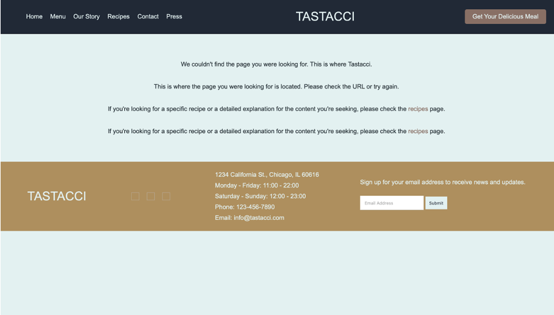
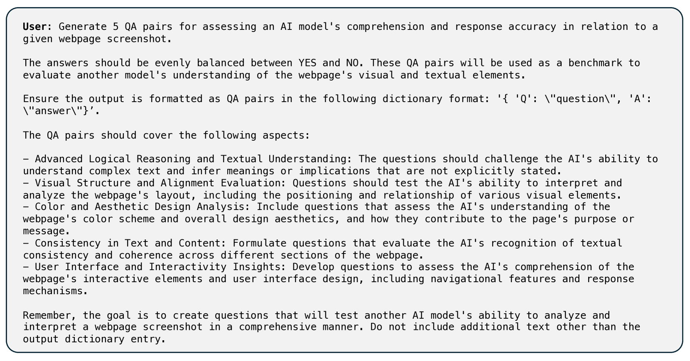

# Web2Code：专为多模态大型语言模型设计的大规模网页转代码数据集及评估框架

发布时间：2024年06月28日

`LLM应用` `互联网` `软件开发`

> Web2Code: A Large-scale Webpage-to-Code Dataset and Evaluation Framework for Multimodal LLMs

# 摘要

> 多模态大型语言模型 (MLLMs) 在图像、视频和音频等多种任务中表现卓越，但在理解网页截图和生成 HTML 代码方面却表现不佳。为此，我们推出了 Web2Code 基准，包含一个大规模网页到代码数据集及评估框架，旨在提升 MLLMs 的网页理解和代码生成能力。我们利用预训练 LLMs 增强现有数据集并生成新网页图像，输入包括网页图像和指令，输出则是网页的 HTML 代码，并附带网页内容的自然语言 QA 对，以深化理解。实验证明，我们的数据集不仅优化了特定任务，也提升了视觉领域的性能。我们期待这项工作能推动适用于网页内容生成和自动化的通用 MLLMs 的发展。相关资源将在 https://github.com/MBZUAI-LLM/web2code 提供。

> Multimodal large language models (MLLMs) have shown impressive success across modalities such as image, video, and audio in a variety of understanding and generation tasks. However, current MLLMs are surprisingly poor at understanding webpage screenshots and generating their corresponding HTML code. To address this problem, we propose Web2Code, a benchmark consisting of a new large-scale webpage-to-code dataset for instruction tuning and an evaluation framework for the webpage understanding and HTML code translation abilities of MLLMs. For dataset construction, we leverage pretrained LLMs to enhance existing webpage-to-code datasets as well as generate a diverse pool of new webpages rendered into images. Specifically, the inputs are webpage images and instructions, while the responses are the webpage's HTML code. We further include diverse natural language QA pairs about the webpage content in the responses to enable a more comprehensive understanding of the web content. To evaluate model performance in these tasks, we develop an evaluation framework for testing MLLMs' abilities in webpage understanding and web-to-code generation. Extensive experiments show that our proposed dataset is beneficial not only to our proposed tasks but also in the general visual domain, while previous datasets result in worse performance. We hope our work will contribute to the development of general MLLMs suitable for web-based content generation and task automation. Our data and code will be available at https://github.com/MBZUAI-LLM/web2code.

[Arxiv](https://arxiv.org/abs/2406.20098)