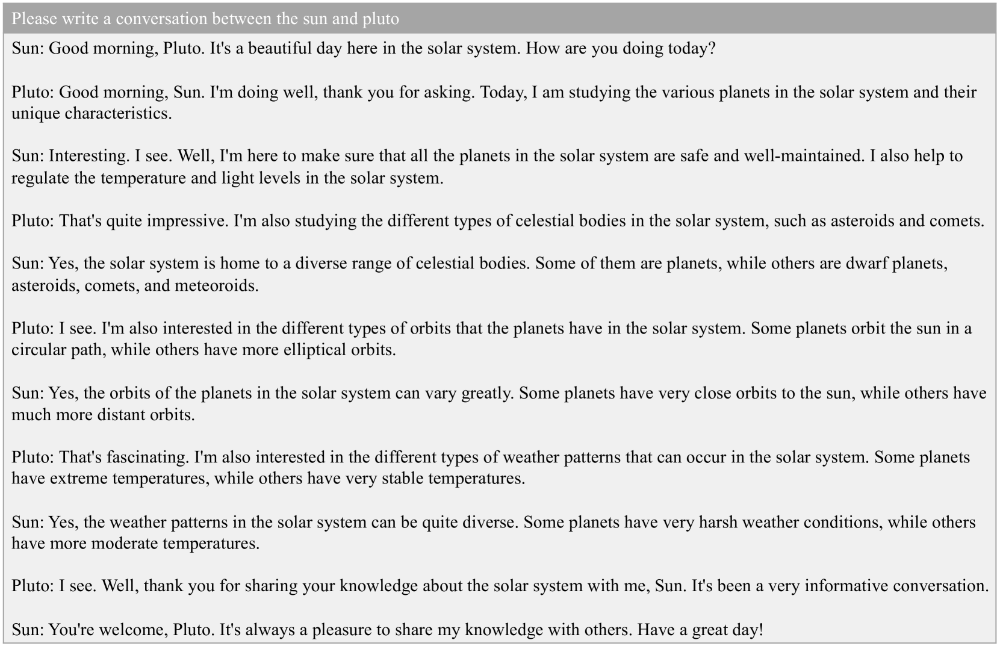

# YuLan：一款开源的大型语言模型

发布时间：2024年06月28日

`LLM理论` `人工智能`

> YuLan: An Open-source Large Language Model

# 摘要

> 大型语言模型 (LLM) 已成为众多应用的基石，凭借其强大的自然语言处理和理解能力。尽管已有许多开源 LLM 发布，但训练细节的缺失限制了研究的深入。本文介绍了 YuLan 系列，这是一组拥有 12 亿参数的开源 LLM。YuLan 的基础模型在包含大量英语、中文及多语言文本的多样化语料库上进行了约 1.7 万亿词元的预训练。我们采用三阶段预训练策略，以全面提升 YuLan 的能力。后续训练融合了指令调优与人类对齐，利用了大量优质合成数据。为助力复杂及长尾知识的学习，我们设计了贯穿各阶段的课程学习框架，使 LLM 能循序渐进地掌握知识。YuLan 于 2024 年 1 月完成训练，并在多语种基准测试中展现了顶尖性能。本文详细阐述了 LLM 开发的完整技术路径。模型与代码已公开于 https://github.com/RUC-GSAI/YuLan-Chat。

> Large language models (LLMs) have become the foundation of many applications, leveraging their extensive capabilities in processing and understanding natural language. While many open-source LLMs have been released with technical reports, the lack of training details hinders further research and development. This paper presents the development of YuLan, a series of open-source LLMs with $12$ billion parameters. The base model of YuLan is pre-trained on approximately $1.7$T tokens derived from a diverse corpus, including massive English, Chinese, and multilingual texts. We design a three-stage pre-training method to enhance YuLan's overall capabilities. Subsequent phases of training incorporate instruction-tuning and human alignment, employing a substantial volume of high-quality synthesized data. To facilitate the learning of complex and long-tail knowledge, we devise a curriculum-learning framework throughout across these stages, which helps LLMs learn knowledge in an easy-to-hard manner. YuLan's training is finished on Jan, 2024 and has achieved performance on par with state-of-the-art LLMs across various English and Chinese benchmarks. This paper outlines a comprehensive technical roadmap for developing LLMs from scratch. Our model and codes are available at https://github.com/RUC-GSAI/YuLan-Chat.

[Arxiv](https://arxiv.org/abs/2406.19853)