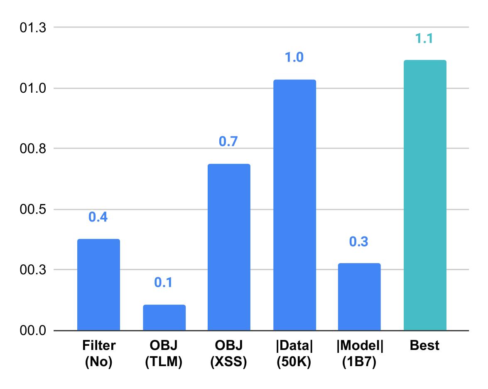

# 多语言大型语言模型的平行语料库利用指南

发布时间：2024年06月29日

`LLM应用` `机器翻译` `文本分类`

> A Recipe of Parallel Corpora Exploitation for Multilingual Large Language Models

# 摘要

> 近期研究凸显了平行语料库在提升多语种大型语言模型性能方面的潜力，不仅在双语任务如机器翻译中，也在通用任务如文本分类中表现出色。基于此，我们展开了一项全面研究，旨在探索利用平行语料库的最佳策略。我们深入分析了语料库的质量与数量、训练目标及模型规模对多语种大型语言模型性能的影响。研究发现：首先，有效过滤噪声翻译是关键，而语言识别和短句过滤则影响甚微；其次，仅10K平行句子的语料库即可媲美大型数据集的效果；再者，单一的机器翻译训练目标效果最佳；最后，大型模型因更强的跨任务迁移能力，从平行语料库中获益更多。本研究不仅为平行语料库的优化利用提供了新视角，还将先前研究的适用范围从特定语言和任务扩展至更广泛的应用场景。

> Recent studies have highlighted the potential of exploiting parallel corpora to enhance multilingual large language models, improving performance in both bilingual tasks, e.g., machine translation, and general-purpose tasks, e.g., text classification. Building upon these findings, our comprehensive study aims to identify the most effective strategies for leveraging parallel corpora. We investigate the impact of parallel corpora quality and quantity, training objectives, and model size on the performance of multilingual large language models enhanced with parallel corpora across diverse languages and tasks. Our analysis reveals several key insights: (i) filtering noisy translations is essential for effectively exploiting parallel corpora, while language identification and short sentence filtering have little effect; (ii) even a corpus containing just 10K parallel sentences can yield results comparable to those obtained from much larger datasets; (iii) employing only the machine translation objective yields the best results among various training objectives and their combinations; (iv) larger multilingual language models benefit more from parallel corpora than smaller models due to their stronger capacity for cross-task transfer. Our study offers valuable insights into the optimal utilization of parallel corpora to enhance multilingual large language models, extending the generalizability of previous findings from limited languages and tasks to a broader range of scenarios.

[Arxiv](https://arxiv.org/abs/2407.00436)