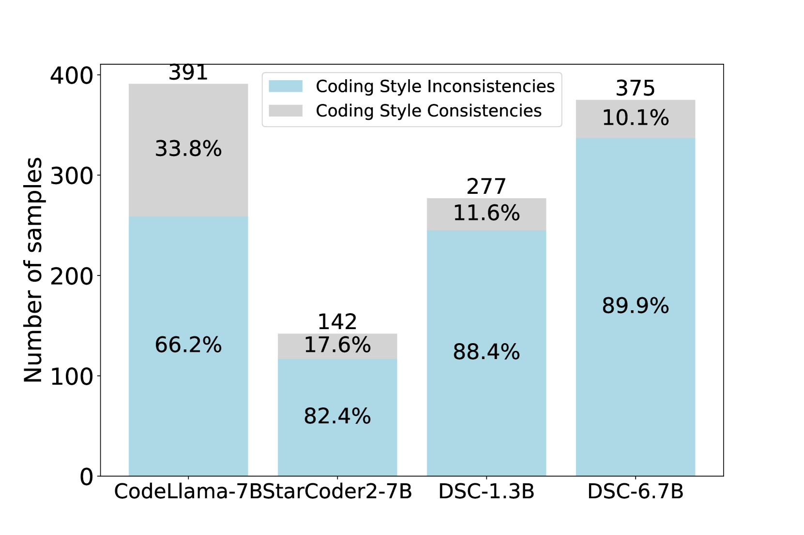
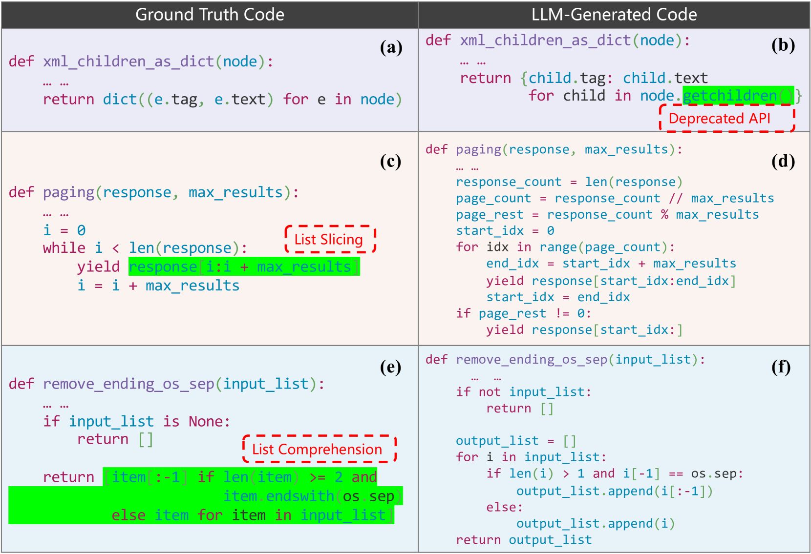

# 探究大规模语言模型中的编码风格不一致，超越功能正确性的局限。

发布时间：2024年06月29日

`LLM应用` `软件开发` `人工智能`

> Beyond Functional Correctness: Investigating Coding Style Inconsistencies in Large Language Models

# 摘要

> 大型语言模型 (LLM) 为代码生成领域带来了革命性的变化，有望优化软件开发流程。然而，以往研究多聚焦于代码生成的准确性，而 LLM 与人类开发者间的编码风格差异却鲜有探讨。本文通过实证分析，揭示了主流 Code LLM 与人类开发者编码风格的不一致性，并对其进行了分类总结。我们首先通过大量生成结果的手动分析，归纳了编码风格不一致的类型，随后从可读性、简洁性和健壮性角度对比了 Code LLM 与人类程序员的代码。研究发现，LLM 与开发者编码风格迥异。同时，我们探讨了这些差异的成因，并提出了缓解这些问题的策略。

> Large language models (LLMs) have brought a paradigm shift to the field of code generation, offering the potential to enhance the software development process. However, previous research mainly focuses on the accuracy of code generation, while coding style differences between LLMs and human developers remain under-explored. In this paper, we empirically analyze the differences in coding style between the code generated by mainstream Code LLMs and the code written by human developers, and summarize coding style inconsistency taxonomy. Specifically, we first summarize the types of coding style inconsistencies by manually analyzing a large number of generation results. We then compare the code generated by Code LLMs with the code written by human programmers in terms of readability, conciseness, and robustness. The results reveal that LLMs and developers have different coding styles. Additionally, we study the possible causes of these inconsistencies and provide some solutions to alleviate the problem.

[Arxiv](https://arxiv.org/abs/2407.00456)