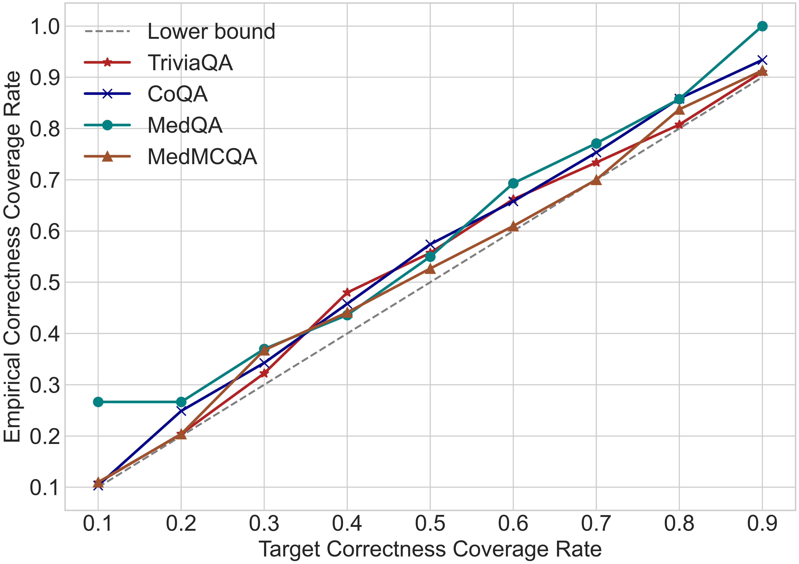
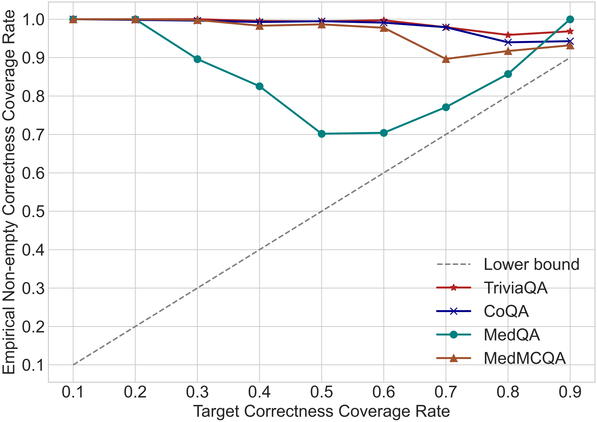
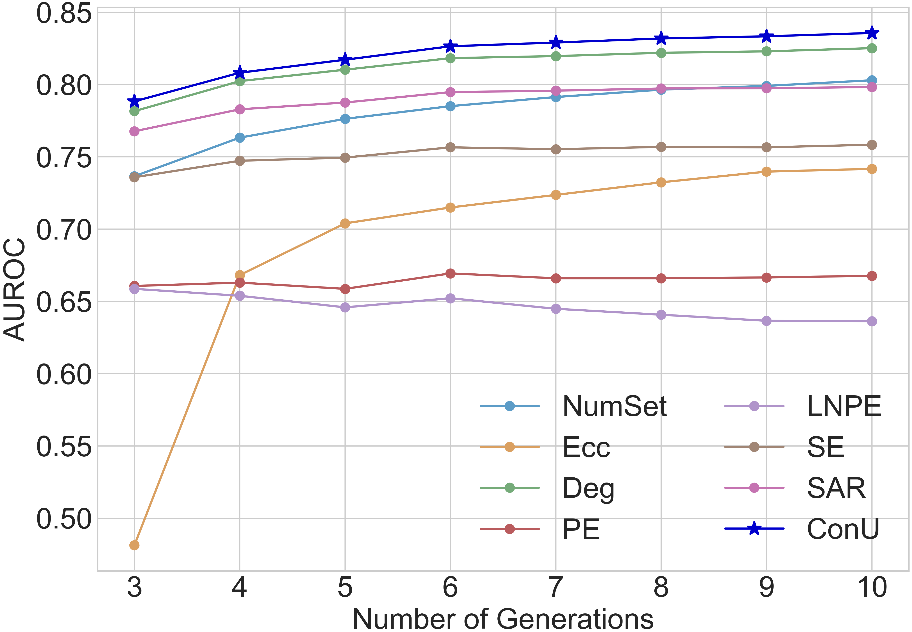
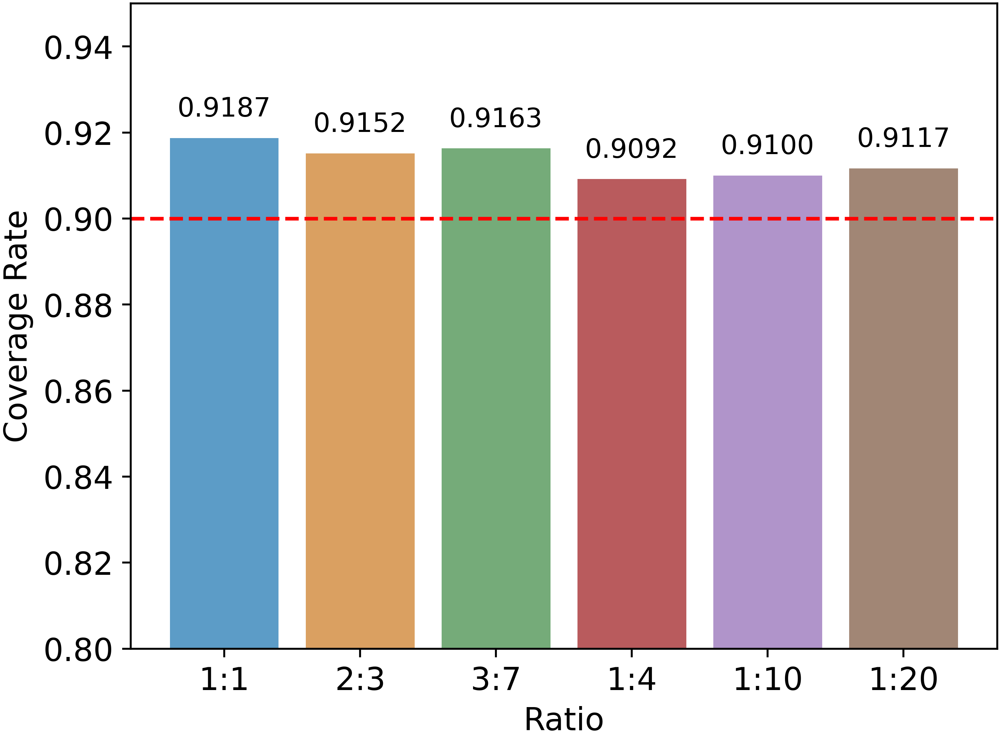
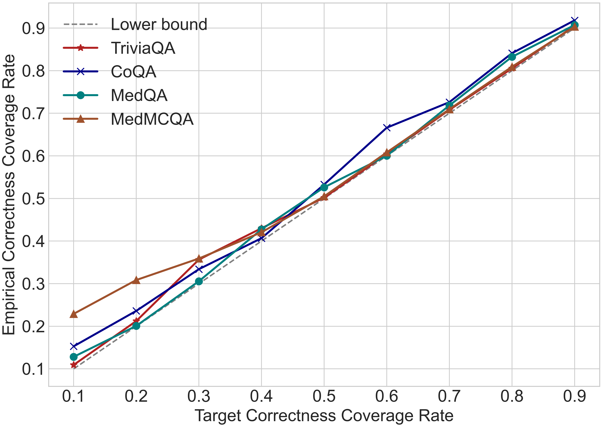
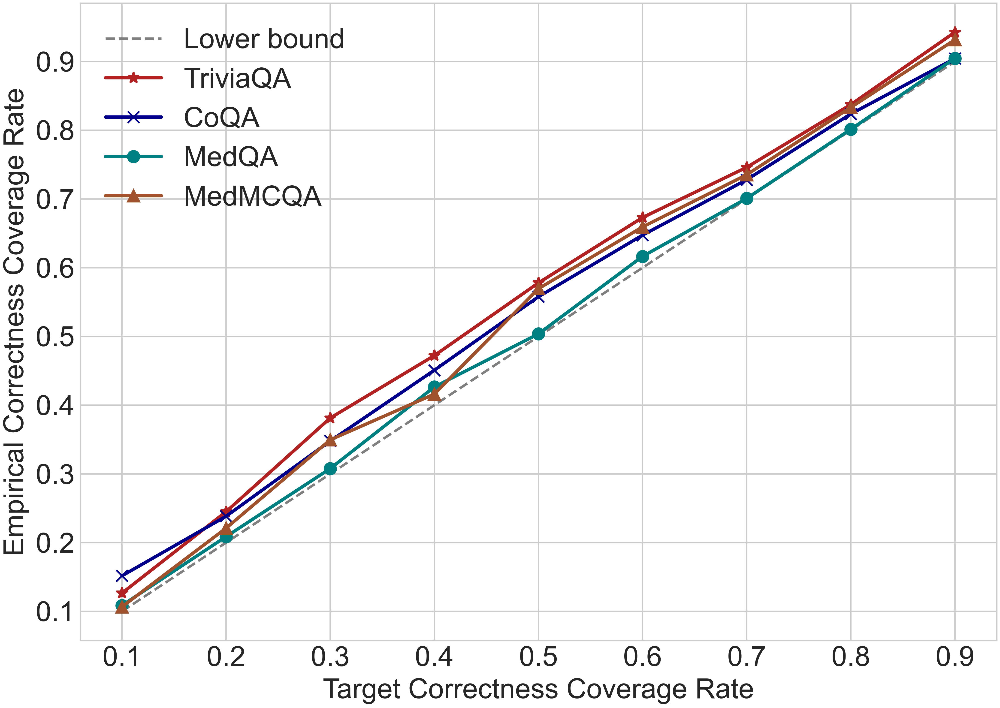
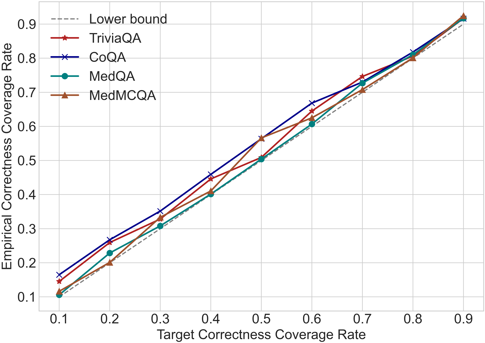
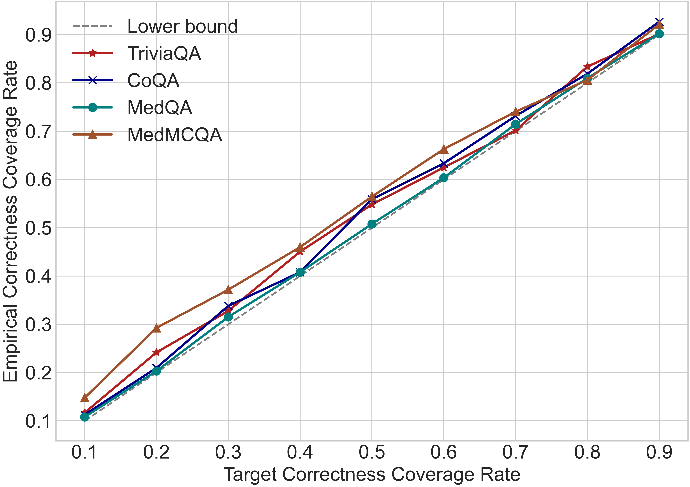
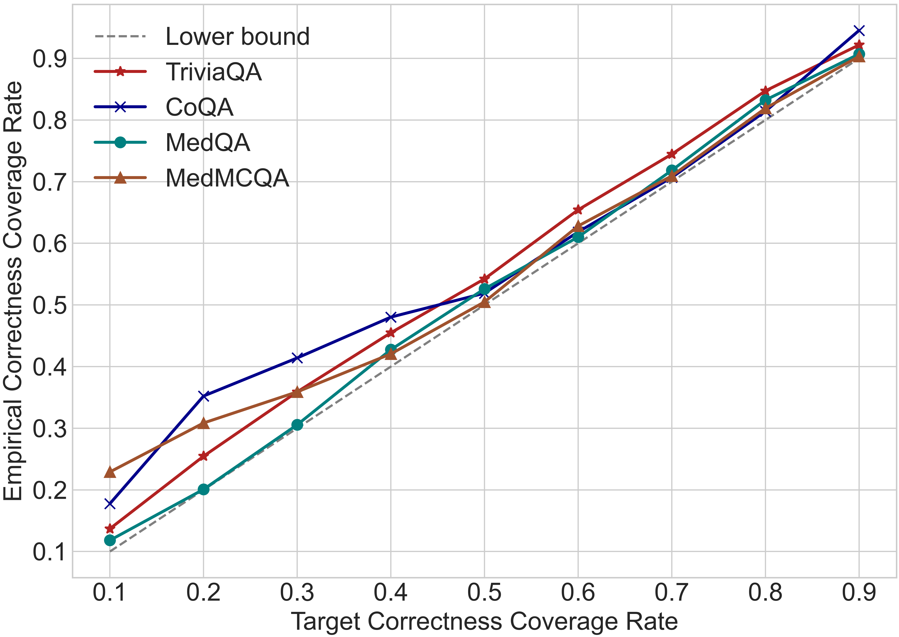

# ConU：在大型语言模型中，通过正确性覆盖保证实现共形不确定性

发布时间：2024年06月29日

`LLM理论` `人工智能`

> ConU: Conformal Uncertainty in Large Language Models with Correctness Coverage Guarantees

# 摘要

> 自然语言生成任务中的不确定性量化仍是一大难题，尤其是随着大型语言模型的复杂性增加。本研究探索了将保形预测应用于黑箱LLM的方法，通过构建预测集将启发式的不确定性度量转化为严格的理论保证。我们提出了一种基于抽样的不确定性度量方法，结合自一致性，并设计了保形不确定性准则，确保与正确性一致。实验显示，我们的方法在性能上超越了现有技术。此外，我们在模型的答案分布中校准预测集，确保了在多个领域和模型中对正确覆盖率的严格控制，同时小规模的平均集大小也显示了方法的高效性，为实际应用提供了可靠的保障。

> Uncertainty quantification (UQ) in natural language generation (NLG) tasks remains an open challenge, exacerbated by the intricate nature of the recent large language models (LLMs). This study investigates adapting conformal prediction (CP), which can convert any heuristic measure of uncertainty into rigorous theoretical guarantees by constructing prediction sets, for black-box LLMs in open-ended NLG tasks. We propose a sampling-based uncertainty measure leveraging self-consistency and develop a conformal uncertainty criterion by integrating the uncertainty condition aligned with correctness into the design of the CP algorithm. Experimental results indicate that our uncertainty measure generally surpasses prior state-of-the-art methods. Furthermore, we calibrate the prediction sets within the model's unfixed answer distribution and achieve strict control over the correctness coverage rate across 6 LLMs on 4 free-form NLG datasets, spanning general-purpose and medical domains, while the small average set size further highlights the efficiency of our method in providing trustworthy guarantees for practical open-ended NLG applications.

[Arxiv](https://arxiv.org/abs/2407.00499)