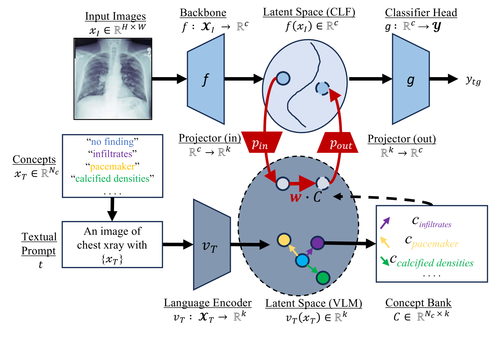
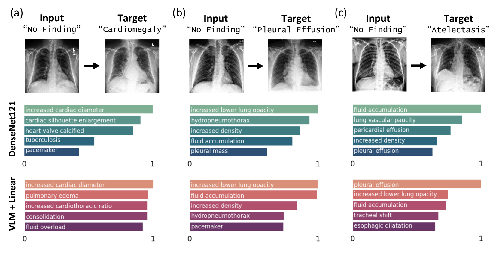

# 通过文本概念阐释胸部X光病理模型

发布时间：2024年06月29日

`LLM应用` `人工智能`

> Explaining Chest X-ray Pathology Models using Textual Concepts

# 摘要

> 深度学习模型虽已革新医学影像诊断领域，但其不透明性却成为临床采纳和信任的障碍。在提升模型透明度的探索中，基于概念的解释力求提供简洁易懂的分类器解释。然而，这类方法常依赖大量手动标注概念的数据，这在医学领域尤为稀缺。为此，我们创新性地提出了CoCoX方法，它巧妙利用现有视觉-语言模型的联合嵌入空间，无需标注数据即可阐释黑盒分类器的结果。通过结合胸部放射报告中的文本概念与预训练的VLM，我们成功解释了三种常见胸腔疾病。实验表明，我们的解释不仅语义丰富，而且准确反映了潜在病理。

> Deep learning models have revolutionized medical imaging and diagnostics, yet their opaque nature poses challenges for clinical adoption and trust. Amongst approaches to improve model interpretability, concept-based explanations aim to provide concise and human understandable explanations of any arbitrary classifier. However, such methods usually require a large amount of manually collected data with concept annotation, which is often scarce in the medical domain. In this paper, we propose Conceptual Counterfactual Explanations for Chest X-ray (CoCoX) that leverage existing vision-language models (VLM) joint embedding space to explain black-box classifier outcomes without the need for annotated datasets. Specifically, we utilize textual concepts derived from chest radiography reports and a pre-trained chest radiography-based VLM to explain three common cardiothoracic pathologies. We demonstrate that the explanations generated by our method are semantically meaningful and faithful to underlying pathologies.

[Arxiv](https://arxiv.org/abs/2407.00557)