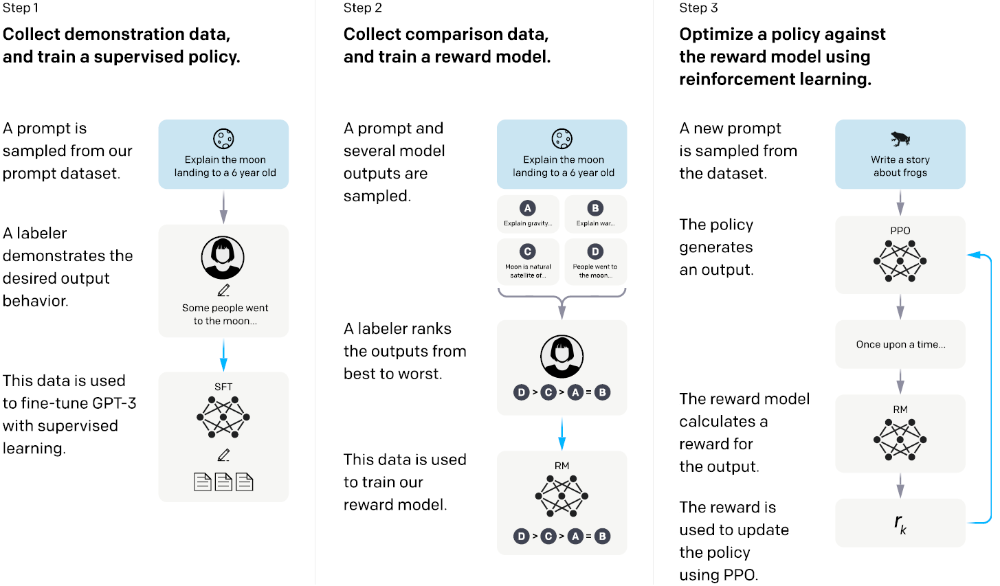
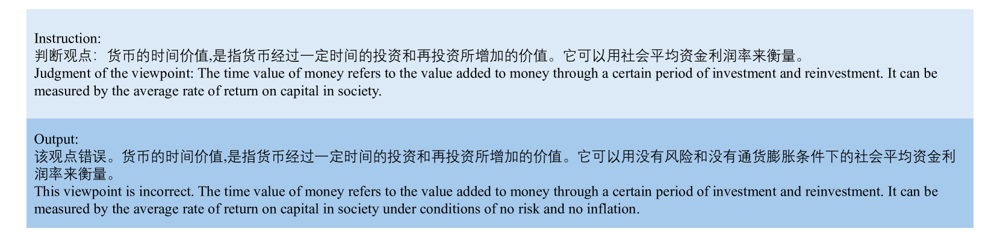

# 金融知识大型语言模型

发布时间：2024年06月29日

`LLM应用` `人工智能`

> Financial Knowledge Large Language Model

# 摘要

> 人工智能正深刻影响金融业，革新数据处理与解读。大型语言模型（LLMs）尤为突出，通过自动化复杂任务、优化客户服务和深化财务分析，重塑金融服务。我们首先推出IDEA-FinBench，专为评估LLMs财务知识而设的基准，采纳全球权威金融考试题，全面检验LLMs应对金融领域考题的能力。接着，提出IDEA-FinKER框架，助力LLMs快速融入金融领域，采用基于检索的少样本学习，实时注入上下文知识，并配备高质量金融指令，微调通用LLMs。最后，呈现IDEA-FinQA系统，由LLMs驱动，聚焦实时知识注入与外部知识强化，包含数据收集、查询及功能性LLM代理三大模块。

> Artificial intelligence is making significant strides in the finance industry, revolutionizing how data is processed and interpreted. Among these technologies, large language models (LLMs) have demonstrated substantial potential to transform financial services by automating complex tasks, enhancing customer service, and providing detailed financial analysis. Firstly, we introduce IDEA-FinBench, an evaluation benchmark specifically tailored for assessing financial knowledge in large language models (LLMs). This benchmark utilizes questions from two globally respected and authoritative financial professional exams, aimimg to comprehensively evaluate the capability of LLMs to directly address exam questions pertinent to the finance sector. Secondly, we propose IDEA-FinKER, a Financial Knowledge Enhancement framework designed to facilitate the rapid adaptation of general LLMs to the financial domain, introducing a retrieval-based few-shot learning method for real-time context-level knowledge injection, and a set of high-quality financial knowledge instructions for fine-tuning any general LLM. Finally, we present IDEA-FinQA, a financial question-answering system powered by LLMs. This system is structured around a scheme of real-time knowledge injection and factual enhancement using external knowledge. IDEA-FinQA is comprised of three main modules: the data collector, the data querying module, and LLM-based agents tasked with specific functions.

[Arxiv](https://arxiv.org/abs/2407.00365)