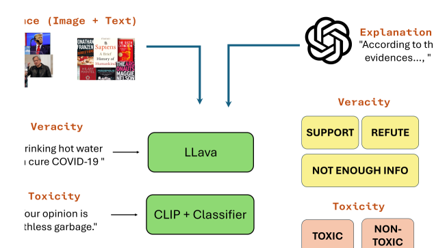
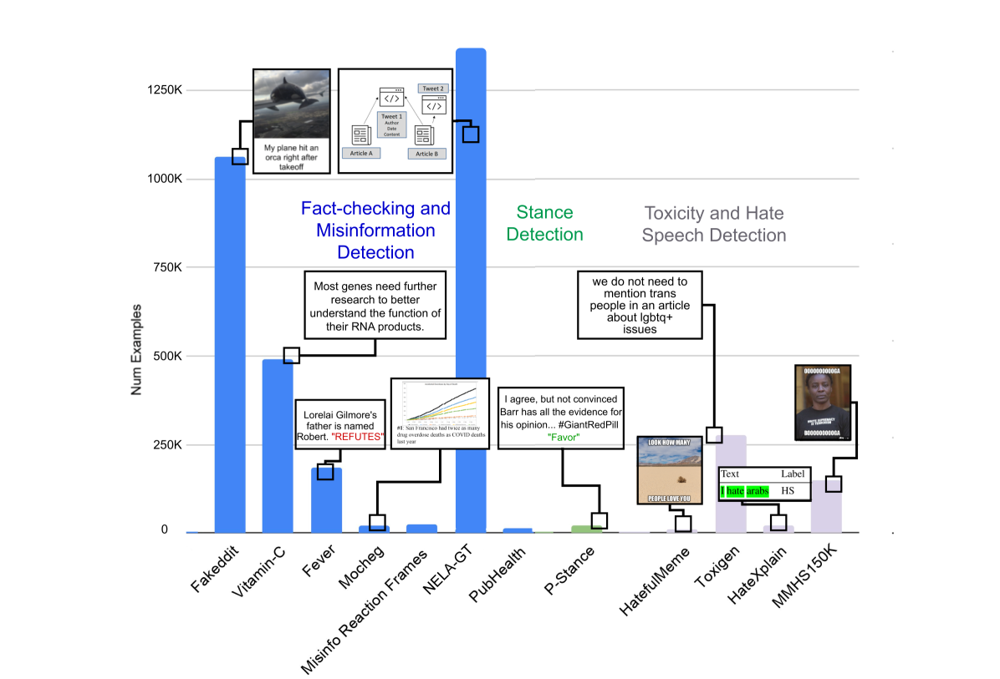
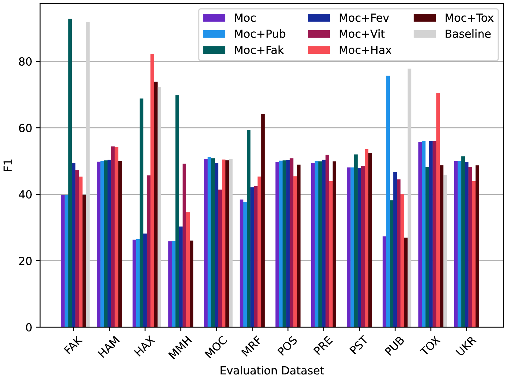
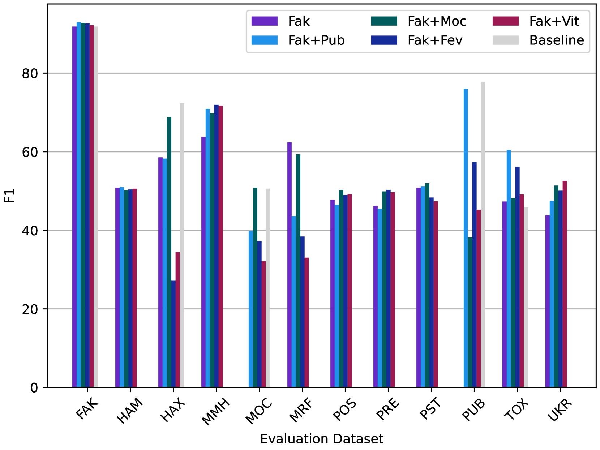
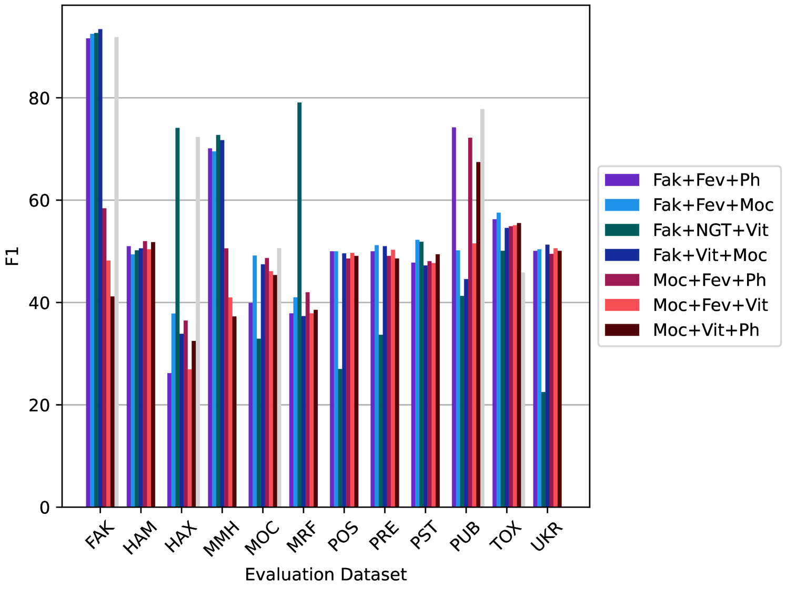
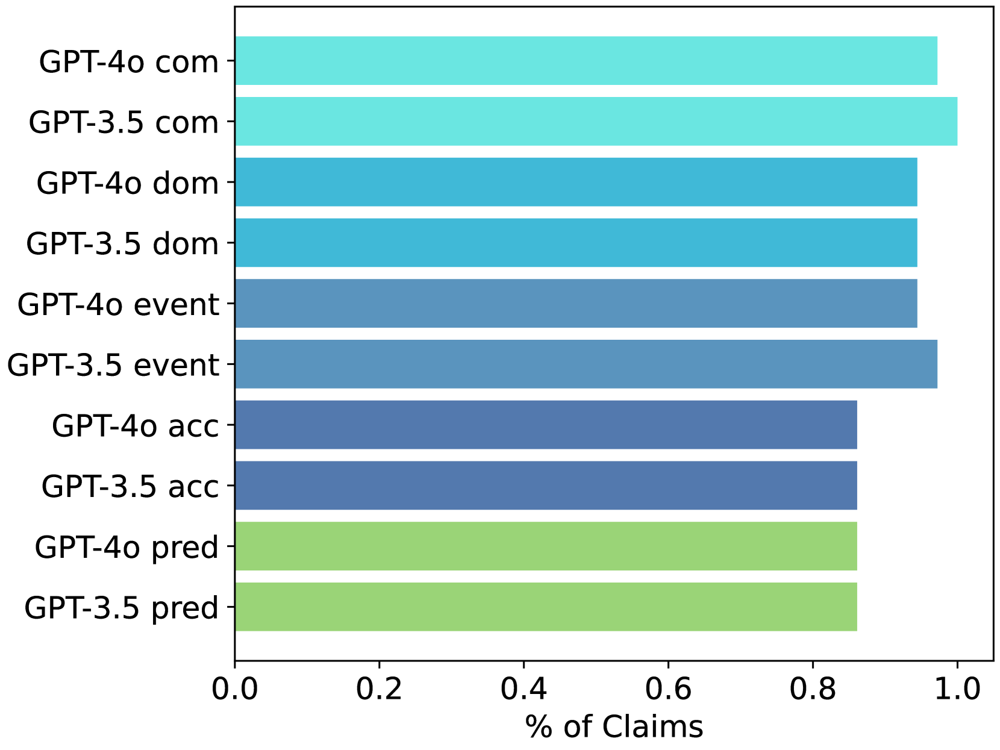
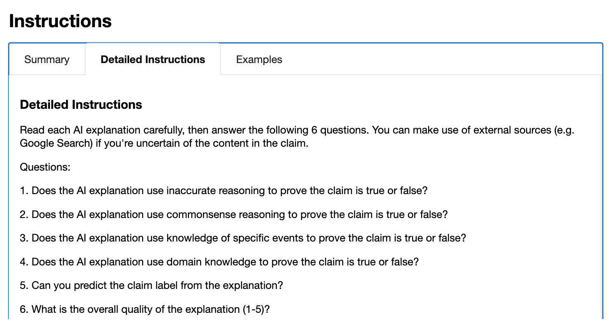
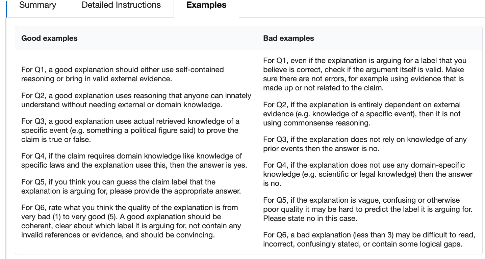

# 训练事实验证器：探索多模态开放模型中的知识传递

发布时间：2024年06月29日

`LLM应用` `网络安全`

> How to Train Your Fact Verifier: Knowledge Transfer with Multimodal Open Models

# 摘要

> 随着新闻和社交媒体上错误信息的激增，我们急需能够实时有效验证新闻声明的系统。为此，基于大型语言或多模态模型的验证方法应运而生，旨在加强在线监管，遏制虚假和有害内容的传播。尽管这些方法有望减轻人工事实核查的负担，但基础模型训练数据的过时可能成为阻碍。在本研究中，我们探索了在不持续更新的前提下，通过知识转移提升基础模型性能的可能性，利用现有基准或大型语言模型生成的解释进行初步研究。我们在12个公共事实核查和错误信息检测基准以及两个与内容审核相关的任务上进行了评估。实验结果显示，在Mocheg和Fakeddit这两个多模态事实核查基准上，知识转移策略分别将性能提升了高达2.9%和1.7%，超越了当前最先进水平。

> Given the growing influx of misinformation across news and social media, there is a critical need for systems that can provide effective real-time verification of news claims. Large language or multimodal model based verification has been proposed to scale up online policing mechanisms for mitigating spread of false and harmful content. While these can potentially reduce burden on human fact-checkers, such efforts may be hampered by foundation model training data becoming outdated. In this work, we test the limits of improving foundation model performance without continual updating through an initial study of knowledge transfer using either existing intra- and inter- domain benchmarks or explanations generated from large language models (LLMs). We evaluate on 12 public benchmarks for fact-checking and misinformation detection as well as two other tasks relevant to content moderation -- toxicity and stance detection. Our results on two recent multi-modal fact-checking benchmarks, Mocheg and Fakeddit, indicate that knowledge transfer strategies can improve Fakeddit performance over the state-of-the-art by up to 1.7% and Mocheg performance by up to 2.9%.

[Arxiv](https://arxiv.org/abs/2407.00369)