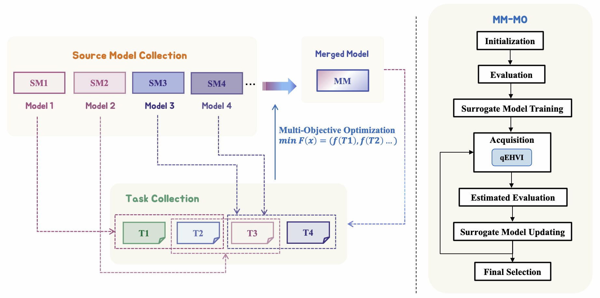

# 变形时刻已至：借助多目标优化，激发多款大型语言模型的无限潜能

发布时间：2024年06月29日

`LLM理论` `人工智能` `软件工程`

> It's Morphing Time: Unleashing the Potential of Multiple LLMs via Multi-objective Optimization

# 摘要

> 本文提出了一种新颖的大型语言模型合并方法，通过黑盒多目标优化算法实现。我们的目标是将多个擅长不同任务的模型合并，创造出一个性能超越所有单一源模型的统一模型。模型合并面临两大难题：一是现有方法过度依赖人工直觉和定制策略；二是合并时常见参数冲突，尽管DARE等方法能缓解，但常随机丢弃参数，可能导致重要增量参数丢失。为此，我们提出MM-MO方法，利用多目标优化算法自动寻找最佳合并方案，无需人工干预。在搜索配置时，我们以多任务的估计性能为优化目标，有效避免参数冲突，保留关键增量参数。实验对比显示，我们的方法性能持续领先。更有趣的是，即使未明确优化的任务类型也见性能提升，表明我们的方法全面提升了模型潜力，而非仅针对特定任务过拟合。这一创新方法为模型合并技术带来显著进步，提供了一个强大且易用的解决方案，将多样模型整合为高效统一的模型。

> In this paper, we introduce a novel approach for large language model merging via black-box multi-objective optimization algorithms. The goal of model merging is to combine multiple models, each excelling in different tasks, into a single model that outperforms any of the individual source models. However, model merging faces two significant challenges: First, existing methods rely heavily on human intuition and customized strategies. Second, parameter conflicts often arise during merging, and while methods like DARE [1] can alleviate this issue, they tend to stochastically drop parameters, risking the loss of important delta parameters. To address these challenges, we propose the MM-MO method, which automates the search for optimal merging configurations using multi-objective optimization algorithms, eliminating the need for human intuition. During the configuration searching process, we use estimated performance across multiple diverse tasks as optimization objectives in order to alleviate the parameter conflicting between different source models without losing crucial delta parameters. We conducted comparative experiments with other mainstream model merging methods, demonstrating that our method consistently outperforms them. Moreover, our experiments reveal that even task types not explicitly targeted as optimization objectives show performance improvements, indicating that our method enhances the overall potential of the model rather than merely overfitting to specific task types. This approach provides a significant advancement in model merging techniques, offering a robust and plug-and-play solution for integrating diverse models into a unified, high-performing model.

[Arxiv](https://arxiv.org/abs/2407.00487)