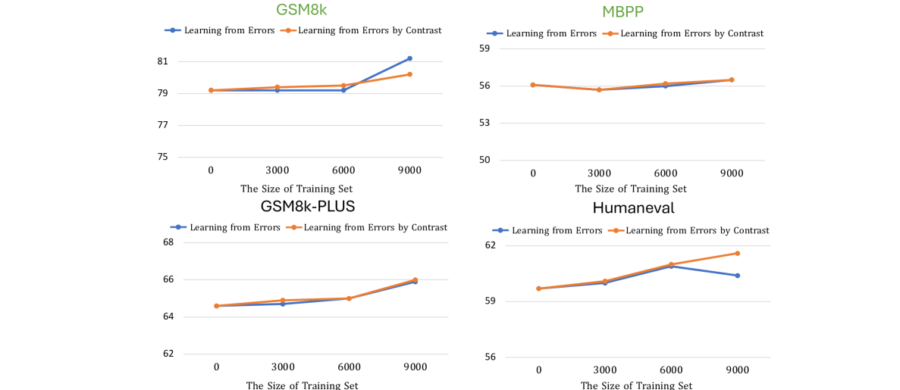

# LLMs 作为导师：通过从错误中学习，迈向模型改进的自动化

发布时间：2024年06月29日

`LLM应用` `人工智能`

> LLMs-as-Instructors: Learning from Errors Toward Automating Model Improvement

# 摘要

> 本文提出创新的“LLMs-as-Instructors”框架，利用大型语言模型自主提升小型模型的训练效率。借鉴“从错误中学习”的理念，该框架通过指导性LLM深入分析目标模型的错误，实现精准高效的训练。我们采用两种策略：一是“从错误中学习”，专注于错误响应定制训练数据；二是“通过对比从错误中学习”，利用对比学习深入剖析错误。实证研究表明，该框架在数学推理、编码能力和事实知识等多个领域显著提升性能，改进后的Llama-3-8b-Instruction更是超越了ChatGPT。通过综合运用这两种策略，我们在各类基准测试中均实现了均衡的性能提升。相关代码已公开，详见https://yingjiahao14.github.io/LLMs-as-Instructors-pages/。

> This paper introduces the innovative "LLMs-as-Instructors" framework, which leverages the advanced Large Language Models (LLMs) to autonomously enhance the training of smaller target models. Inspired by the theory of "Learning from Errors", this framework employs an instructor LLM to meticulously analyze the specific errors within a target model, facilitating targeted and efficient training cycles. Within this framework, we implement two strategies: "Learning from Error," which focuses solely on incorrect responses to tailor training data, and "Learning from Error by Contrast", which uses contrastive learning to analyze both correct and incorrect responses for a deeper understanding of errors.
  Our empirical studies, conducted with several open-source models, demonstrate significant improvements across multiple benchmarks, including mathematical reasoning, coding abilities, and factual knowledge. Notably, the refined Llama-3-8b-Instruction has outperformed ChatGPT, illustrating the effectiveness of our approach. By leveraging the strengths of both strategies, we have attained a more balanced performance improvement on both in-domain and out-of-domain benchmarks. Our code can be found at https://yingjiahao14.github.io/LLMs-as-Instructors-pages/.

[Arxiv](https://arxiv.org/abs/2407.00497)