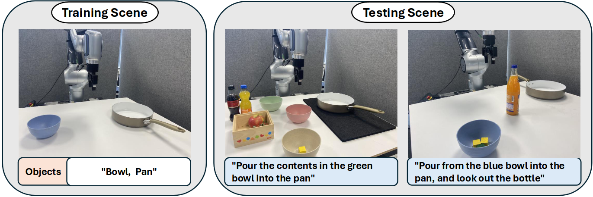
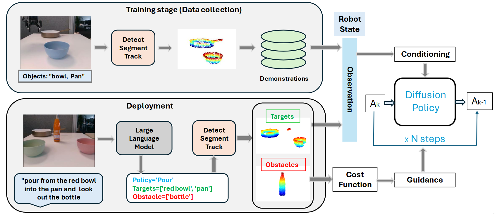
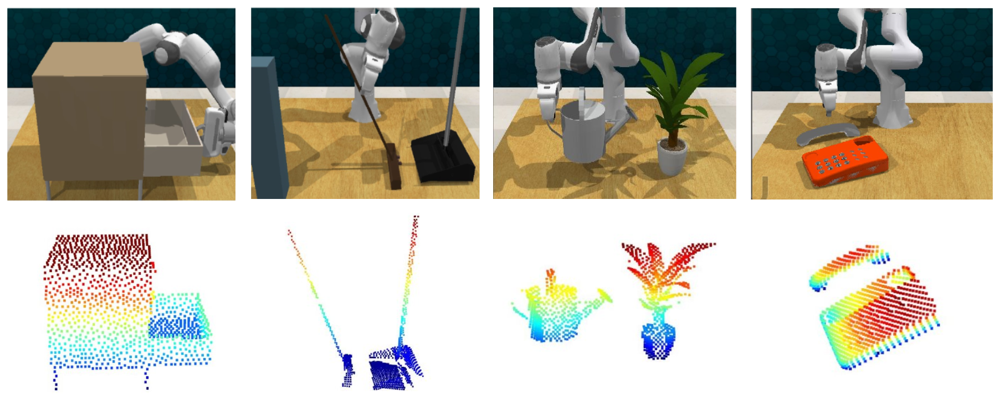
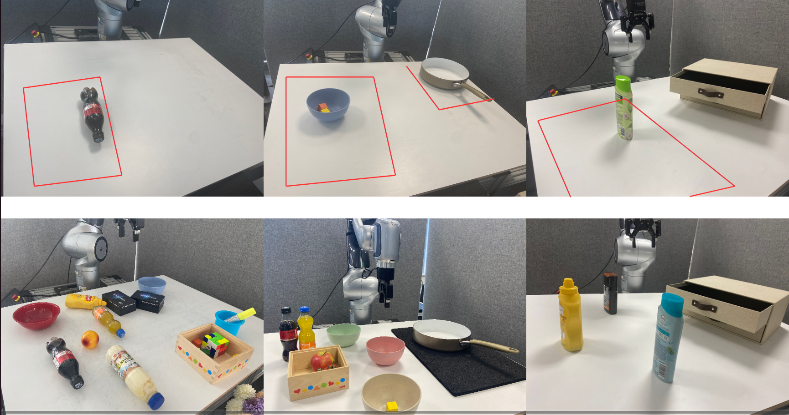
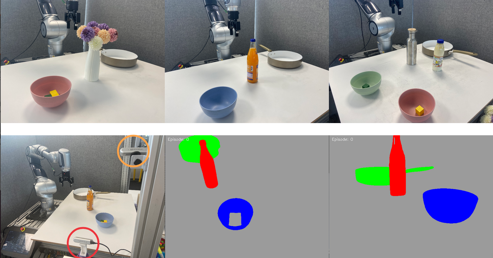
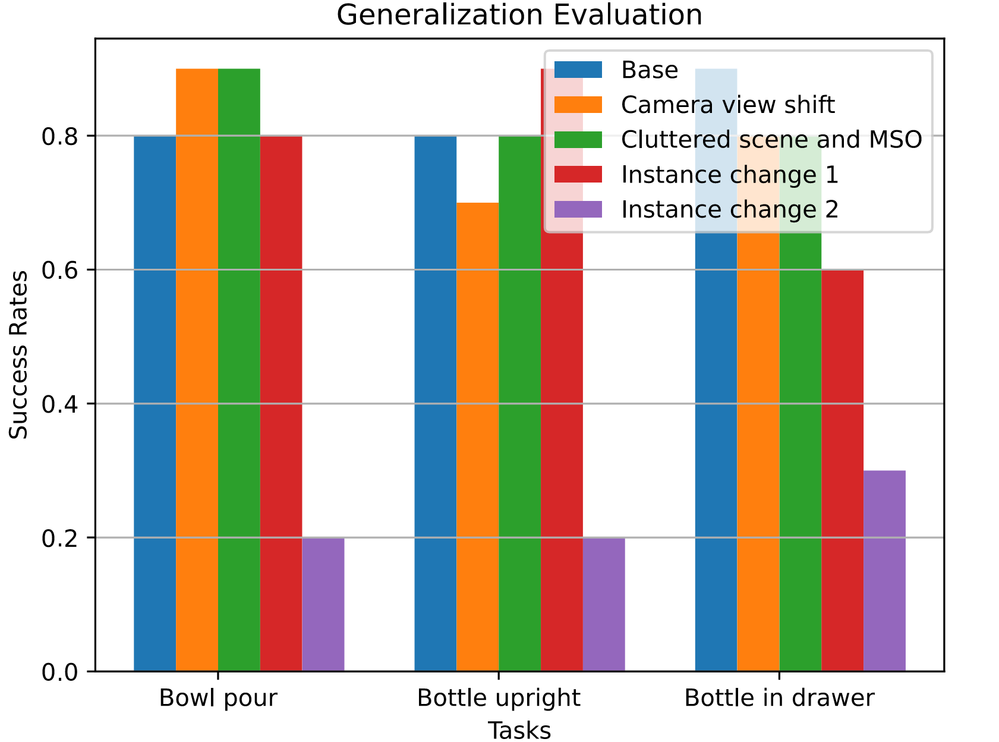
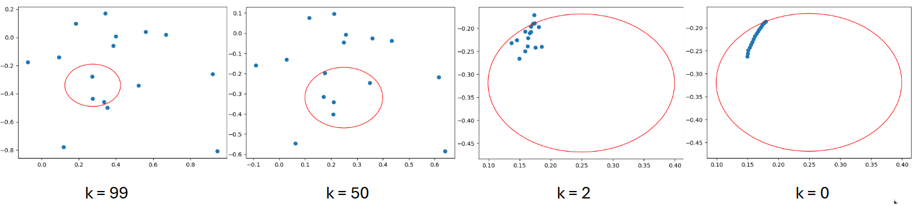
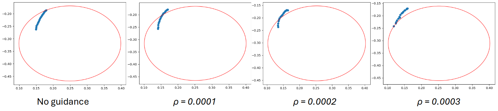

# 语言引导的物体中心扩散策略，助力机器人实现碰撞感知的精准操作

发布时间：2024年06月29日

`Agent` `机器人` `人工智能`

> Language-Guided Object-Centric Diffusion Policy for Collision-Aware Robotic Manipulation

# 摘要

> 为了克服从演示学习中的泛化难题和视觉变化的脆弱性，我们推出了Lan-o3dp——一种语言引导的、以对象为中心的扩散策略。该策略利用任务相关对象的3D表示，并通过成本函数在推理时确保安全。Lan-o3dp不仅在背景变化和视觉模糊性方面表现出色，还能有效规避演示中未曾遇到的新障碍。具体操作上，我们首先基于目标对象的点云训练扩散策略，再借助大型语言模型将用户指令细化分解为任务核心单元，这些单元既可作为策略网络的视觉输入，也可转化为成本函数，确保测试时轨迹生成避开碰撞区域。模拟实验证明，我们的方法训练效率高且成功率优于传统方法。实际应用中，Lan-o3dp在处理未见实例、复杂场景及多相似对象情况时，展现了卓越的泛化能力和无需额外训练的障碍规避特性。

> Learning from demonstrations faces challenges in generalizing beyond the training data and is fragile even to slight visual variations. To tackle this problem, we introduce Lan-o3dp, a language guided object centric diffusion policy that takes 3d representation of task relevant objects as conditional input and can be guided by cost function for safety constraints at inference time. Lan-o3dp enables strong generalization in various aspects, such as background changes, visual ambiguity and can avoid novel obstacles that are unseen during the demonstration process. Specifically, We first train a diffusion policy conditioned on point clouds of target objects and then harness a large language model to decompose the user instruction into task related units consisting of target objects and obstacles, which can be used as visual observation for the policy network or converted to a cost function, guiding the generation of trajectory towards collision free region at test time. Our proposed method shows training efficiency and higher success rates compared with the baselines in simulation experiments. In real world experiments, our method exhibits strong generalization performance towards unseen instances, cluttered scenes, scenes of multiple similar objects and demonstrates training free capability of obstacle avoidance.

[Arxiv](https://arxiv.org/abs/2407.00451)