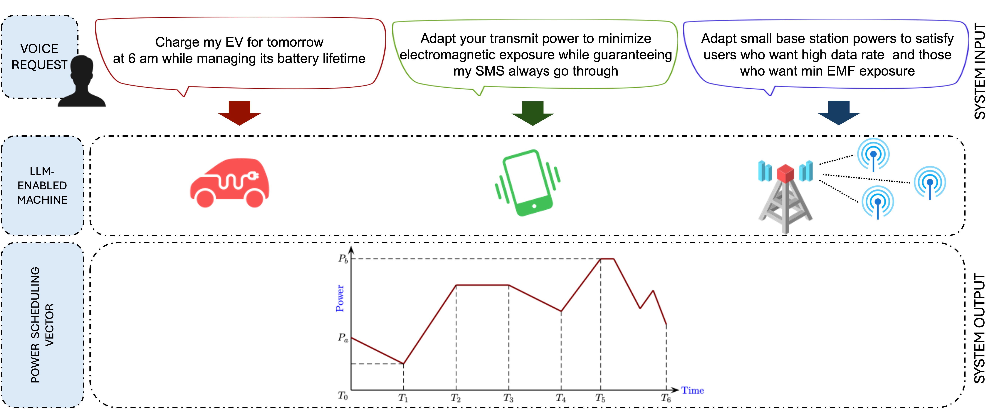
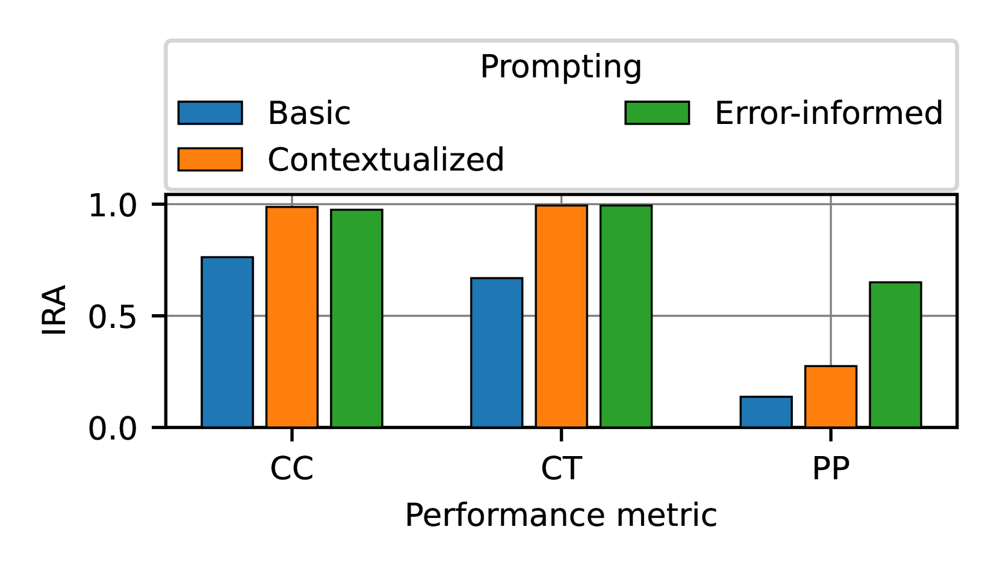
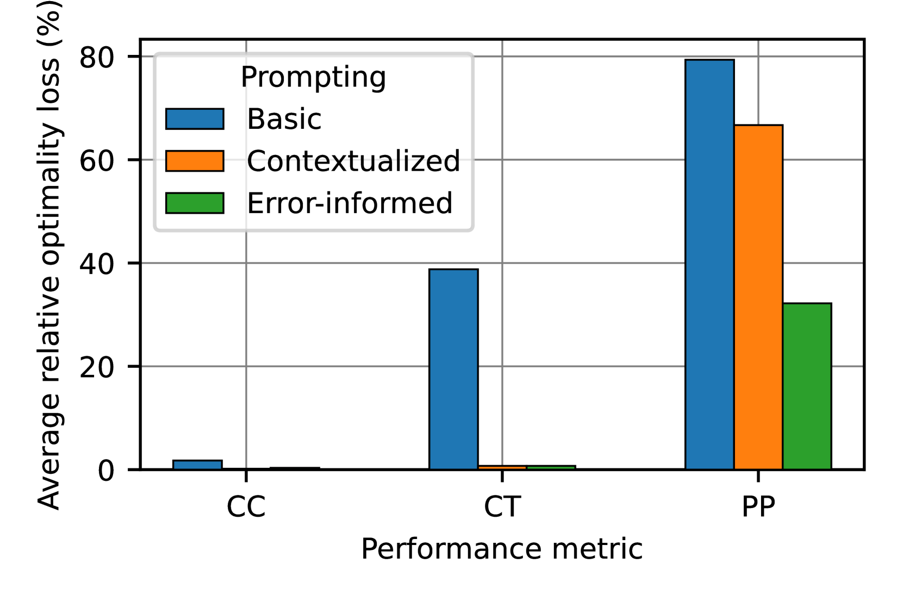
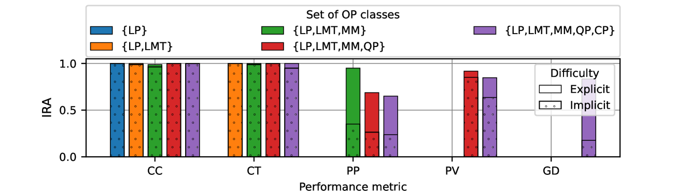
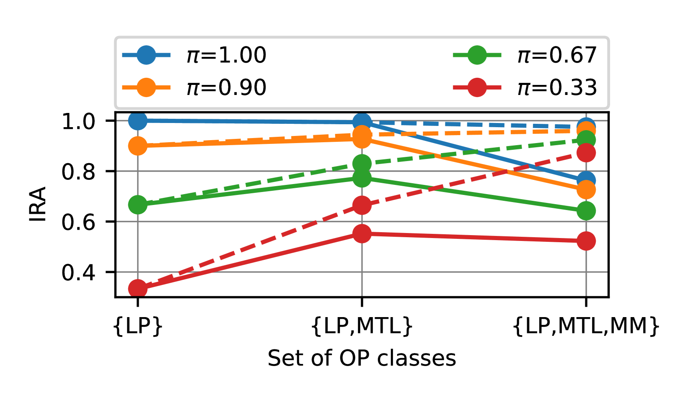
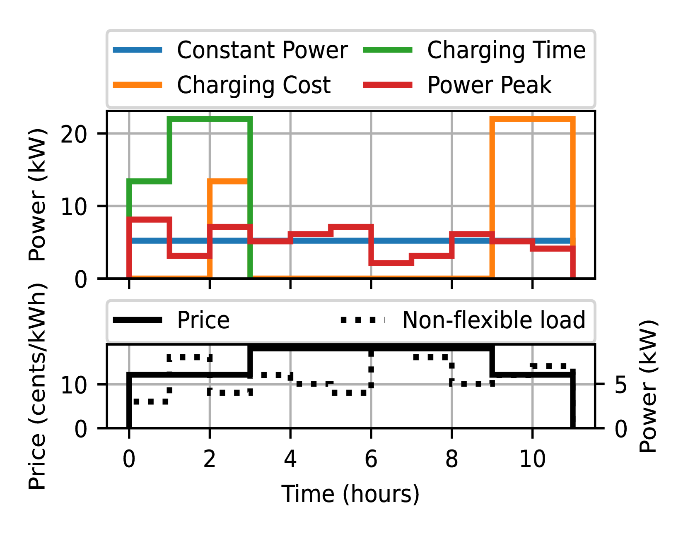

# 大型语言模型在电力调度中的应用：聚焦用户需求的方法

发布时间：2024年06月29日

`Agent`

> Large Language Models for Power Scheduling: A User-Centric Approach

# 摘要

> 传统优化与调度方案满足固定系统需求，而未来系统正转向用户驱动与个性化服务，追求高QoE与灵活性。无线与数字化能源网络中，用户需求因缺乏人机共同语言而常被忽视。大型语言模型（LLMs）的崛起，通过提供自然人机交互界面，标志着从系统中心向用户中心的转变。本文首次提出一种创新资源调度架构，利用三个LLM代理将用户语音请求（VRQ）转化为资源分配向量。我们设计了意图识别、参数识别及问题求解三个LLM代理，构建了电动汽车充电场景下的VRQ数据库，并使用Llama 3 8B进行概念验证。测试结果显示了该架构的高效性，分析揭示了候选OP数量增加可能因识别噪声而影响最终性能。所有成果与代码均已开源。

> While traditional optimization and scheduling schemes are designed to meet fixed, predefined system requirements, future systems are moving toward user-driven approaches and personalized services, aiming to achieve high quality-of-experience (QoE) and flexibility. This challenge is particularly pronounced in wireless and digitalized energy networks, where users' requirements have largely not been taken into consideration due to the lack of a common language between users and machines. The emergence of powerful large language models (LLMs) marks a radical departure from traditional system-centric methods into more advanced user-centric approaches by providing a natural communication interface between users and devices. In this paper, for the first time, we introduce a novel architecture for resource scheduling problems by constructing three LLM agents to convert an arbitrary user's voice request (VRQ) into a resource allocation vector. Specifically, we design an LLM intent recognition agent to translate the request into an optimization problem (OP), an LLM OP parameter identification agent, and an LLM OP solving agent. To evaluate system performance, we construct a database of typical VRQs in the context of electric vehicle (EV) charging. As a proof of concept, we primarily use Llama 3 8B. Through testing with different prompt engineering scenarios, the obtained results demonstrate the efficiency of the proposed architecture. The conducted performance analysis allows key insights to be extracted. For instance, having a larger set of candidate OPs to model the real-world problem might degrade the final performance because of a higher recognition/OP classification noise level. All results and codes are open source.

[Arxiv](https://arxiv.org/abs/2407.00476)