# MMEvalPro：致力于校准多模态基准，确保评估的可信性与高效性。

发布时间：2024年06月29日

`LLM应用` `人工智能` `教育评估`

> MMEvalPro: Calibrating Multimodal Benchmarks Towards Trustworthy and Efficient Evaluation

# 摘要

> 大型多模态模型 (LMMs) 在跨模态理解和推理方面表现卓越，常通过包含图像的多项选择题 (MCQs) 进行评估。然而，现有基准普遍存在系统性偏差，甚至无视觉感知能力的 LLMs 也能取得不俗成绩，降低了评估的可信度。为此，我们推出了 MMEvalPro 基准，通过三阶段评估流程和严格指标，有效避免 I 型错误。该基准包含 $2,138$ 个问题三元组，共计 $6,414$ 个问题，其中三分之二由专家手工标注，其余源自现有基准。实验显示，MMEvalPro 不仅更具挑战性（最佳 LMM 与人类表现差距达 $31.73\%$），而且更可信（最佳 LLM 与最佳 LMM 差距为 $23.09\%$）。深入分析揭示了性能差距的原因，并证实了评估的可靠性，预示着其对未来研究的重大推动作用。

> Large Multimodal Models (LMMs) exhibit impressive cross-modal understanding and reasoning abilities, often assessed through multiple-choice questions (MCQs) that include an image, a question, and several options. However, many benchmarks used for such evaluations suffer from systematic biases. Remarkably, Large Language Models (LLMs) without any visual perception capabilities achieve non-trivial performance, undermining the credibility of these evaluations. To address this issue while maintaining the efficiency of MCQ evaluations, we propose MMEvalPro, a benchmark designed to avoid Type-I errors through a trilogy evaluation pipeline and more rigorous metrics. For each original question from existing benchmarks, human annotators augment it by creating one perception question and one knowledge anchor question through a meticulous annotation process. MMEvalPro comprises $2,138$ question triplets, totaling $6,414$ distinct questions. Two-thirds of these questions are manually labeled by human experts, while the rest are sourced from existing benchmarks (MMMU, ScienceQA, and MathVista). Compared with the existing benchmarks, our experiments with the latest LLMs and LMMs demonstrate that MMEvalPro is more challenging (the best LMM lags behind human performance by $31.73\%$, compared to an average gap of $8.03\%$ in previous benchmarks) and more trustworthy (the best LLM trails the best LMM by $23.09\%$, whereas the gap for previous benchmarks is just $14.64\%$). Our in-depth analysis explains the reason for the large performance gap and justifies the trustworthiness of evaluation, underscoring its significant potential for advancing future research.

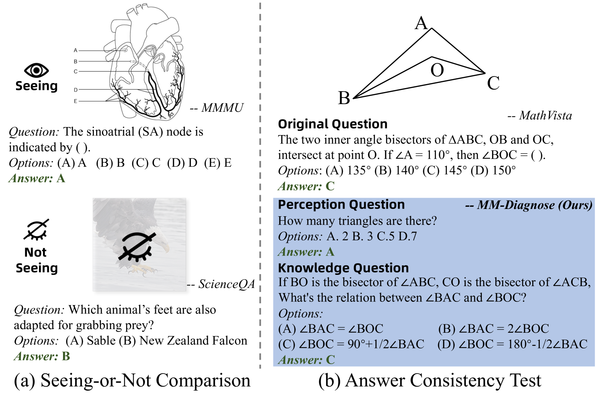

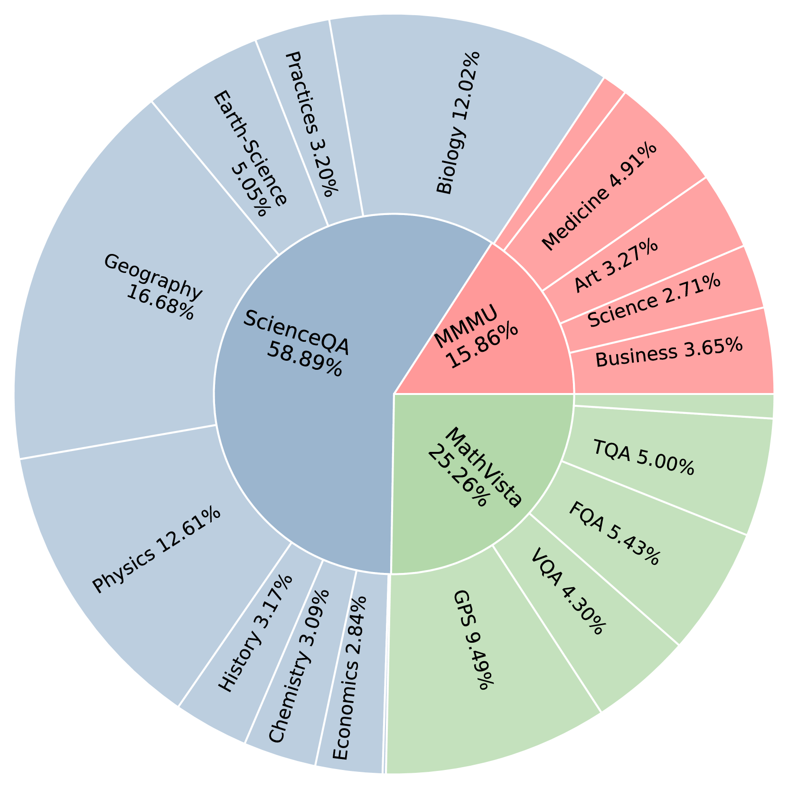

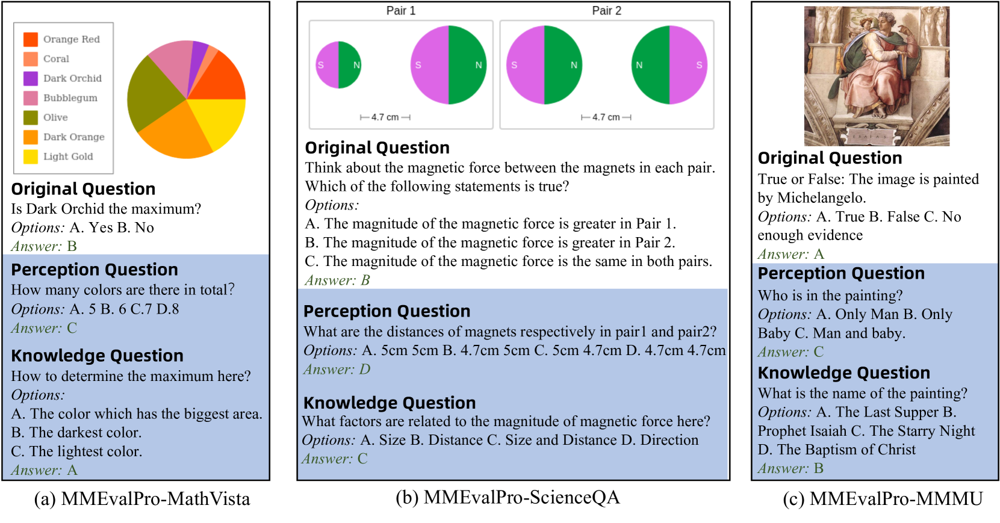

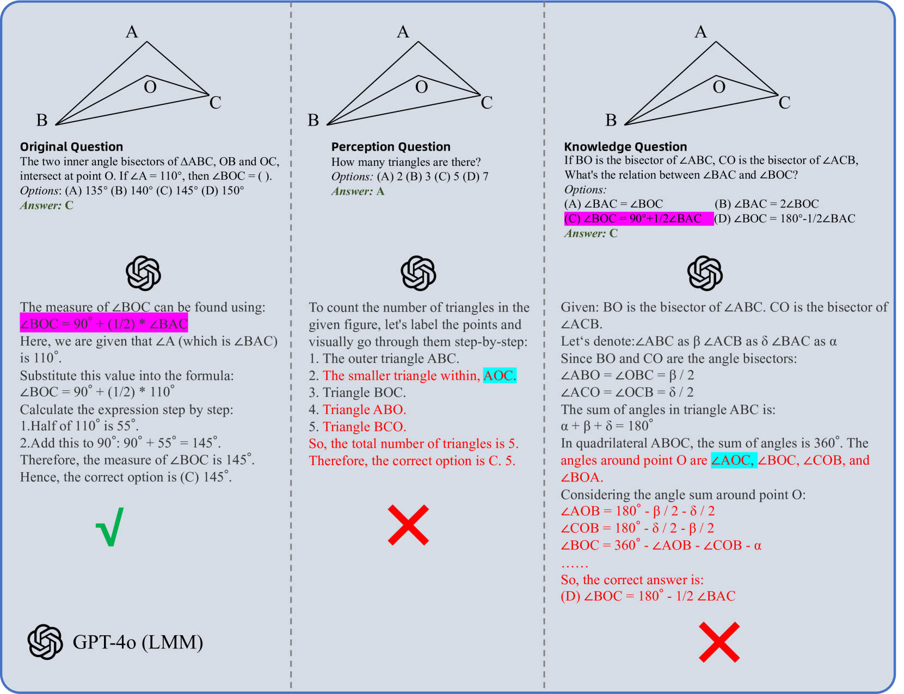

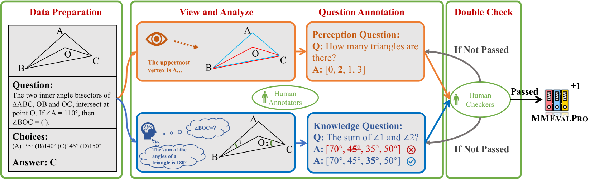

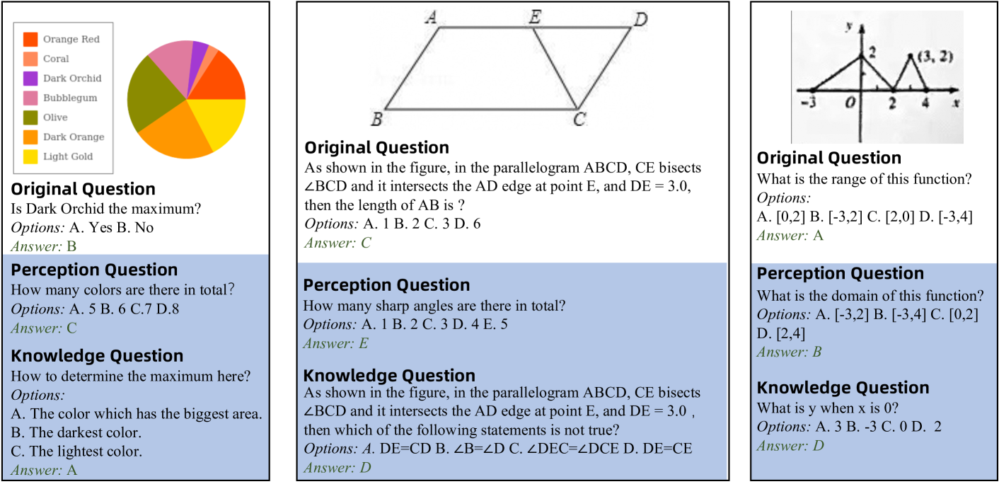

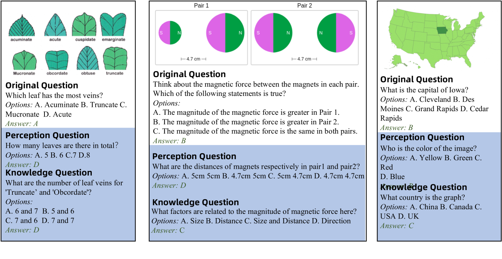

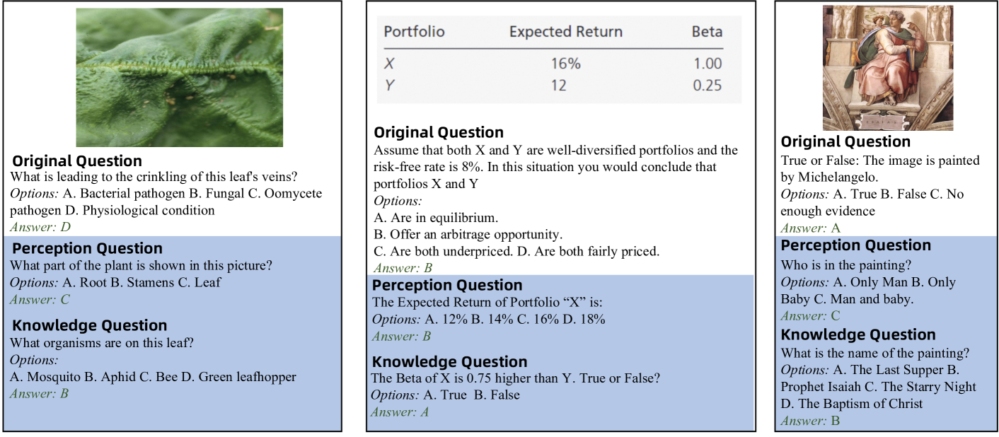

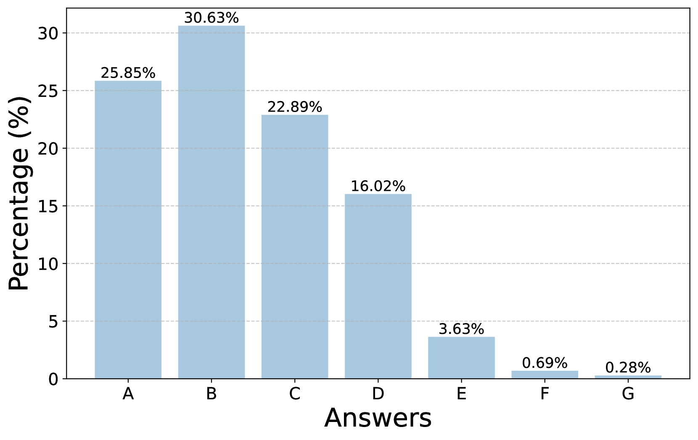

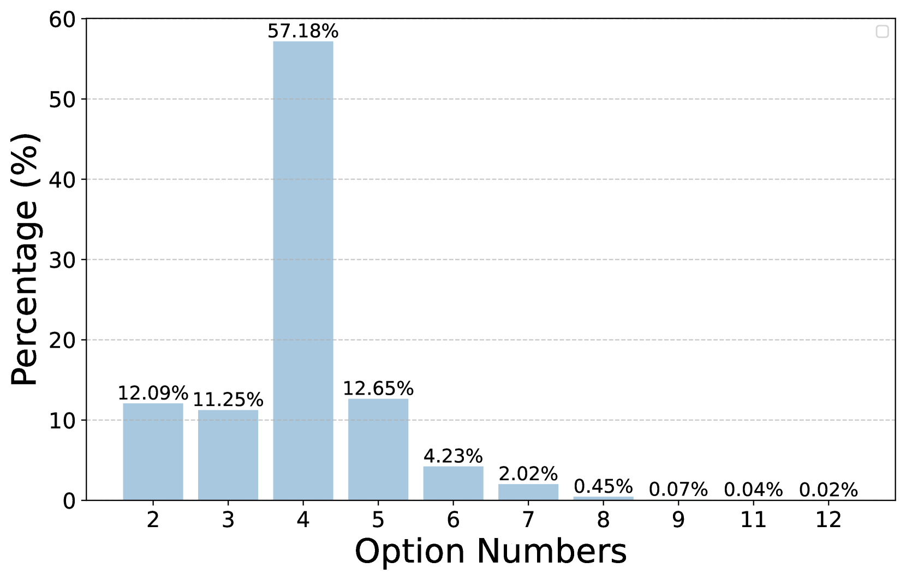

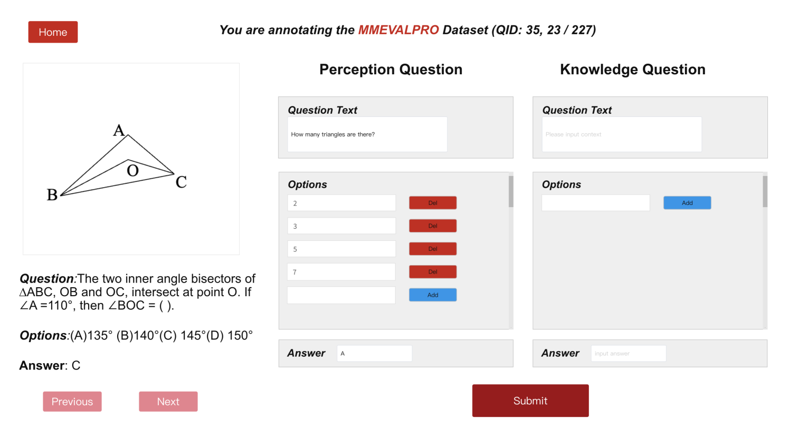

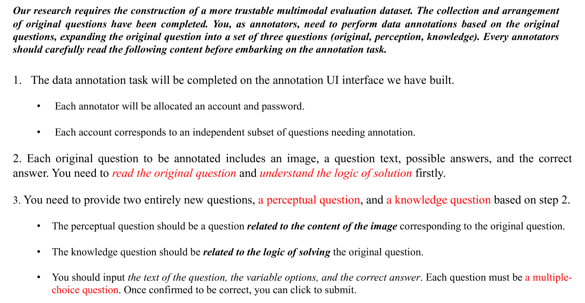

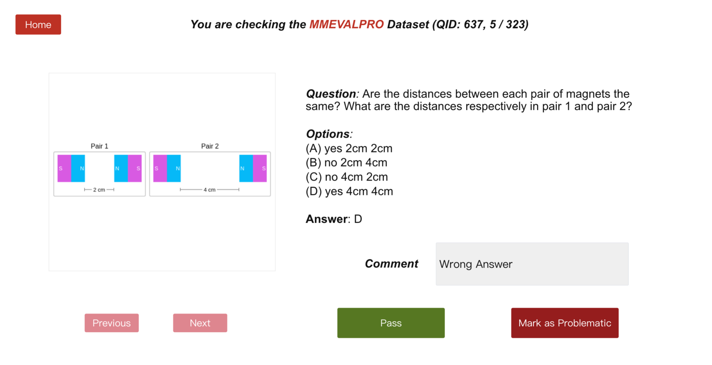

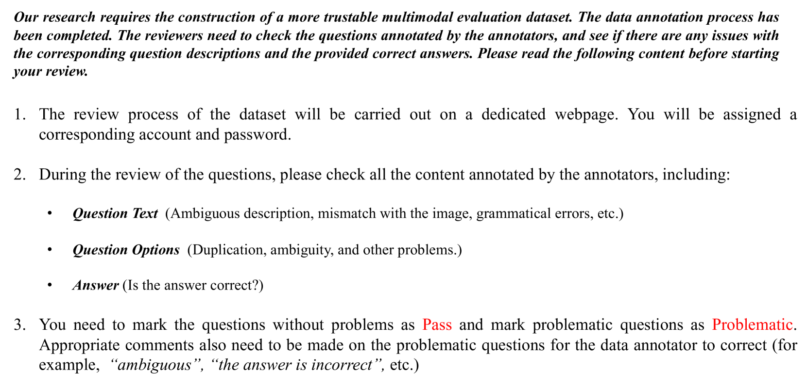

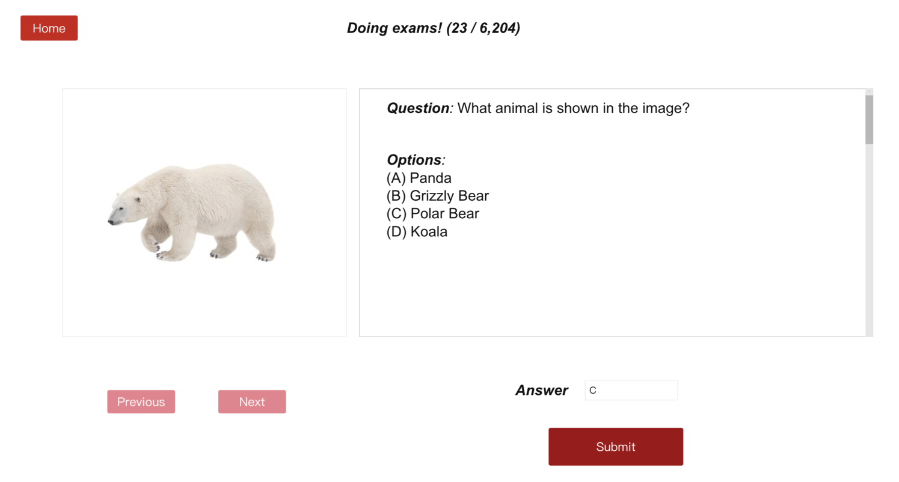

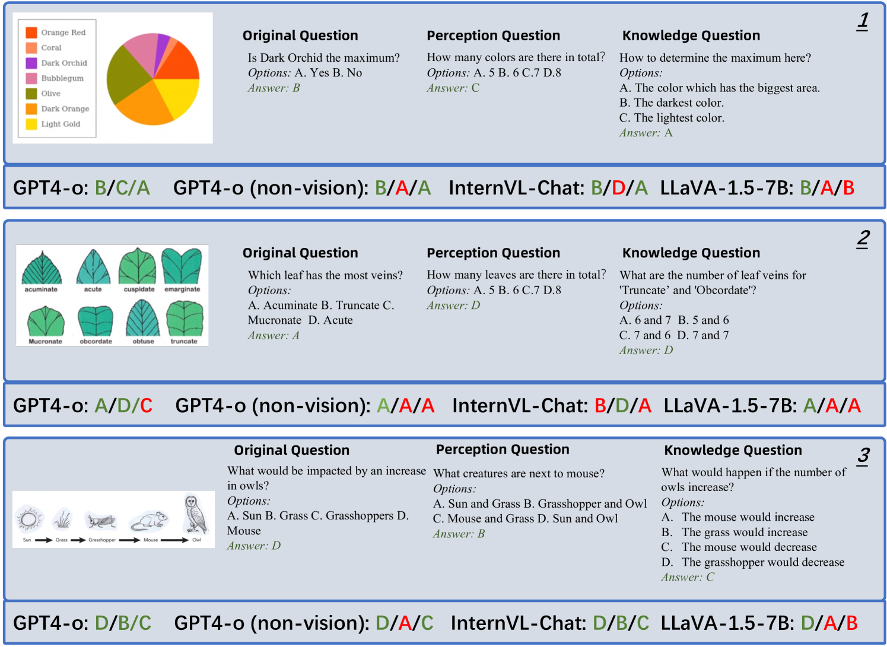

[Arxiv](https://arxiv.org/abs/2407.00468)