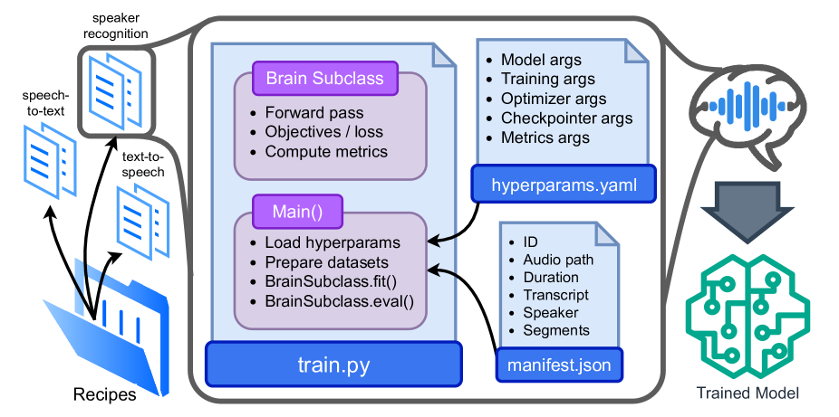

# 开源对话AI：SpeechBrain 1.0登场

发布时间：2024年06月29日

`Agent` `语音处理` `人工智能`

> Open-Source Conversational AI with SpeechBrain 1.0

# 摘要

> SpeechBrain，一款基于 PyTorch 的开源对话 AI 工具包，专注于语音处理领域，涵盖语音识别、增强、说话人识别及文本转语音等多项任务。它通过公开预训练模型及完整训练“配方”，增强了透明度与可复制性。本文聚焦 SpeechBrain 1.0，标志着工具包的重大进展，现提供超 200 种任务配方及 100 多个 Hugging Face 上的模型。新版本不仅支持多样化学习模式、LLM 集成与高级解码策略，还引入了创新模型与任务。此外，新增的基准库为跨任务模型评估提供了统一平台。

> SpeechBrain is an open-source Conversational AI toolkit based on PyTorch, focused particularly on speech processing tasks such as speech recognition, speech enhancement, speaker recognition, text-to-speech, and much more.It promotes transparency and replicability by releasing both the pre-trained models and the complete "recipes" of code and algorithms required for training them. This paper presents SpeechBrain 1.0, a significant milestone in the evolution of the toolkit, which now has over 200 recipes for speech, audio, and language processing tasks, and more than 100 models available on Hugging Face. SpeechBrain 1.0 introduces new technologies to support diverse learning modalities, Large Language Model (LLM) integration, and advanced decoding strategies, along with novel models, tasks, and modalities. It also includes a new benchmark repository, offering researchers a unified platform for evaluating models across diverse tasks.

[Arxiv](https://arxiv.org/abs/2407.00463)