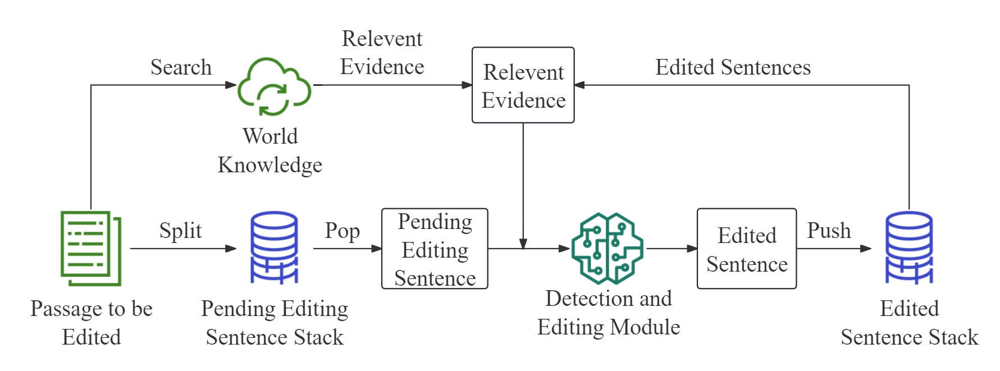
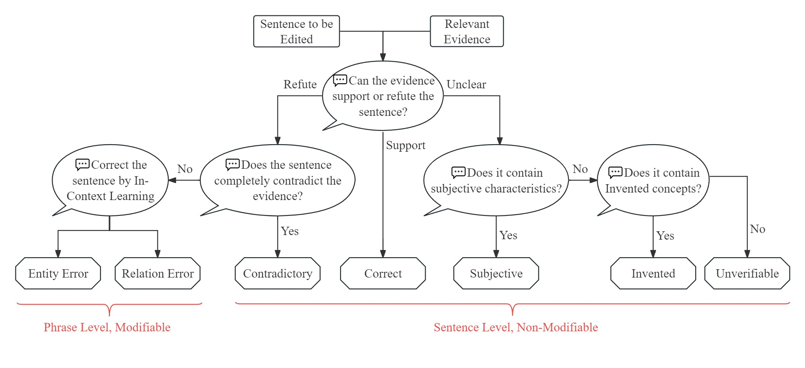
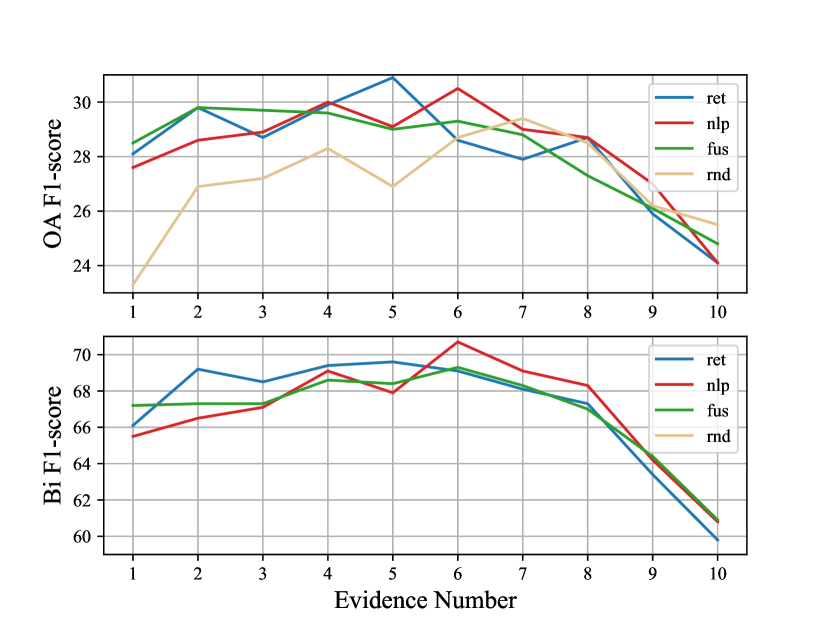

# PFME：一种模块化方法，专为大型语言模型的细粒度幻觉检测与编辑设计。

发布时间：2024年06月29日

`LLM应用` `人工智能`

> PFME: A Modular Approach for Fine-grained Hallucination Detection and Editing of Large Language Models

# 摘要

> 大型语言模型 (LLM) 虽然流畅，但易产生“幻觉”——不准确的内容。本文提出了一套标准化流程，用于细粒度幻觉类型的分类，并创新性地设计了渐进式细粒度模型编辑器 (PFME)，旨在检测和修正 LLM 中的细粒度幻觉。PFME 由两个协同工作的模块组成：实时事实检索模块和细粒度幻觉检测与编辑模块。前者负责识别文档中的关键实体，并从可信来源获取最新事实证据；后者则将文档分解为句子级文本，依据相关证据和已编辑的上下文，精准识别、定位并修正每句中的幻觉。实验显示，PFME 在细粒度幻觉检测方面超越了现有技术，尤其是在 Llama3-8B-Instruct 模型辅助下，其性能较 ChatGPT 提升了 8.7 个百分点。此外，在编辑任务中，PFME 显著提高了 FActScore-Alpaca13B 和 FActScore-ChatGPT 数据集的 FActScore，分别增长了 16.2pp 和 4.6pp。

> Large Language Models (LLMs) excel in fluency but risk producing inaccurate content, called "hallucinations." This paper outlines a standardized process for categorizing fine-grained hallucination types and proposes an innovative framework--the Progressive Fine-grained Model Editor (PFME)--specifically designed to detect and correct fine-grained hallucinations in LLMs. PFME consists of two collaborative modules: the Real-time Fact Retrieval Module and the Fine-grained Hallucination Detection and Editing Module. The former identifies key entities in the document and retrieves the latest factual evidence from credible sources. The latter further segments the document into sentence-level text and, based on relevant evidence and previously edited context, identifies, locates, and edits each sentence's hallucination type. Experimental results on FavaBench and FActScore demonstrate that PFME outperforms existing methods in fine-grained hallucination detection tasks. Particularly, when using the Llama3-8B-Instruct model, PFME's performance in fine-grained hallucination detection with external knowledge assistance improves by 8.7 percentage points (pp) compared to ChatGPT. In editing tasks, PFME further enhances the FActScore of FActScore-Alpaca13B and FActScore-ChatGPT datasets, increasing by 16.2pp and 4.6pp, respectively.

[Arxiv](https://arxiv.org/abs/2407.00488)