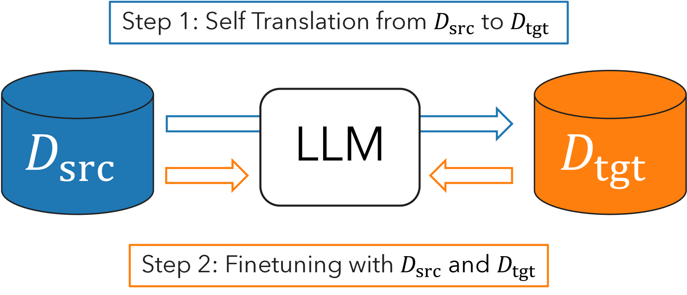
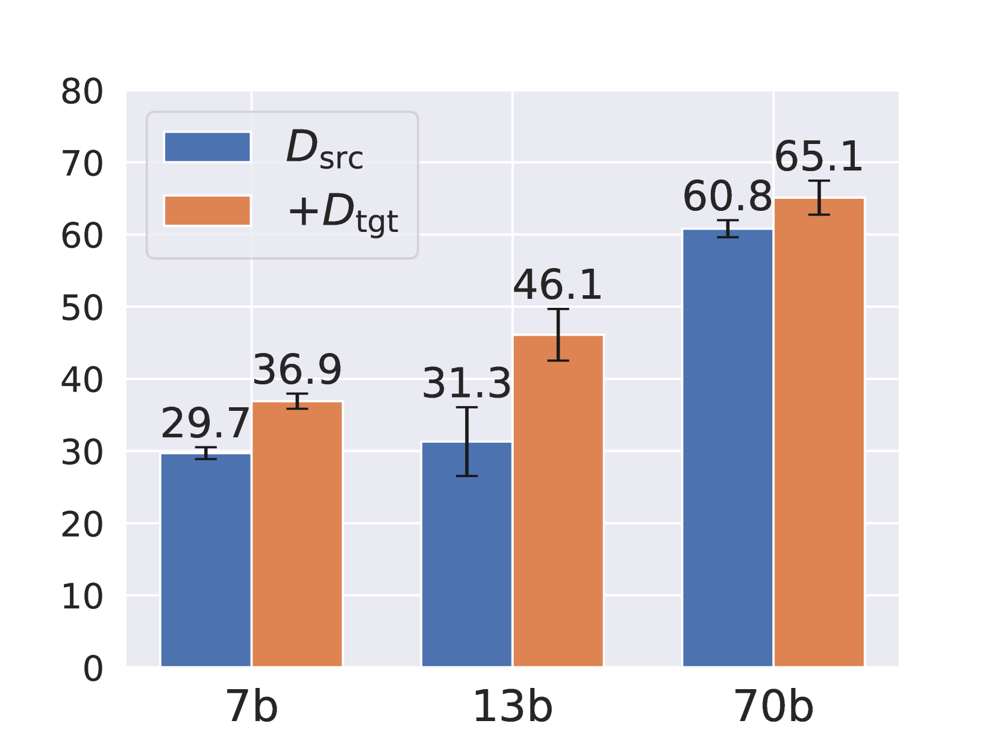
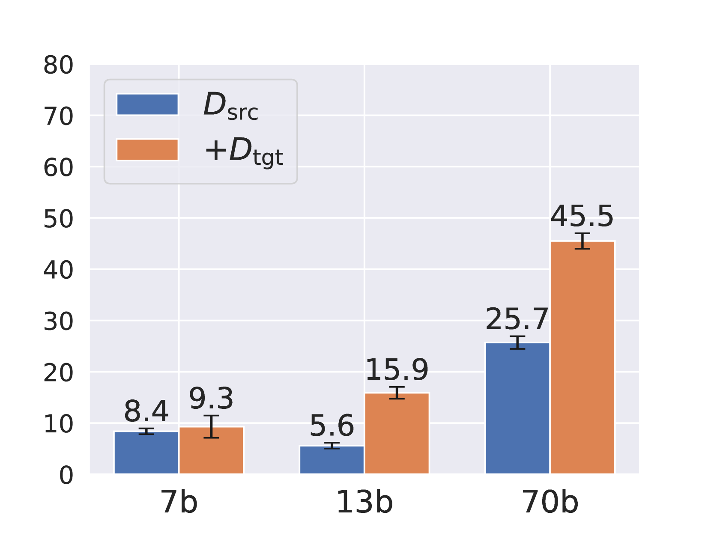

# 自译训练：一种简洁而高效的基线方法，专为大型语言模型的跨语言迁移设计。

发布时间：2024年06月29日

`LLM应用` `语言技术` `机器翻译`

> Self-Translate-Train: A Simple but Strong Baseline for Cross-lingual Transfer of Large Language Models

# 摘要

> 跨语言迁移技术前景广阔，但现有方法常依赖外部翻译系统或因过度依赖多语言模型的跨语言泛化而表现不佳。本研究提出了一种简便高效的方法——自翻译训练，该方法利用大型语言模型的翻译能力生成目标语言的合成训练数据，并以此数据微调模型。实验结果显示，该方法在多种非英语语言任务上取得了显著的性能提升。

> Cross-lingual transfer is a promising technique for utilizing data in a source language to improve performance in a target language. However, current techniques often require an external translation system or suffer from suboptimal performance due to over-reliance on cross-lingual generalization of multi-lingual pretrained language models. In this study, we propose a simple yet effective method called Self-Translate-Train. It leverages the translation capability of a large language model to generate synthetic training data in the target language and fine-tunes the model with its own generated data. We evaluate the proposed method on a wide range of tasks and show substantial performance gains across several non-English languages.

[Arxiv](https://arxiv.org/abs/2407.00454)