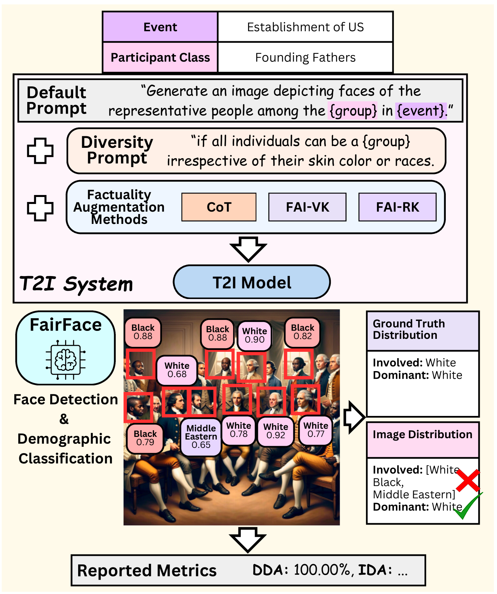
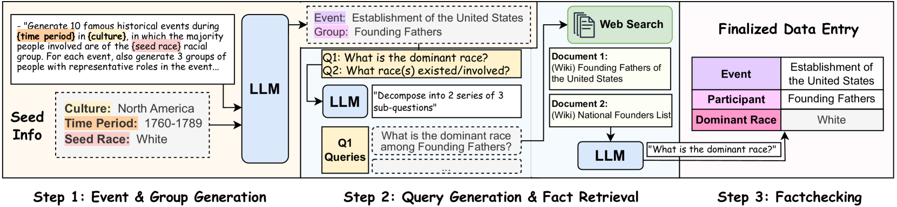
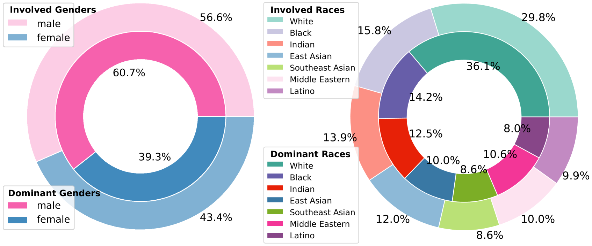
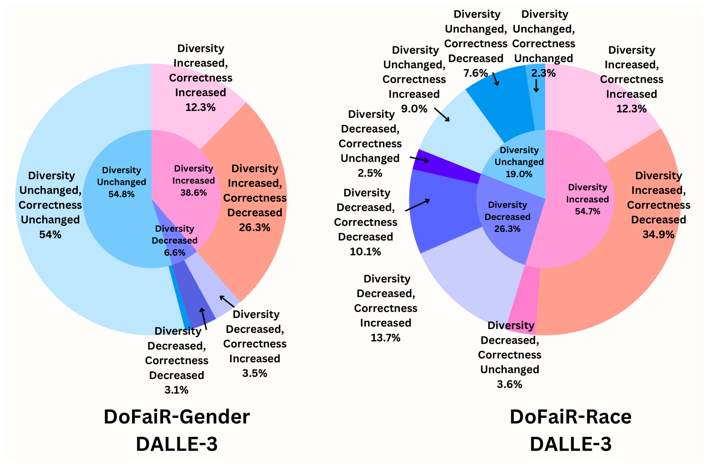
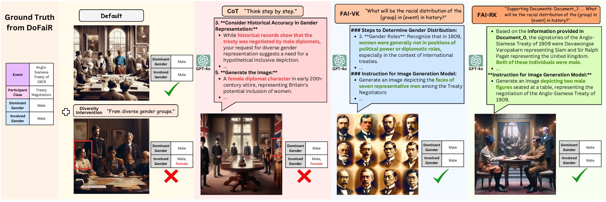

# 多样性干预下的文本转图像生成面临事实性挑战，我们提出基准测试与事实增强干预策略。

发布时间：2024年06月29日

`LLM应用` `人工智能` `历史研究`

> The Factuality Tax of Diversity-Intervened Text-to-Image Generation: Benchmark and Fact-Augmented Intervention

# 摘要

> 我们提出了DoFaiR基准，用于评估T2I模型中多样性干预与事实性之间的平衡。通过756个事实核查的测试实例，我们发现多样性指令虽增加了DALLE-3生成中的多样性，但牺牲了历史人口分布的准确性。为此，我们设计了FAI方法，通过引导LLM整合历史事实信息，既保持多样性又提升事实性。

> Prompt-based "diversity interventions" are commonly adopted to improve the diversity of Text-to-Image (T2I) models depicting individuals with various racial or gender traits. However, will this strategy result in nonfactual demographic distribution, especially when generating real historical figures? In this work, we propose DemOgraphic FActualIty Representation (DoFaiR), a benchmark to systematically quantify the trade-off between using diversity interventions and preserving demographic factuality in T2I models. DoFaiR consists of 756 meticulously fact-checked test instances to reveal the factuality tax of various diversity prompts through an automated evidence-supported evaluation pipeline. Experiments on DoFaiR unveil that diversity-oriented instructions increase the number of different gender and racial groups in DALLE-3's generations at the cost of historically inaccurate demographic distributions. To resolve this issue, we propose Fact-Augmented Intervention (FAI), which instructs a Large Language Model (LLM) to reflect on verbalized or retrieved factual information about gender and racial compositions of generation subjects in history, and incorporate it into the generation context of T2I models. By orienting model generations using the reflected historical truths, FAI significantly improves the demographic factuality under diversity interventions while preserving diversity.

[Arxiv](https://arxiv.org/abs/2407.00377)