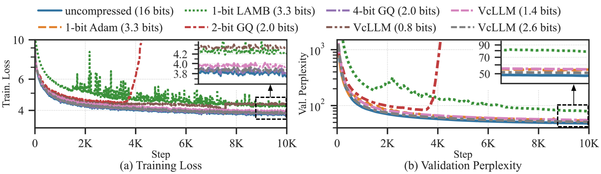

# VcLLM：视频编解码器，实为隐秘的张量编解码器

发布时间：2024年06月29日

`LLM理论` `计算机科学` `人工智能`

> VcLLM: Video Codecs are Secretly Tensor Codecs

# 摘要

> 随着 LLM 参数规模的不断增长，大量内存和高带宽的需求已成为其训练与推理的瓶颈。为此，我们探索了张量压缩技术，发现视频编解码器在张量压缩方面表现出色。我们展示了视频编解码器不仅多用途，还能在各类任务中实现顶尖的压缩效率。借助 GPU 上的硬件编解码模块，我们构建了一个框架，将视频编解码器用作张量编解码器，从而显著降低了对内存和带宽的需求，使得大型模型的训练与推理在消费级 GPU 上成为现实。

> As the parameter size of large language models (LLMs) continues to expand, the need for a large memory footprint and high communication bandwidth have become significant bottlenecks for the training and inference of LLMs. To mitigate these bottlenecks, various tensor compression techniques have been proposed to reduce the data size, thereby alleviating memory requirements and communication pressure.
  Our research found that video codecs, despite being originally designed for compressing videos, show excellent efficiency when compressing various types of tensors. We demonstrate that video codecs can be versatile and general-purpose tensor codecs while achieving the state-of-the-art compression efficiency in various tasks. We further make use of the hardware video encoding and decoding module available on GPUs to create a framework capable of both inference and training with video codecs repurposed as tensor codecs. This greatly reduces the requirement for memory capacity and communication bandwidth, enabling training and inference of large models on consumer-grade GPUs.

[Arxiv](https://arxiv.org/abs/2407.00467)