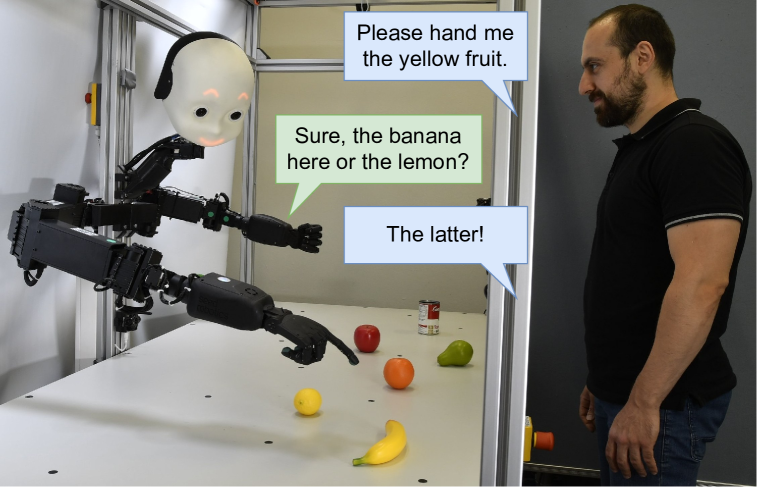
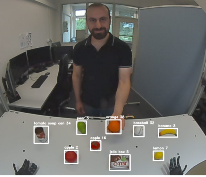
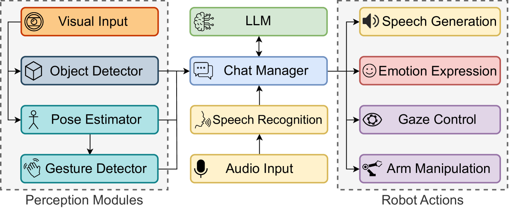

# 机器人开口说话时：构建多模态人机对话与协作的基石

发布时间：2024年06月29日

`LLM应用` `机器人` `人工智能`

> When Robots Get Chatty: Grounding Multimodal Human-Robot Conversation and Collaboration

# 摘要

> 我们探索如何利用大型语言模型 (LLM) 赋予机器人类人的社交与认知能力，以实现开放式的人机对话与协作。为此，我们提出了一种模块化且可扩展的方法，将 LLM 与机器人的感知及功能相结合，并在系统架构中整合了多种深度学习模型。这些集成模型涵盖了语音识别、语音生成、物体检测、人体姿态估计及手势识别等功能，而 LLM 则作为核心的文本协调单元。实证研究表明，LLM 在自然且社交的交互中，为机器人提供了创新的认知能力与语言控制，展现出巨大的应用潜力。

> We investigate the use of Large Language Models (LLMs) to equip neural robotic agents with human-like social and cognitive competencies, for the purpose of open-ended human-robot conversation and collaboration. We introduce a modular and extensible methodology for grounding an LLM with the sensory perceptions and capabilities of a physical robot, and integrate multiple deep learning models throughout the architecture in a form of system integration. The integrated models encompass various functions such as speech recognition, speech generation, open-vocabulary object detection, human pose estimation, and gesture detection, with the LLM serving as the central text-based coordinating unit. The qualitative and quantitative results demonstrate the huge potential of LLMs in providing emergent cognition and interactive language-oriented control of robots in a natural and social manner.

[Arxiv](https://arxiv.org/abs/2407.00518)