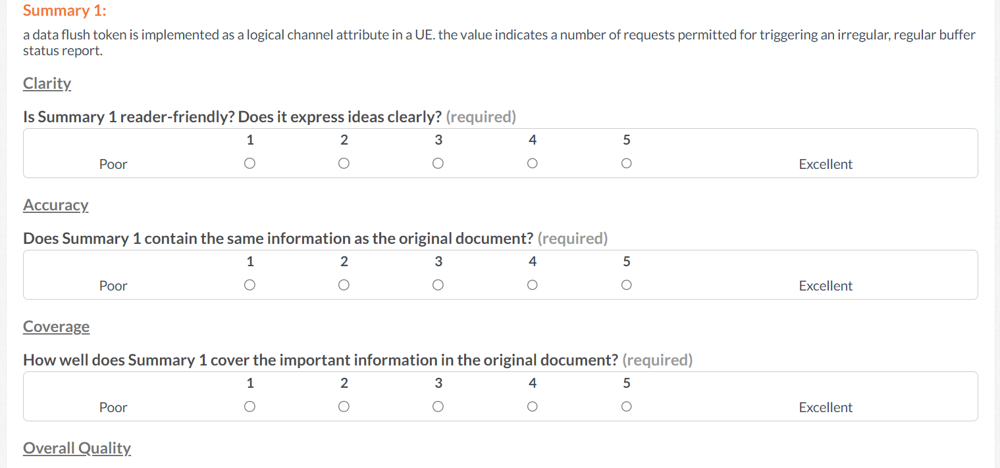

# 文本摘要质量评估方法比较研究

发布时间：2024年06月30日

`LLM应用` `文本摘要`

> A Comparative Study of Quality Evaluation Methods for Text Summarization

# 摘要

> 在 NLP 领域，评估文本摘要一直是个难题。依赖参考摘要的自动指标常不适用，而人工评估成本高昂。为此，我们提出了一种基于 LLM 的新方法。通过对比八种自动指标、人工评估及我们的 LLM 方法，我们评估了七种 SOTA 摘要模型。实验表明，LLM 评估与人工评估高度吻合，而常用自动指标如 ROUGE-2、BERTScore 和 SummaC 则表现不佳。基于这些发现，我们设计了一个 LLM 驱动的框架，旨在自动评估和提升文本摘要质量，预计将受到社区的广泛关注。

> Evaluating text summarization has been a challenging task in natural language processing (NLP). Automatic metrics which heavily rely on reference summaries are not suitable in many situations, while human evaluation is time-consuming and labor-intensive. To bridge this gap, this paper proposes a novel method based on large language models (LLMs) for evaluating text summarization. We also conducts a comparative study on eight automatic metrics, human evaluation, and our proposed LLM-based method. Seven different types of state-of-the-art (SOTA) summarization models were evaluated. We perform extensive experiments and analysis on datasets with patent documents. Our results show that LLMs evaluation aligns closely with human evaluation, while widely-used automatic metrics such as ROUGE-2, BERTScore, and SummaC do not and also lack consistency. Based on the empirical comparison, we propose a LLM-powered framework for automatically evaluating and improving text summarization, which is beneficial and could attract wide attention among the community.

[Arxiv](https://arxiv.org/abs/2407.00747)