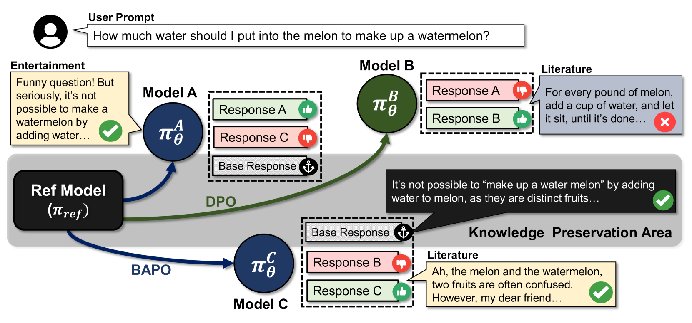

# BAPO：大型语言模型中个性化对齐的基础锚定偏好优化方法

发布时间：2024年06月30日

`LLM理论` `人工智能` `个性化服务`

> BAPO: Base-Anchored Preference Optimization for Personalized Alignment in Large Language Models

# 摘要

> 尽管将大型语言模型与人类偏好对齐已取得显著成效，但在满足多样化用户偏好的同时保留先前知识仍面临挑战。本文探讨了个性化偏好优化对 LLM 的影响，发现知识损失与偏好多样性密切相关。虽然现有方法通过 KL 约束来维持模型一致性，但在个性化偏好面前，这些方法难以保持知识与对齐的平衡。为此，我们提出了 Base-Anchored Preference Optimization (BAPO)，一种简便高效的方法，通过利用参考模型的初始响应，既减轻遗忘又适应个性化对齐。BAPO 在适应用户多样偏好的同时，对全局知识或对齐的影响微乎其微。实验结果显示，BAPO 在多种场景下均表现出色。

> While learning to align Large Language Models (LLMs) with human preferences has shown remarkable success, aligning these models to meet the diverse user preferences presents further challenges in preserving previous knowledge. This paper examines the impact of personalized preference optimization on LLMs, revealing that the extent of knowledge loss varies significantly with preference heterogeneity. Although previous approaches have utilized the KL constraint between the reference model and the policy model, we observe that they fail to maintain general knowledge and alignment when facing personalized preferences. To this end, we introduce Base-Anchored Preference Optimization (BAPO), a simple yet effective approach that utilizes the initial responses of reference model to mitigate forgetting while accommodating personalized alignment. BAPO effectively adapts to diverse user preferences while minimally affecting global knowledge or general alignment. Our experiments demonstrate the efficacy of BAPO in various setups.

[Arxiv](https://arxiv.org/abs/2407.00693)