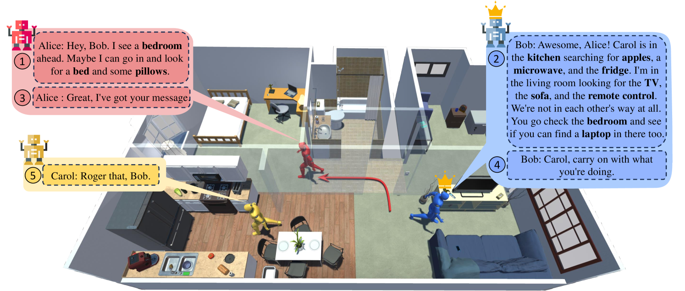

# CAMON：多对象导航中基于 LLM 对话的合作代理

发布时间：2024年06月30日

`Agent` `机器人` `智能家居`

> CAMON: Cooperative Agents for Multi-Object Navigation with LLM-based Conversations

# 摘要

> 家用服务机器人的视觉导航任务至关重要，随着任务复杂性增加，多机器人间的有效沟通与协作变得不可或缺。尽管大型语言模型（LLM）在实体代理中展现出卓越的理解与规划能力，但其在家庭环境中，特别是多代理通过协作完成复杂导航任务的应用，仍属未知领域。为此，本文提出一种基于LLM的分散式多代理导航框架，通过创新沟通触发动态领导结构，实现快速团队共识与高效沟通，显著提升导航与协作效率。该框架采用的新型沟通方案，确保在多对象导航任务中无冲突且稳定，即便团队规模扩大亦能保持性能。

> Visual navigation tasks are critical for household service robots. As these tasks become increasingly complex, effective communication and collaboration among multiple robots become imperative to ensure successful completion. In recent years, large language models (LLMs) have exhibited remarkable comprehension and planning abilities in the context of embodied agents. However, their application in household scenarios, specifically in the use of multiple agents collaborating to complete complex navigation tasks through communication, remains unexplored. Therefore, this paper proposes a framework for decentralized multi-agent navigation, leveraging LLM-enabled communication and collaboration. By designing the communication-triggered dynamic leadership organization structure, we achieve faster team consensus with fewer communication instances, leading to better navigation effectiveness and collaborative exploration efficiency. With the proposed novel communication scheme, our framework promises to be conflict-free and robust in multi-object navigation tasks, even when there is a surge in team size.

[Arxiv](https://arxiv.org/abs/2407.00632)