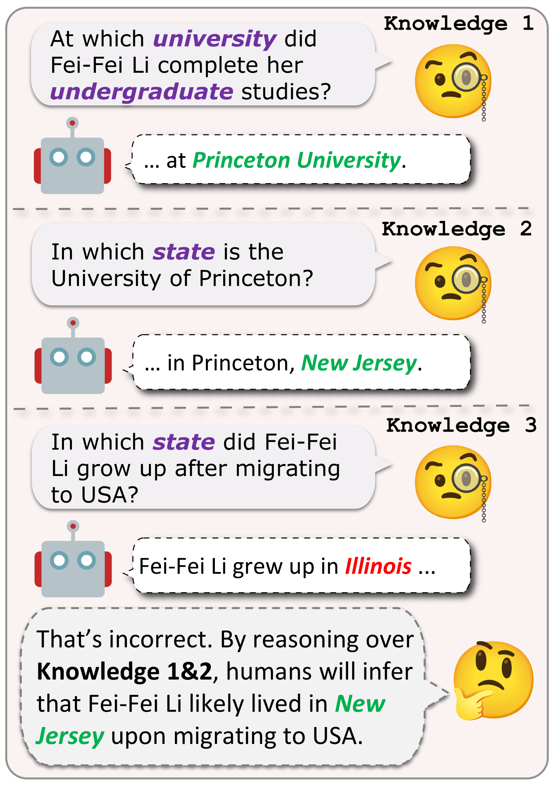
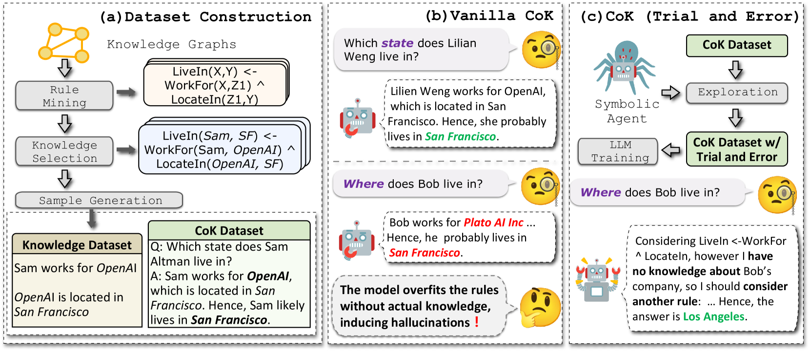

# 知识链：借助知识图谱的学习，将知识推理融入大型语言模型，实现更深层次的智能整合。

发布时间：2024年06月30日

`LLM应用` `知识图谱`

> Chain-of-Knowledge: Integrating Knowledge Reasoning into Large Language Models by Learning from Knowledge Graphs

# 摘要

> 大型语言模型 (LLM) 在复杂的自然语言处理任务中表现卓越，尤其是在知识推理方面。尽管知识图谱 (KGs) 中的知识推理研究已相当成熟，但 LLM 中的这一领域仍有待深入探索。本文提出的 Chain-of-Knowledge 框架，不仅涵盖了数据集构建，还包括了创新的模型学习方法。我们通过规则挖掘在 KGs 上构建了 KnowReason 数据集，并针对模型学习中的过拟合问题，引入了模拟人类探索过程的试错机制，以提升 CoK 的性能。实验结果表明，CoK 不仅能提升 LLM 在知识推理上的表现，还能在一般推理任务中取得优异成绩。

> Large Language Models (LLMs) have exhibited impressive proficiency in various natural language processing (NLP) tasks, which involve increasingly complex reasoning. Knowledge reasoning, a primary type of reasoning, aims at deriving new knowledge from existing one.While it has been widely studied in the context of knowledge graphs (KGs), knowledge reasoning in LLMs remains underexplored. In this paper, we introduce Chain-of-Knowledge, a comprehensive framework for knowledge reasoning, including methodologies for both dataset construction and model learning. For dataset construction, we create KnowReason via rule mining on KGs. For model learning, we observe rule overfitting induced by naive training. Hence, we enhance CoK with a trial-and-error mechanism that simulates the human process of internal knowledge exploration. We conduct extensive experiments with KnowReason. Our results show the effectiveness of CoK in refining LLMs in not only knowledge reasoning, but also general reasoning benchmarkms.

[Arxiv](https://arxiv.org/abs/2407.00653)