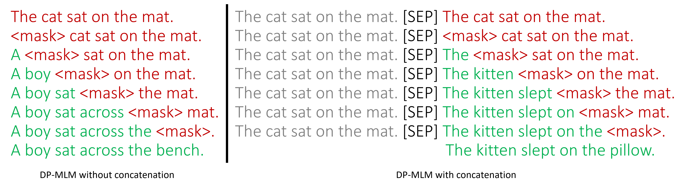
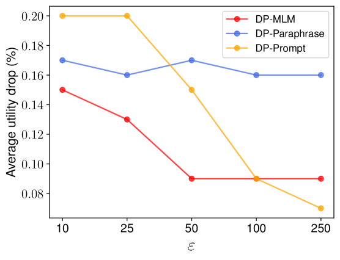

# DP-MLM：运用掩码语言模型实现差分隐私的文本改写

发布时间：2024年06月30日

`LLM应用` `网络安全` `数据隐私`

> DP-MLM: Differentially Private Text Rewriting Using Masked Language Models

# 摘要

> 近期，文本隐私化任务采用了$\textit{文本重写}$的形式，通过生成（大型）语言模型对输入文本进行混淆。虽然这些方法在隐私保护方面表现出色，但它们依赖的自回归模型缺乏上下文化重写过程的机制。为此，我们提出了$\textbf{DP-MLM}$，一种基于掩码语言模型（MLMs）的新方法，以语义相似且混淆的方式重写文本。我们采用逐标记重写的简单技术，发现与依赖大型解码器模型的方法相比，仅编码器的MLMs在低$\varepsilon$水平下效用保持更佳。此外，MLMs允许更灵活的重写机制定制。我们公开了$\textbf{DP-MLM}$的代码，可在https://github.com/sjmeis/DPMLM获取。

> The task of text privatization using Differential Privacy has recently taken the form of $\textit{text rewriting}$, in which an input text is obfuscated via the use of generative (large) language models. While these methods have shown promising results in the ability to preserve privacy, these methods rely on autoregressive models which lack a mechanism to contextualize the private rewriting process. In response to this, we propose $\textbf{DP-MLM}$, a new method for differentially private text rewriting based on leveraging masked language models (MLMs) to rewrite text in a semantically similar $\textit{and}$ obfuscated manner. We accomplish this with a simple contextualization technique, whereby we rewrite a text one token at a time. We find that utilizing encoder-only MLMs provides better utility preservation at lower $\varepsilon$ levels, as compared to previous methods relying on larger models with a decoder. In addition, MLMs allow for greater customization of the rewriting mechanism, as opposed to generative approaches. We make the code for $\textbf{DP-MLM}$ public and reusable, found at https://github.com/sjmeis/DPMLM .

[Arxiv](https://arxiv.org/abs/2407.00637)