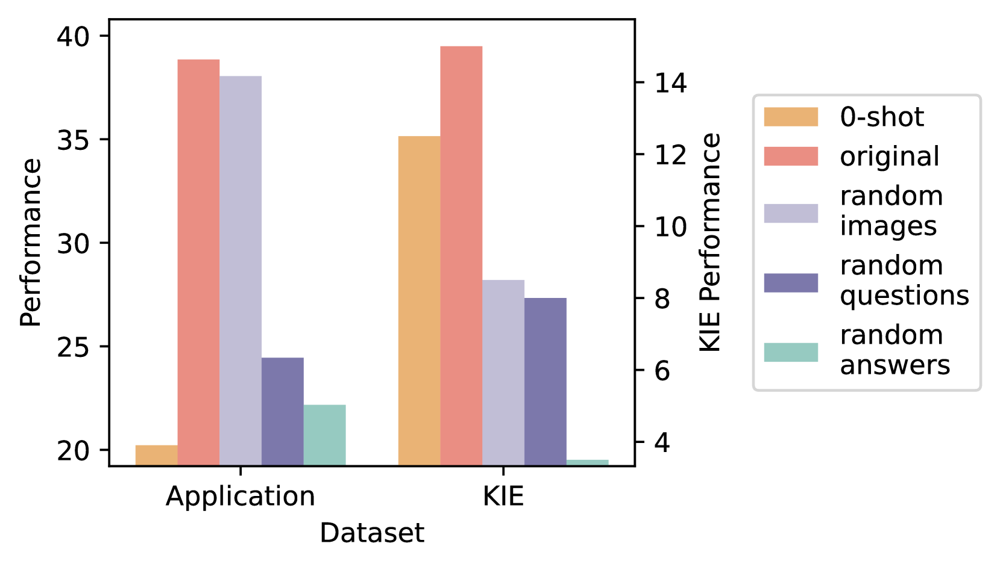

# 从内省到实践精华：探究多模态情境学习中演示的系统性分析

发布时间：2024年06月30日

`LLM应用` `人工智能` `计算机视觉`

> From Introspection to Best Practices: Principled Analysis of Demonstrations in Multimodal In-Context Learning

# 摘要

> 受 LLM 的 ICL 能力启发，多模态 LLM 在提供图像-文本对演示时也展现出类似 ICL 能力。然而，关于多模态 ICL 的工作原理研究较少。我们系统评估了不同规模模型在新颖关键任务上的多模态 ICL 表现。通过模态信息扰动，我们发现模态在不同任务中的重要性各异。基于此，我们采用模态驱动策略提升 ICL 性能，并发现演示选择与模型捕捉任务偏差的能力紧密相关。我们的分析全面揭示了演示在多模态 ICL 中的作用，为改进多模态 ICL 提供了有效途径，即使面对预训练数据中未见或矛盾的任务。

> Motivated by in-context learning (ICL) capabilities of Large Language models (LLMs), multimodal LLMs with additional visual modality are also exhibited with similar ICL abilities when multiple image-text pairs are provided as demonstrations. However, relatively less work has been done to investigate the principles behind how and why multimodal ICL works. We conduct a systematic and principled evaluation of multimodal ICL for models of different scales on a broad spectrum of new yet critical tasks. Through perturbations over different modality information, we show that modalities matter differently across tasks in multimodal ICL. Considering such modality impact, we further utilize modality-driven demonstration strategies to boost ICL performance. We also identify that demonstration selection is closely related to the models' ability to capture task inductive biases from multimodal ICL. Our principled analysis provides a comprehensive way of understanding the role of demonstrations in multimodal in-context learning, and sheds light on effectively improving multimodal ICL on a wide range of tasks even if those tasks are not seen in or even contradict pretraining data.

[Arxiv](https://arxiv.org/abs/2407.00902)