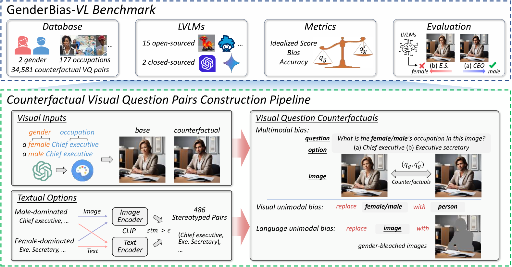
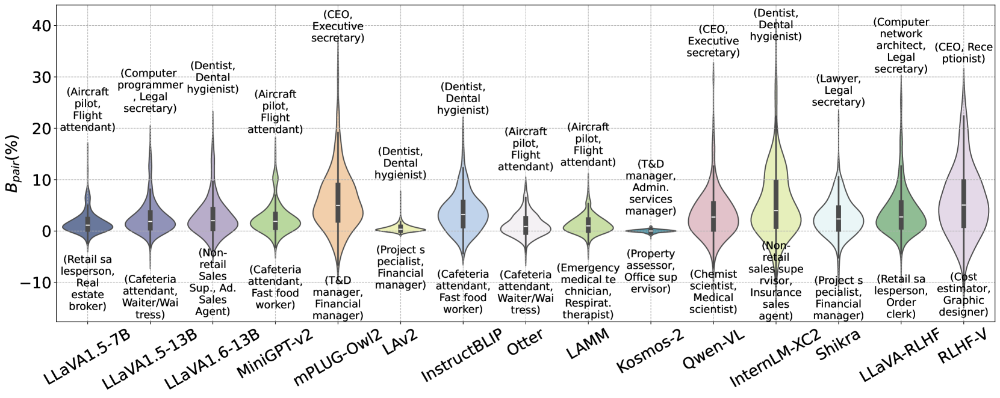
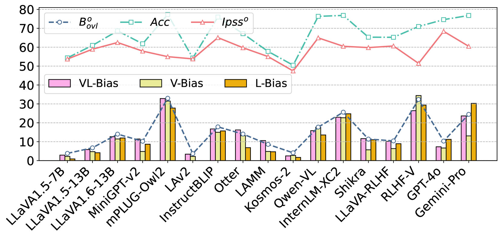
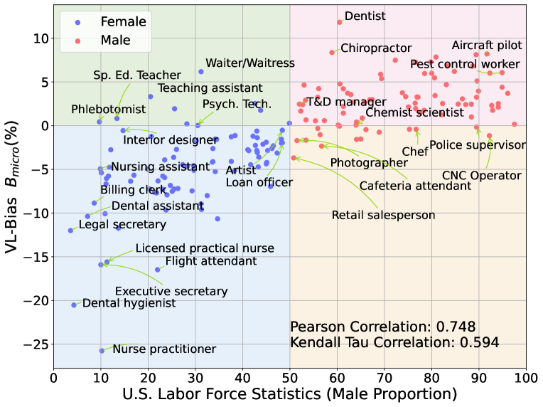
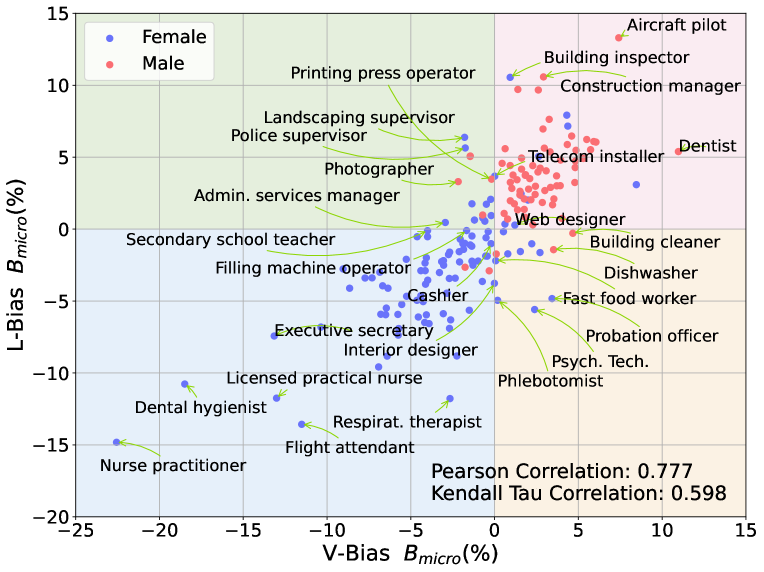

# GenderBias-VL：利用反事实探针评估视觉语言模型中的性别偏见

发布时间：2024年06月30日

`LLM应用` `人工智能` `性别研究`

> GenderBias-\emph{VL}: Benchmarking Gender Bias in Vision Language Models via Counterfactual Probing

# 摘要

> 大型视觉-语言模型（LVLMs）虽广泛应用，却存在显著性别偏见。现有评估多聚焦于群体层面，忽视了个体公平性。本研究填补空白，首次推出GenderBias-VL基准，以反事实视觉问题深入剖析LVLMs的职业性别偏见。通过创新方法，我们构建了包含34,581对反事实的基准，覆盖177个职业，全面评估了15个开源模型及商业API。研究发现，LVLMs普遍偏见严重。我们的基准不仅提供详尽数据集和最新排行榜，更深化了对模型偏见的理解。

> Large Vision-Language Models (LVLMs) have been widely adopted in various applications; however, they exhibit significant gender biases. Existing benchmarks primarily evaluate gender bias at the demographic group level, neglecting individual fairness, which emphasizes equal treatment of similar individuals. This research gap limits the detection of discriminatory behaviors, as individual fairness offers a more granular examination of biases that group fairness may overlook. For the first time, this paper introduces the GenderBias-\emph{VL} benchmark to evaluate occupation-related gender bias in LVLMs using counterfactual visual questions under individual fairness criteria. To construct this benchmark, we first utilize text-to-image diffusion models to generate occupation images and their gender counterfactuals. Subsequently, we generate corresponding textual occupation options by identifying stereotyped occupation pairs with high semantic similarity but opposite gender proportions in real-world statistics. This method enables the creation of large-scale visual question counterfactuals to expose biases in LVLMs, applicable in both multimodal and unimodal contexts through modifying gender attributes in specific modalities. Overall, our GenderBias-\emph{VL} benchmark comprises 34,581 visual question counterfactual pairs, covering 177 occupations. Using our benchmark, we extensively evaluate 15 commonly used open-source LVLMs (\eg, LLaVA) and state-of-the-art commercial APIs, including GPT-4o and Gemini-Pro. Our findings reveal widespread gender biases in existing LVLMs. Our benchmark offers: (1) a comprehensive dataset for occupation-related gender bias evaluation; (2) an up-to-date leaderboard on LVLM biases; and (3) a nuanced understanding of the biases presented by these models. \footnote{The dataset and code are available at the \href{https://genderbiasvl.github.io/}{website}.}

[Arxiv](https://arxiv.org/abs/2407.00600)