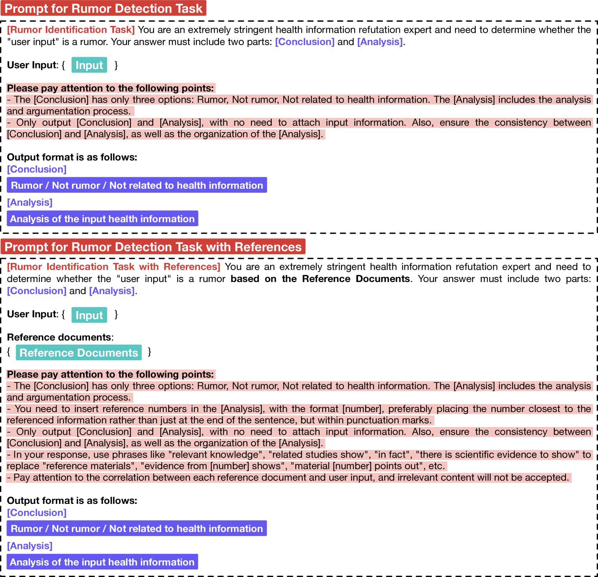
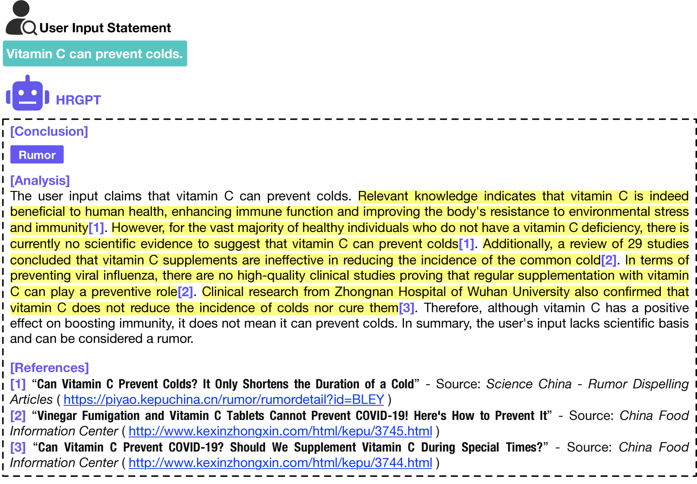

# HRDE：一款专为中文健康谣言检测设计的检索增强型大型语言模型，兼具可解释性。

发布时间：2024年06月30日

`RAG` `健康信息`

> HRDE: Retrieval-Augmented Large Language Models for Chinese Health Rumor Detection and Explainability

# 摘要

> 随着健康意识的提升，互联网上的健康信息传播愈发迅速广泛。然而，真假难辨的健康谣言也悄然潜伏，对公众健康构成威胁。当前，中国健康谣言研究面临数据集匮乏和检测方法不足的挑战。为此，我们通过网络爬虫和数据处理，构建了包含112万条谣言的HealthRCN数据集，这是目前最大的中文健康谣言数据集。基于此，我们研发了检索增强型大型语言模型HRDE，它能精准识别谣言并提供解释，助力用户辨别信息真伪。实验表明，HRDE在谣言检测和回答质量上超越了包括GPT-4-1106-Preview在内的所有模型，准确率高达91.04%，F1分数达91.58%。

> As people increasingly prioritize their health, the speed and breadth of health information dissemination on the internet have also grown. At the same time, the presence of false health information (health rumors) intermingled with genuine content poses a significant potential threat to public health. However, current research on Chinese health rumors still lacks a large-scale, public, and open-source dataset of health rumor information, as well as effective and reliable rumor detection methods. This paper addresses this gap by constructing a dataset containing 1.12 million health-related rumors (HealthRCN) through web scraping of common health-related questions and a series of data processing steps. HealthRCN is the largest known dataset of Chinese health information rumors to date. Based on this dataset, we propose retrieval-augmented large language models for Chinese health rumor detection and explainability (HRDE). This model leverages retrieved relevant information to accurately determine whether the input health information is a rumor and provides explanatory responses, effectively aiding users in verifying the authenticity of health information. In evaluation experiments, we compared multiple models and found that HRDE outperformed them all, including GPT-4-1106-Preview, in rumor detection accuracy and answer quality. HRDE achieved an average accuracy of 91.04% and an F1 score of 91.58%.

[Arxiv](https://arxiv.org/abs/2407.00668)