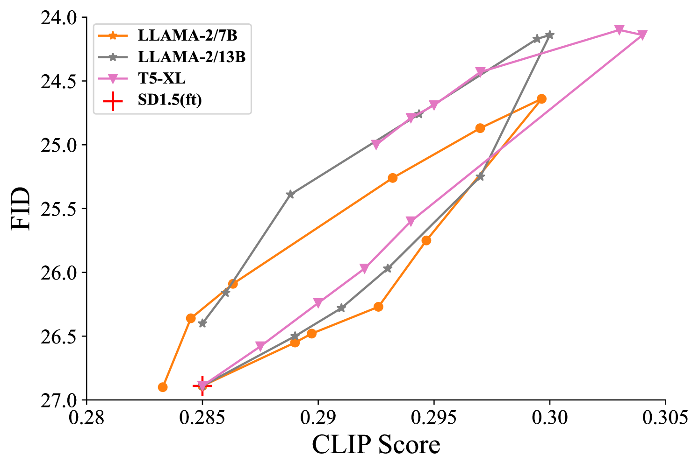

# LLM4GEN：借助 LLM 的语义表征实现文本至图像的生成

发布时间：2024年06月30日

`LLM应用` `图像生成` `人工智能`

> LLM4GEN: Leveraging Semantic Representation of LLMs for Text-to-Image Generation

# 摘要

> 扩散模型在文本到图像生成领域取得了显著成就，但在处理复杂密集的提示时仍面临挑战。为此，我们提出了 **LLM4GEN** 框架，通过结合大型语言模型的语义表示，显著提升了文本到图像扩散模型的语义理解能力。借助特制的交叉适配器模块 (CAM)，LLM4GEN 能无缝融入各类扩散模型，实现即插即用的增强效果。为深化对复杂提示的理解，我们构建了 LAION-refined 数据集，包含百万级改进描述的文本-图像对，并引入了 DensePrompts 以全面评估生成任务。实验显示，仅用 ELLA 所需训练数据的 10%，LLM4GEN 便大幅提升了 SD1.5 和 SDXL 的语义对齐，颜色表现分别提升 7.69% 和 9.60%。在 DensePrompts 上的广泛测试进一步证明，LLM4GEN 在样本质量、图像-文本对齐及人类评估方面均超越了现有顶尖模型。项目详情请访问：\textcolor{magenta}{\url{https://xiaobul.github.io/LLM4GEN/}}

> Diffusion Models have exhibited substantial success in text-to-image generation. However, they often encounter challenges when dealing with complex and dense prompts that involve multiple objects, attribute binding, and long descriptions. This paper proposes a framework called \textbf{LLM4GEN}, which enhances the semantic understanding ability of text-to-image diffusion models by leveraging the semantic representation of Large Language Models (LLMs). Through a specially designed Cross-Adapter Module (CAM) that combines the original text features of text-to-image models with LLM features, LLM4GEN can be easily incorporated into various diffusion models as a plug-and-play component and enhances text-to-image generation. Additionally, to facilitate the complex and dense prompts semantic understanding, we develop a LAION-refined dataset, consisting of 1 million (M) text-image pairs with improved image descriptions. We also introduce DensePrompts which contains 7,000 dense prompts to provide a comprehensive evaluation for the text-to-image generation task. With just 10\% of the training data required by recent ELLA, LLM4GEN significantly improves the semantic alignment of SD1.5 and SDXL, demonstrating increases of 7.69\% and 9.60\% in color on T2I-CompBench, respectively. The extensive experiments on DensePrompts also demonstrate that LLM4GEN surpasses existing state-of-the-art models in terms of sample quality, image-text alignment, and human evaluation. The project website is at: \textcolor{magenta}{\url{https://xiaobul.github.io/LLM4GEN/}}

[Arxiv](https://arxiv.org/abs/2407.00737)