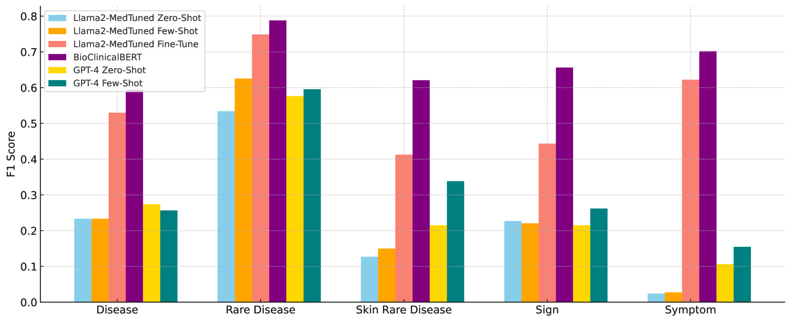

# 大型语言模型在处理标记级别的临床命名实体识别任务时显得力不从心。

发布时间：2024年06月30日

`LLM应用` `信息学`

> Large Language Models Struggle in Token-Level Clinical Named Entity Recognition

# 摘要

> 大型语言模型（LLM）在医疗保健等领域的革新尤为显著，尤其是在罕见疾病的数据稀缺、复杂性和特异性挑战下。临床领域的命名实体识别（NER）是提取临床文本信息的关键任务。尽管LLM潜力巨大，但研究多聚焦于文档级NER，忽略了实体的精确位置。此外，ChatGPT在令牌级NER的适应性也受到关注。然而，本地开源LLM在临床文本令牌级NER的应用研究尚存空白。本研究通过对比专有与本地LLM在令牌级临床NER的有效性，填补了这一研究空白。我们通过零-shot、少-shot提示、RAG及指令微调等实验，深入分析了LLM在令牌级NER的挑战，特别是在罕见疾病领域，并提出了改进方向。这项研究不仅缩小了医疗信息学的研究差距，还为LLM在医疗保健领域的精细化应用提供了新视角。

> Large Language Models (LLMs) have revolutionized various sectors, including healthcare where they are employed in diverse applications. Their utility is particularly significant in the context of rare diseases, where data scarcity, complexity, and specificity pose considerable challenges. In the clinical domain, Named Entity Recognition (NER) stands out as an essential task and it plays a crucial role in extracting relevant information from clinical texts. Despite the promise of LLMs, current research mostly concentrates on document-level NER, identifying entities in a more general context across entire documents, without extracting their precise location. Additionally, efforts have been directed towards adapting ChatGPT for token-level NER. However, there is a significant research gap when it comes to employing token-level NER for clinical texts, especially with the use of local open-source LLMs. This study aims to bridge this gap by investigating the effectiveness of both proprietary and local LLMs in token-level clinical NER. Essentially, we delve into the capabilities of these models through a series of experiments involving zero-shot prompting, few-shot prompting, retrieval-augmented generation (RAG), and instruction-fine-tuning. Our exploration reveals the inherent challenges LLMs face in token-level NER, particularly in the context of rare diseases, and suggests possible improvements for their application in healthcare. This research contributes to narrowing a significant gap in healthcare informatics and offers insights that could lead to a more refined application of LLMs in the healthcare sector.

[Arxiv](https://arxiv.org/abs/2407.00731)