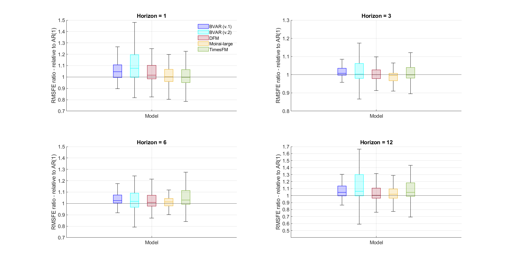

# 利用大型语言模型预测宏观经济

发布时间：2024年06月30日

`LLM应用` `宏观经济` `时间序列分析`

> Macroeconomic Forecasting with Large Language Models

# 摘要

> 本文通过比较分析，探讨了大型语言模型（LLM）与传统宏观时间序列预测方法的准确性。LLM 因能捕捉复杂数据模式并快速适应不同领域，近年来在预测领域备受青睐。但与传统方法相比，LLM 在宏观经济时间序列预测的有效性仍待探讨。为此，我们以 FRED-MD 数据库为基准，对 LLM 与传统方法进行了严格对比。研究结果揭示了 LLM 在宏观经济预测中的优势与局限，为其在实际应用中的可行性提供了重要见解。

> This paper presents a comparative analysis evaluating the accuracy of Large Language Models (LLMs) against traditional macro time series forecasting approaches. In recent times, LLMs have surged in popularity for forecasting due to their ability to capture intricate patterns in data and quickly adapt across very different domains. However, their effectiveness in forecasting macroeconomic time series data compared to conventional methods remains an area of interest. To address this, we conduct a rigorous evaluation of LLMs against traditional macro forecasting methods, using as common ground the FRED-MD database. Our findings provide valuable insights into the strengths and limitations of LLMs in forecasting macroeconomic time series, shedding light on their applicability in real-world scenarios

[Arxiv](https://arxiv.org/abs/2407.00890)