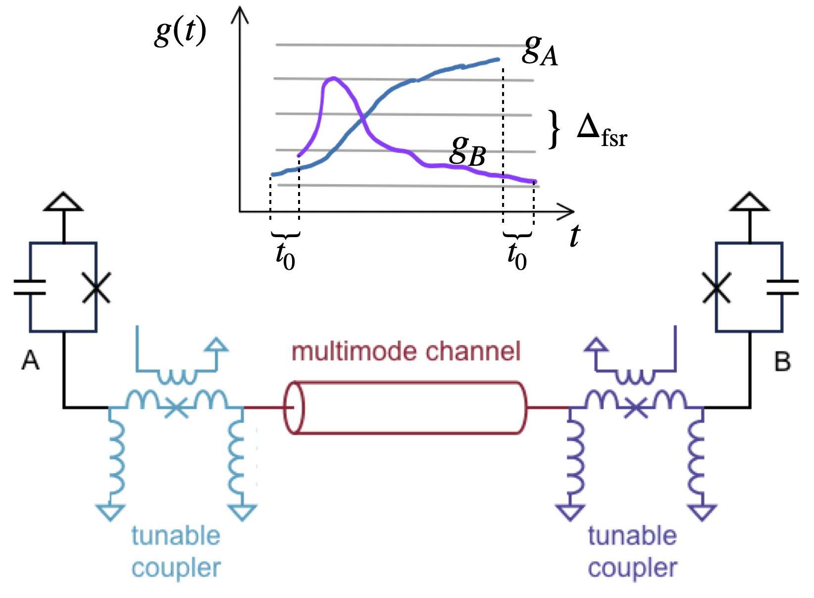
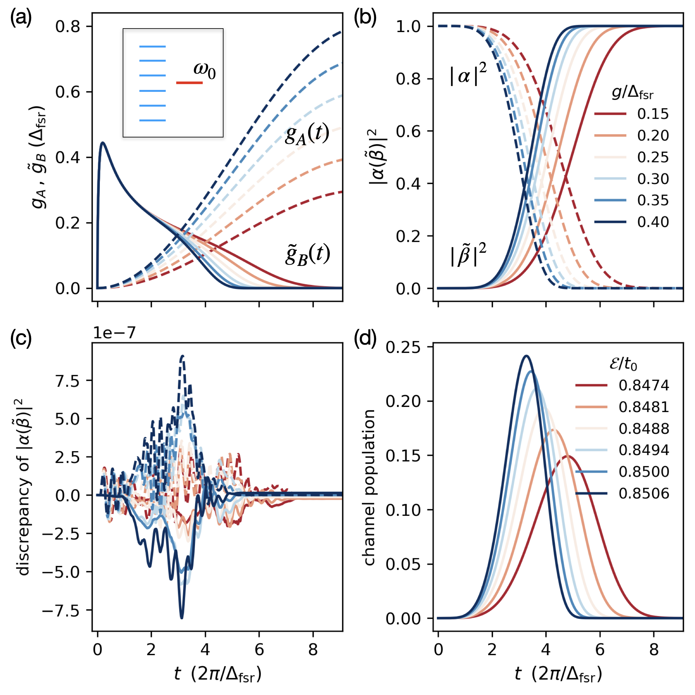
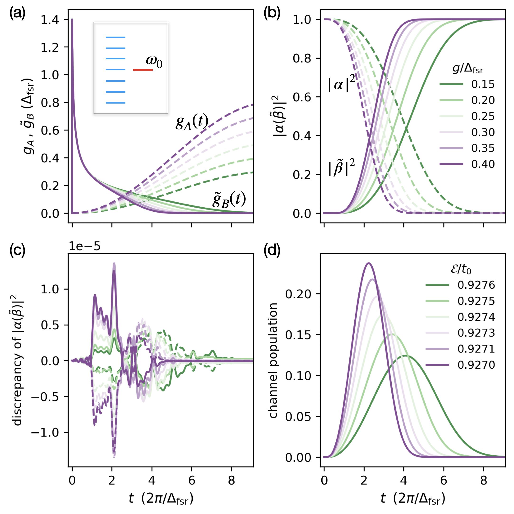

# 多模谐振器实现量子态传输

发布时间：2024年06月30日

`Agent` `量子计算` `通信技术`

> Quantum State Transfer via a Multimode Resonator

# 摘要

> 大规模容错超导量子计算要求快速量子通信连接不同芯片上的量子比特，并需要长程耦合器来执行高效的量子错误校正。为此，量子通道的最佳模型是介于单模腔和连续模式波导之间的多模谐振器。本文提出了一种量子态传输方法，其耦合强度与通道的自由光谱范围相当（$g\simΔ_{\text{fsr}}$）。该方案结合了基于STIRAP的单模腔方法和长波导抛接协议的优点，实现了低损耗和高速度的传输。

> Large-scale fault-tolerant superconducting quantum computation needs rapid quantum communication to network qubits fabricated on different chips and long-range couplers to implement efficient quantum error-correction codes. Quantum channels used for these purposes are best modeled by multimode resonators, which lie between single-mode cavities and waveguides with a continuum of modes. In this Letter, we propose a formalism for quantum state transfer using coupling strengths comparable to the channel's free spectral range ($g\simΔ_{\text{fsr}}$). Our scheme merges features of both the STIRAP-based methods for single-model cavities and the pitch-and-catch protocol for long waveguides, integrating their advantage of low loss and high speed.

[Arxiv](https://arxiv.org/abs/2407.00683)