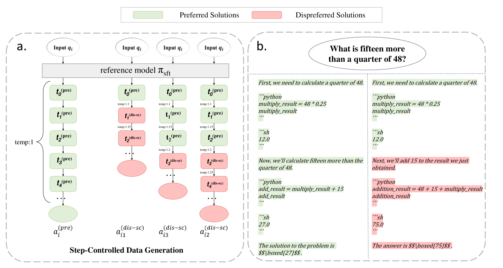
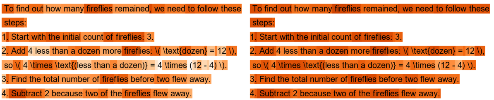
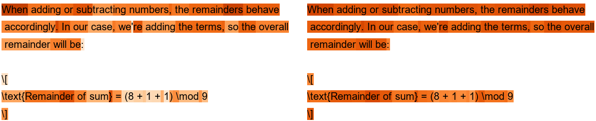
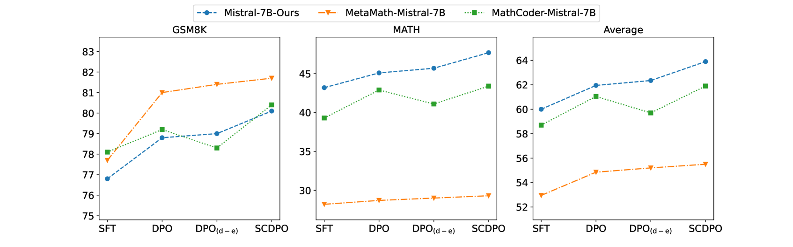
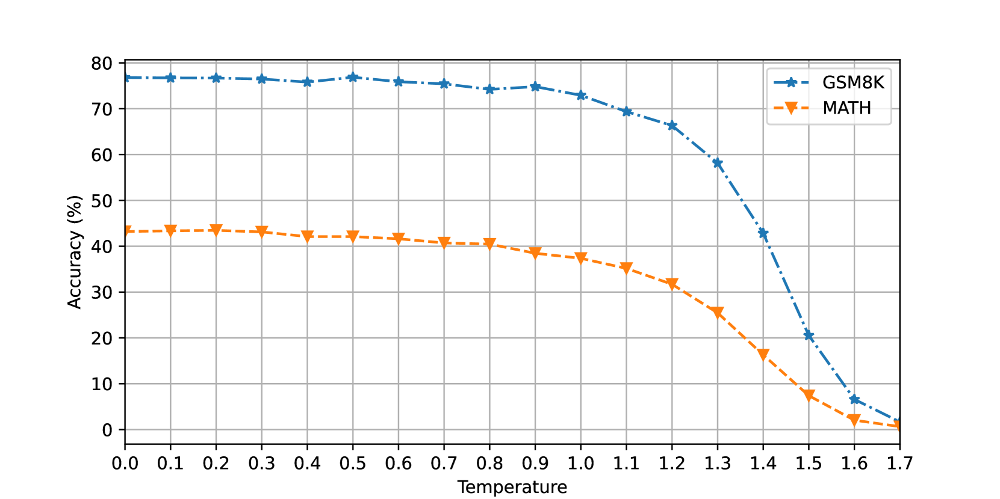
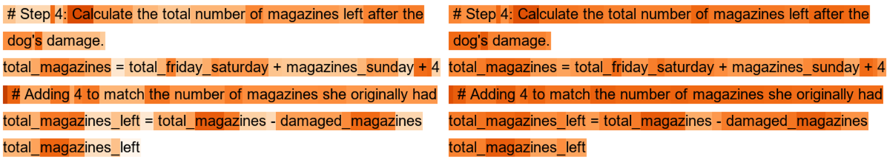
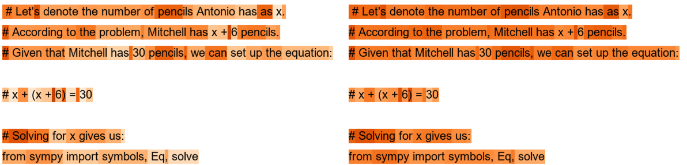
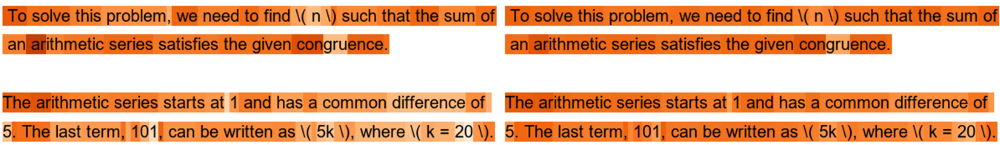

# 通过步骤控制DPO，我们利用逐步错误来提升数学推理能力。

发布时间：2024年06月30日

`LLM应用` `软件开发`

> Step-Controlled DPO: Leveraging Stepwise Error for Enhanced Mathematical Reasoning

# 摘要

> 直接偏好优化 (DPO) 在提升大型语言模型 (LLM) 的推理和对齐能力方面已见成效。我们提出的步骤控制 DPO (SCDPO)，通过生成特定步骤开始出错的数学推理负样本来实现自动化的逐步错误监督，从而在 DPO 训练中帮助模型更精准地识别和纠正推理错误。实证研究表明，SCDPO 在代码集成和思维链解决方案中均优于传统 DPO，显著提升了三个 SFT 模型的性能。定性分析进一步证实了 SCDPO 在精准定位数学解题错误方面的优势。应用 SCDPO 于 InternLM2-20B 模型，使其在 GSM8K 和 MATH 测试中分别达到 88.5% 和 58.1% 的高分，彰显了我们方法的强大潜力。

> Direct Preference Optimization (DPO) has proven effective at improving the performance of large language models (LLMs) on downstream tasks such as reasoning and alignment. In this work, we propose Step-Controlled DPO (SCDPO), a method for automatically providing stepwise error supervision by creating negative samples of mathematical reasoning rationales that start making errors at a specified step. By applying these samples in DPO training, SCDPO can better align the model to understand reasoning errors and output accurate reasoning steps. We apply SCDPO to both code-integrated and chain-of-thought solutions, empirically showing that it consistently improves the performance compared to naive DPO on three different SFT models, including one existing SFT model and two models we finetuned. Qualitative analysis of the credit assignment of SCDPO and DPO demonstrates the effectiveness of SCDPO at identifying errors in mathematical solutions. We then apply SCDPO to an InternLM2-20B model, resulting in a 20B model that achieves high scores of 88.5% on GSM8K and 58.1% on MATH, rivaling all other open-source LLMs, showing the great potential of our method.

[Arxiv](https://arxiv.org/abs/2407.00782)