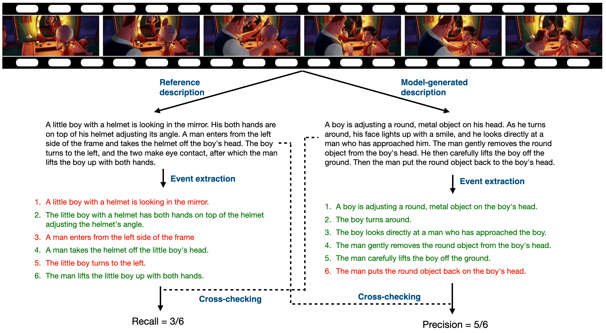

# Tarsier：大型视频描述模型训练与评估的秘方

发布时间：2024年06月30日

`LLM应用` `视频处理` `人工智能`

> Tarsier: Recipes for Training and Evaluating Large Video Description Models

# 摘要

> 在视频理解领域，生成细粒度描述是一项基础挑战。我们推出的 Tarsier 系列模型，通过 CLIP-ViT 独立编码视频帧并利用 LLM 处理时间关系，展现了卓越的视频描述能力。经过精心设计的两阶段训练，Tarsier 在视频描述方面超越了所有开源模型，在人类评估中领先最强模型 $+51.4\%$。同时，它与顶尖专有模型不相上下，对 GPT-4V 领先 $+12.3\%$，对 Gemini 1.5 Pro 稍逊 $-6.7\%$。Tarsier 不仅在视频描述上表现出色，还刷新了九个公共基准的记录，涵盖多选 VQA、开放式 VQA 和零-shot 视频字幕等多个领域。此外，我们引入了新的视频描述模型评估基准，包含多样化且复杂度各异的视频数据集，以及专为细粒度视频描述质量评估设计的自动方法。所有模型和评估基准已在 \url{https://github.com/bytedance/tarsier} 公开。

> Generating fine-grained video descriptions is a fundamental challenge in video understanding. In this work, we introduce Tarsier, a family of large-scale video-language models designed to generate high-quality video descriptions. Tarsier employs CLIP-ViT to encode frames separately and then uses an LLM to model temporal relationships. Despite its simple architecture, we demonstrate that with a meticulously designed two-stage training procedure, the Tarsier models exhibit substantially stronger video description capabilities than any existing open-source model, showing a $+51.4\%$ advantage in human side-by-side evaluation over the strongest model. Additionally, they are comparable to state-of-the-art proprietary models, with a $+12.3\%$ advantage against GPT-4V and a $-6.7\%$ disadvantage against Gemini 1.5 Pro. Besides video description, Tarsier proves to be a versatile generalist model, achieving new state-of-the-art results across nine public benchmarks, including multi-choice VQA, open-ended VQA, and zero-shot video captioning. Our second contribution is the introduction of a new benchmark for evaluating video description models, consisting of a new challenging dataset featuring videos from diverse sources and varying complexity, along with an automatic method specifically designed to assess the quality of fine-grained video descriptions. We make our models and evaluation benchmark publicly available at \url{https://github.com/bytedance/tarsier}.

[Arxiv](https://arxiv.org/abs/2407.00634)