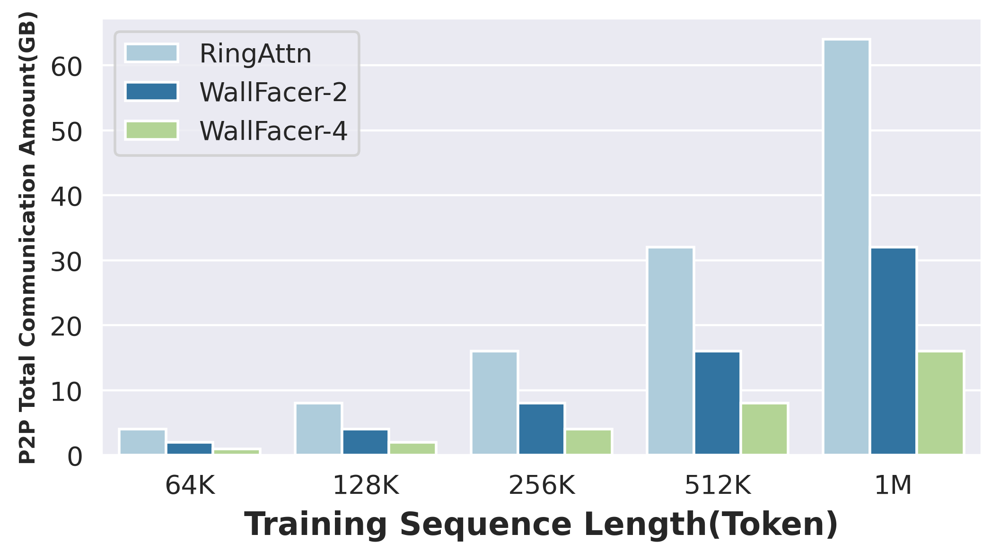
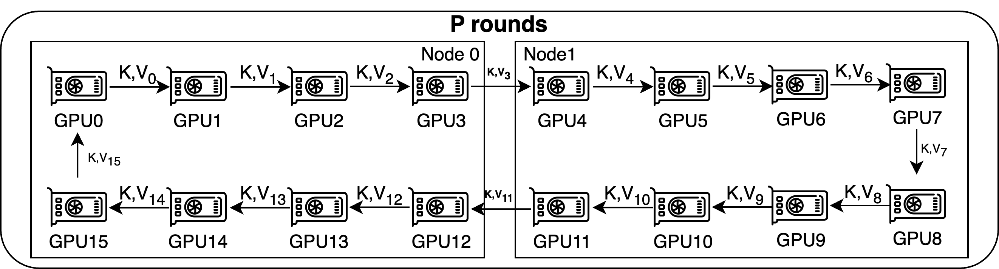
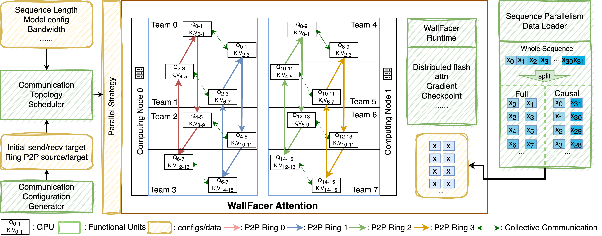
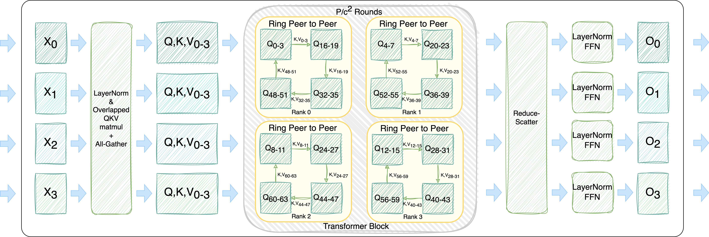
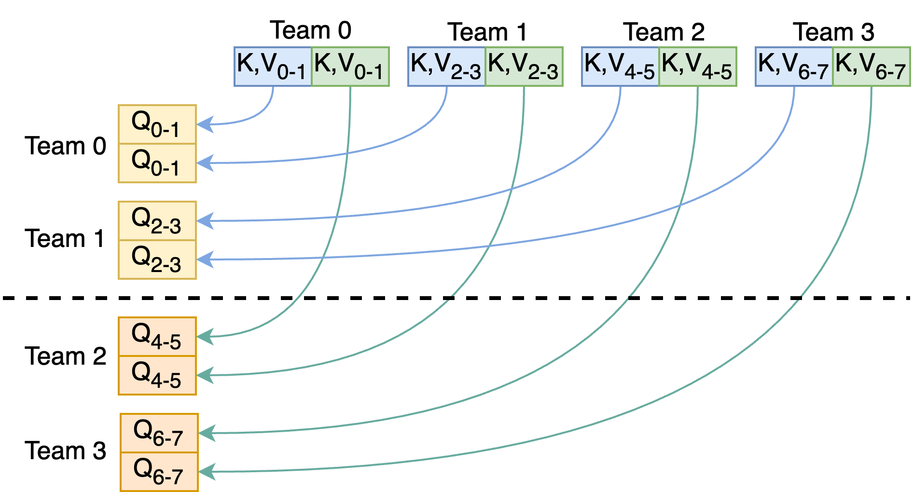
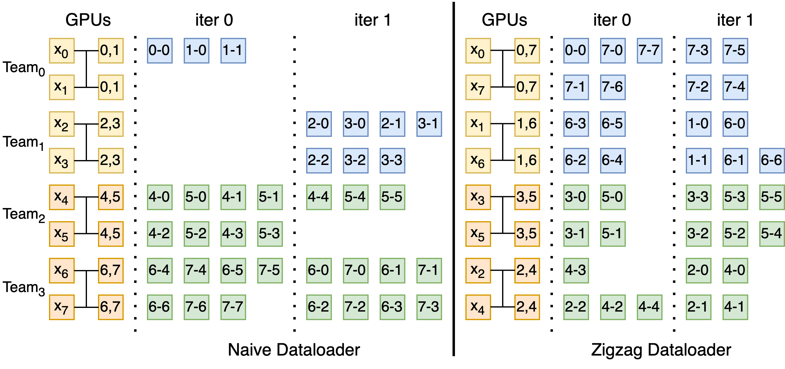
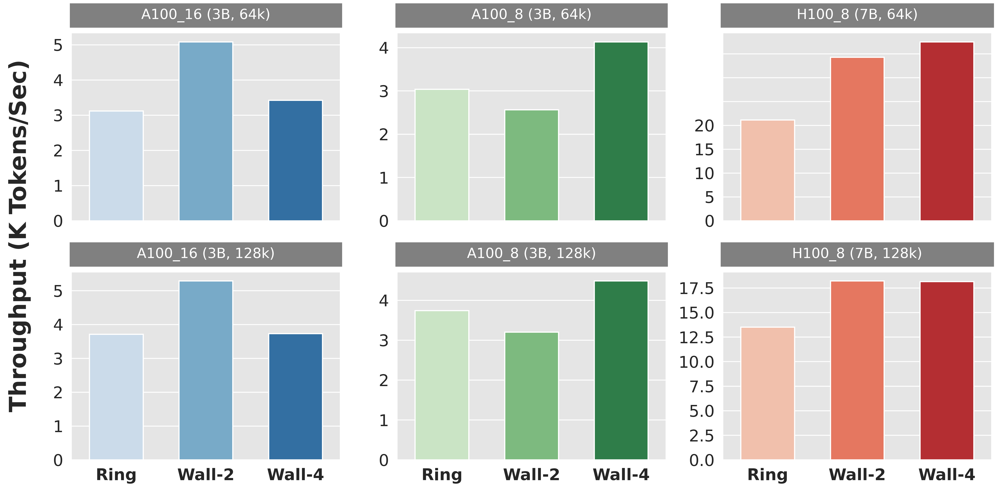
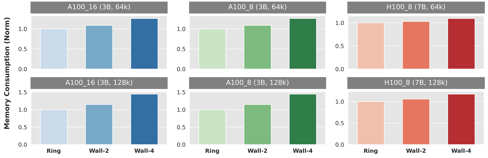
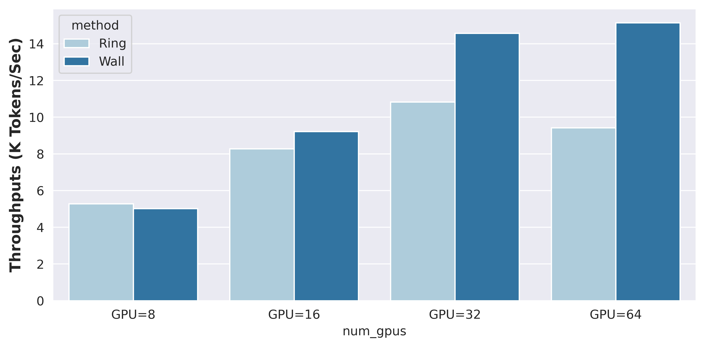
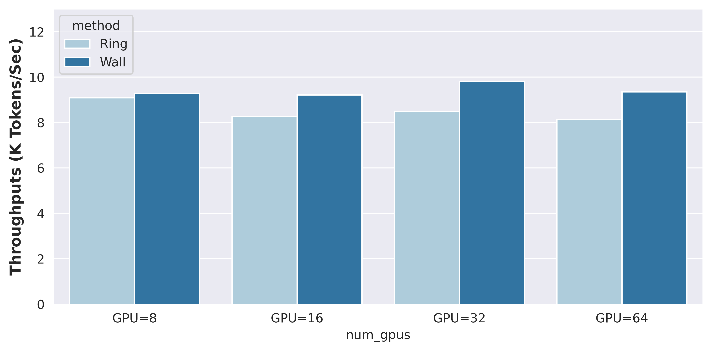

# WallFacer：借助 N 体问题，引领 Transformer 模型训练摆脱长上下文的困境

发布时间：2024年06月30日

`LLM理论` `人工智能` `高性能计算`

> WallFacer: Guiding Transformer Model Training Out of the Long-Context Dark Forest with N-body Problem

# 摘要

> 近年来，基于Transformer的LLMs因其卓越性能备受瞩目，但长序列训练的效率与可扩展性仍是一大挑战。现有方法或受限于注意力头数量，或面临高通信开销。本文提出，注意力计算可视为n体问题的特例。基于此，我们推出WallFacer系统，采用创新的多维环序列并行技术，优化通信模式并提供更多调整空间。实验表明，WallFacer在多种环境下大幅领先现有技术，性能提升高达77.12%。

> In recent years, Transformer-based Large Language Models (LLMs) have garnered significant attention due to their exceptional performance across a variety of tasks. However, training these models on long sequences presents a substantial challenge in terms of efficiency and scalability. Current methods are constrained either by the number of attention heads, limiting scalability, or by excessive communication overheads. In this paper, we propose an insight that Attention Computation can be considered as a special case of n-body problem with direct interactions. Based on this concept, this paper introduces WallFacer, an efficient long-sequence training system with a novel multi-dimensional ring sequence parallelism, fostering an efficient communication paradigm and extra tuning space for communication arrangement. Through comprehensive experiments under diverse environments and model settings, we demonstrate that WallFacer significantly surpasses state-of-the-art method that supports near-infinite sequence length, achieving performance improvements of up to 77.12%.

[Arxiv](https://arxiv.org/abs/2407.00611)