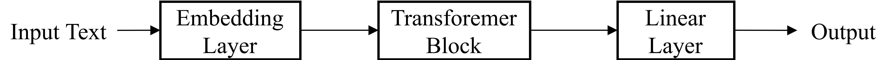
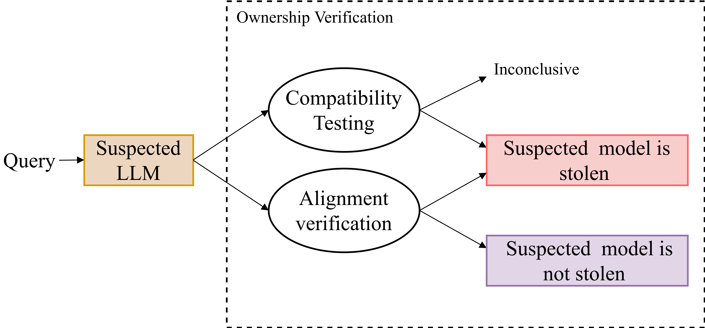

# 大型语言模型的独特印记

发布时间：2024年07月01日

`LLM理论` `知识产权保护` `人工智能`

> A Fingerprint for Large Language Models

# 摘要

> 随着预训练语言模型的扩展在众多下游任务中达到顶尖性能，大型语言模型 (LLMs) 已成为人工智能研究的热点。然而，鉴于从头训练 LLMs 的高资源需求，保护其知识产权刻不容缓。为此，本文提出了一种无需训练或微调的黑盒指纹技术。我们首先证实 LLMs 的输出构成了独特的向量空间。将所有权认证视为比较受害者与嫌疑模型输出空间相似度的任务，我们设计了两种方案：一是快速验证嫌疑模型输出是否与受害者模型同处一空间，二是重建向量空间并集以应对参数高效微调攻击。实验显示，该技术在所有权验证及抗攻击方面表现卓越。这项研究不仅揭示了 LLMs 的本质特征，还为黑盒环境下的所有权验证提供了高效、通用且实用的解决方案。

> Recent advances show that scaling a pre-trained language model could achieve state-of-the-art performance on many downstream tasks, prompting large language models (LLMs) to become a hot research topic in the field of artificial intelligence. However, due to the resource-intensive nature of training LLMs from scratch, it is urgent and crucial to protect the intellectual property of LLMs against infringement. This has motivated the authors in this paper to propose a novel black-box fingerprinting technique for LLMs, which requires neither model training nor model fine-tuning. We first demonstrate that the outputs of LLMs span a unique vector space associated with each model. We model the problem of ownership authentication as the task of evaluating the similarity between the victim model's space and the output's space of the suspect model. To deal with this problem, we propose two solutions, where the first solution involves verifying whether the outputs of the suspected large model are in the same space as those of the victim model, enabling rapid identification of model infringement, and the second one reconstructs the union of the vector spaces for LLM outputs and the victim model to address situations where the victim model has undergone the Parameter-Efficient Fine-Tuning (PEFT) attacks. Experimental results indicate that the proposed technique achieves superior performance in ownership verification and robustness against PEFT attacks. This work reveals inherent characteristics of LLMs and provides a promising solution for ownership verification of LLMs in black-box scenarios, ensuring efficiency, generality and practicality.

[Arxiv](https://arxiv.org/abs/2407.01235)