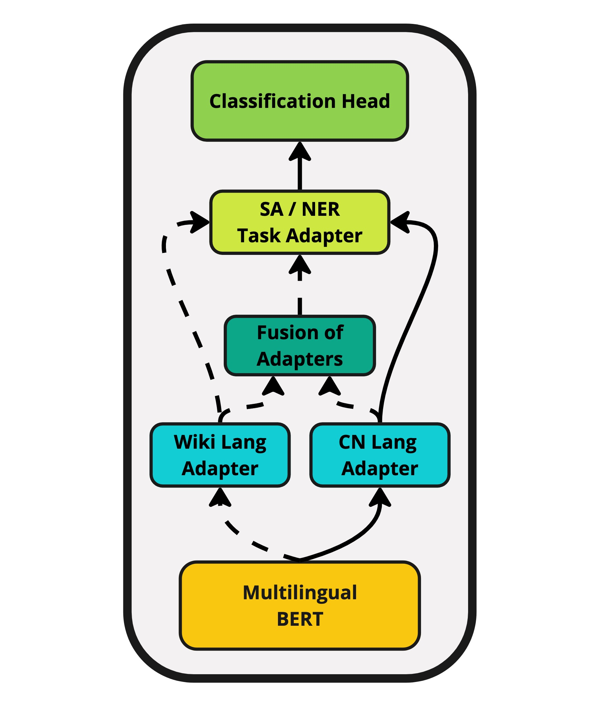

# 借助知识图谱和适配器，让多语言LLMs轻松适应低资源语言

发布时间：2024年07月01日

`LLM应用` `人工智能`

> Adapting Multilingual LLMs to Low-Resource Languages with Knowledge Graphs via Adapters

# 摘要

> 本文通过适配器将语言本体的图知识融入多语言大型语言模型 (LLM)，旨在提升低资源语言 (LRL) 在情感分析 (SA) 和命名实体识别 (NER) 的表现。借鉴 K-ADAPTER 和 MAD-X 等参数高效微调技术，我们提出新方法，利用多语言图知识，通过语言关系连接不同语言概念，增强多语言 LLM 对 LRL 的支持。我们特别关注八种 LRL，包括马耳他语、保加利亚语等，并使用特定语言适配器，基于 ConceptNet 特定语言部分的数据进行微调，促进知识跨语言转移。通过比较不同微调策略，如标准 MLM、全词掩码 MLM 和目标掩码 MLM，我们分析了它们在整合图数据方面的效果。实证评估显示，结构化图知识显著影响多语言 LLM 在 LRL 的 SA 和 NER 性能，揭示了适应低资源场景的语言模型的潜在优势。

> This paper explores the integration of graph knowledge from linguistic ontologies into multilingual Large Language Models (LLMs) using adapters to improve performance for low-resource languages (LRLs) in sentiment analysis (SA) and named entity recognition (NER). Building upon successful parameter-efficient fine-tuning techniques, such as K-ADAPTER and MAD-X, we propose a similar approach for incorporating knowledge from multilingual graphs, connecting concepts in various languages with each other through linguistic relationships, into multilingual LLMs for LRLs. Specifically, we focus on eight LRLs -- Maltese, Bulgarian, Indonesian, Nepali, Javanese, Uyghur, Tibetan, and Sinhala -- and employ language-specific adapters fine-tuned on data extracted from the language-specific section of ConceptNet, aiming to enable knowledge transfer across the languages covered by the knowledge graph. We compare various fine-tuning objectives, including standard Masked Language Modeling (MLM), MLM with full-word masking, and MLM with targeted masking, to analyse their effectiveness in learning and integrating the extracted graph data. Through empirical evaluation on language-specific tasks, we assess how structured graph knowledge affects the performance of multilingual LLMs for LRLs in SA and NER, providing insights into the potential benefits of adapting language models for low-resource scenarios.

[Arxiv](https://arxiv.org/abs/2407.01406)