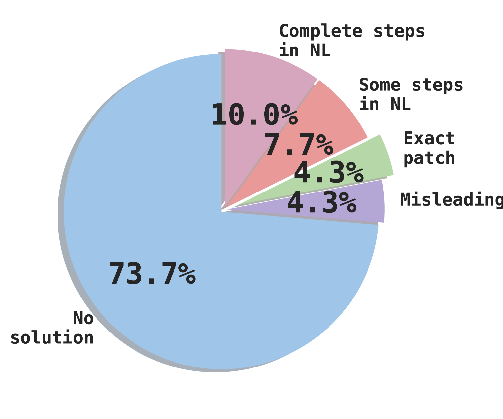

# 无代理模式：探索基于LLM的软件工程代理之谜

发布时间：2024年07月01日

`Agent` `软件开发` `人工智能`

> Agentless: Demystifying LLM-based Software Engineering Agents

# 摘要

> 大型语言模型的最新进展极大地推动了软件开发自动化的进程，涵盖了代码合成、程序修复和测试生成等多个方面。近期，研究者和业界专家开发了多种自主LLM代理，以完成端到端的软件开发任务。这些代理不仅能够使用工具、执行命令，还能从环境反馈中学习并规划未来的行动。然而，这些基于代理的方法的复杂性，以及当前LLM能力的局限，引发了一个问题：我们是否真的需要依赖复杂的自主软件代理？为了探索这一问题，我们提出了Agentless——一种无需代理的解决方案，旨在自动解决软件开发中的难题。与依赖复杂工具和决策的代理方法相比，Agentless采用了一种简洁的两阶段流程：先定位问题，再进行修复，避免了LLM进行复杂操作或决策的需要。在SWE-bench Lite这一广受欢迎的基准测试中，Agentless的表现令人瞩目，不仅达到了最高的性能（27.33%），还实现了最低的成本（$0.34），超越了所有现有的开源软件代理。此外，我们通过手动分类SWE-bench Lite中的问题，识别出了一些具有确切解决方案或描述不准确的问题，并据此构建了SWE-bench Lite-S，以进行更为严格的评估和比较。我们的研究揭示了简单、可解释技术在自主软件开发中的巨大潜力，希望Agentless能够为自主软件代理的发展设定新的基准和方向，并激发更多相关领域的研究。

> Recent advancements in large language models (LLMs) have significantly advanced the automation of software development tasks, including code synthesis, program repair, and test generation. More recently, researchers and industry practitioners have developed various autonomous LLM agents to perform end-to-end software development tasks. These agents are equipped with the ability to use tools, run commands, observe feedback from the environment, and plan for future actions. However, the complexity of these agent-based approaches, together with the limited abilities of current LLMs, raises the following question: Do we really have to employ complex autonomous software agents? To attempt to answer this question, we build Agentless -- an agentless approach to automatically solve software development problems. Compared to the verbose and complex setup of agent-based approaches, Agentless employs a simplistic two-phase process of localization followed by repair, without letting the LLM decide future actions or operate with complex tools. Our results on the popular SWE-bench Lite benchmark show that surprisingly the simplistic Agentless is able to achieve both the highest performance (27.33%) and lowest cost (\$0.34) compared with all existing open-source software agents! Furthermore, we manually classified the problems in SWE-bench Lite and found problems with exact ground truth patch or insufficient/misleading issue descriptions. As such, we construct SWE-bench Lite-S by excluding such problematic issues to perform more rigorous evaluation and comparison. Our work highlights the current overlooked potential of a simple, interpretable technique in autonomous software development. We hope Agentless will help reset the baseline, starting point, and horizon for autonomous software agents, and inspire future work along this crucial direction.

[Arxiv](https://arxiv.org/abs/2407.01489)