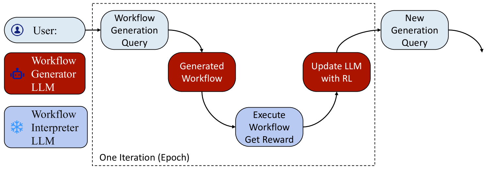
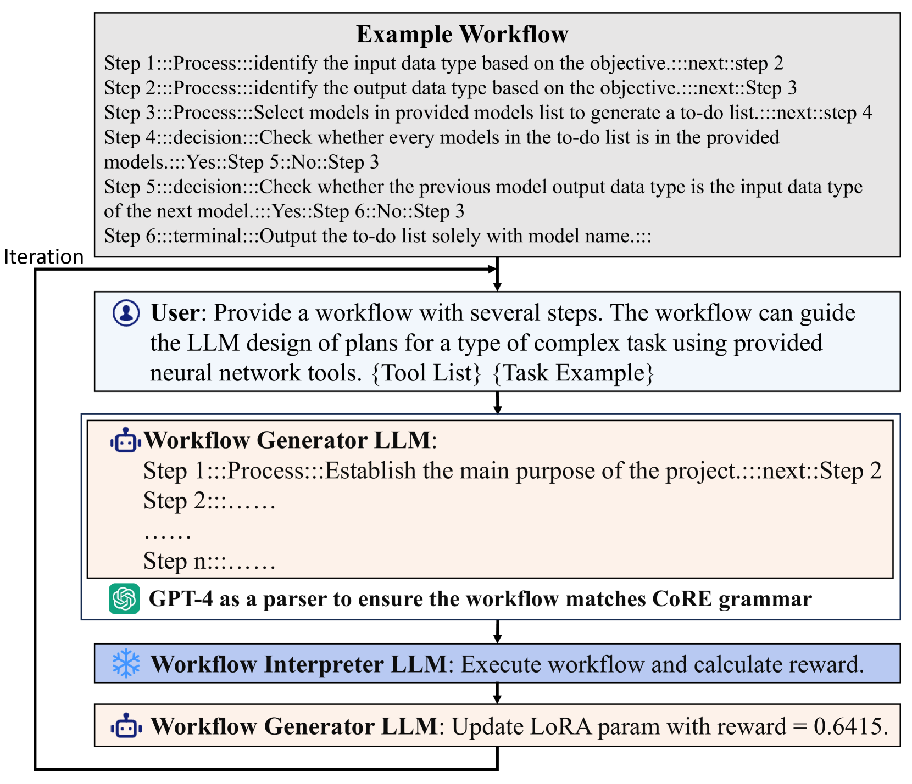
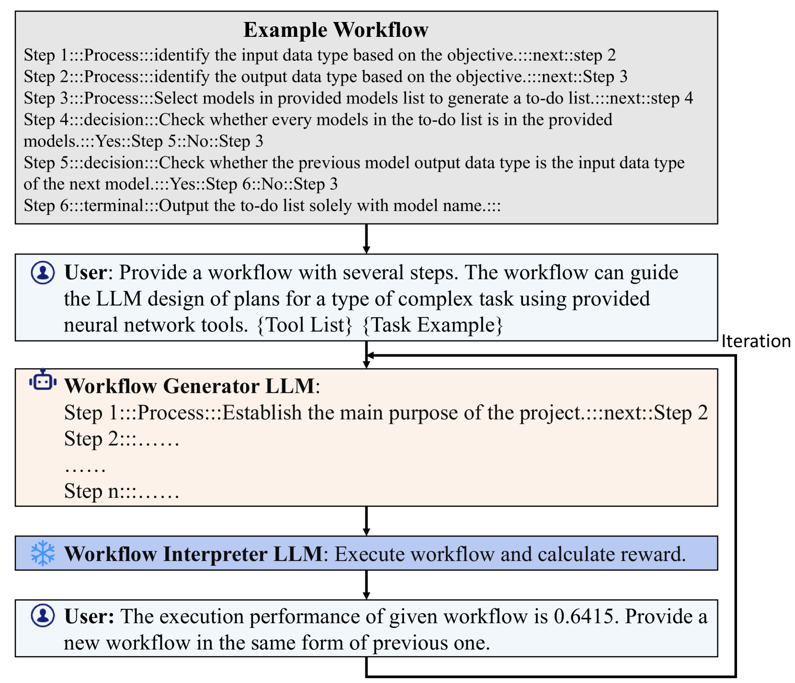

# AutoFlow：自动构建大型语言模型代理的工作流程

发布时间：2024年07月01日

`Agent` `人工智能` `软件开发`

> AutoFlow: Automated Workflow Generation for Large Language Model Agents

# 摘要

> 大型语言模型 (LLM) 在理解复杂自然语言方面取得了显著进展。其中，基于 LLM 的 AI 代理是一个重要应用，它结合 LLM 能力与外部工具解决复杂任务。为确保代理高效可靠，通常需手动设计工作流程。然而，这既耗时又依赖专业知识，限制了大规模应用。为此，我们推出 AutoFlow 框架，自动生成代理流程。该框架采用自然语言程序格式，并通过优化流程质量。此外，提供两种生成方法，适用于各类 LLM。实验证明，AutoFlow 能产出稳健可靠的流程。我们认为，自然语言流程的自动生成与解释，是应对复杂任务的新兴范式，尤其在 LLM 快速发展的背景下。项目源码已公开于 https://github.com/agiresearch/AutoFlow。

> Recent advancements in Large Language Models (LLMs) have shown significant progress in understanding complex natural language. One important application of LLM is LLM-based AI Agent, which leverages the ability of LLM as well as external tools for complex-task solving. To make sure LLM Agents follow an effective and reliable procedure to solve the given task, manually designed workflows are usually used to guide the working mechanism of agents. However, manually designing the workflows requires considerable efforts and domain knowledge, making it difficult to develop and deploy agents on massive scales. To address these issues, we propose AutoFlow, a framework designed to automatically generate workflows for agents to solve complex tasks. AutoFlow takes natural language program as the format of agent workflow and employs a workflow optimization procedure to iteratively optimize the workflow quality. Besides, this work offers two workflow generation methods: fine-tuning-based and in-context-based methods, making the AutoFlow framework applicable to both open-source and closed-source LLMs. Experimental results show that our framework can produce robust and reliable agent workflows. We believe that the automatic generation and interpretation of workflows in natural language represent a promising paradigm for solving complex tasks, particularly with the rapid development of LLMs. The source code of this work is available at https://github.com/agiresearch/AutoFlow.

[Arxiv](https://arxiv.org/abs/2407.12821)