# BERGEN：一款专为检索增强生成技术打造的基准库

发布时间：2024年07月01日

`RAG` `问答系统` `开源软件`

> BERGEN: A Benchmarking Library for Retrieval-Augmented Generation

# 摘要

> Retrieval-Augmented Generation（RAG）通过外部知识增强了大型语言模型。随着生成型 LLM 的兴起，众多 RAG 方法涌现，涵盖了评估数据集、集合、指标、检索器和 LLM 等多种配置。然而，基准测试的不一致性为方法比较和组件影响理解带来了挑战。本研究探索了 RAG 系统评估的最佳实践，并推出了 BERGEN，一个标准化 RAG 实验的端到端开源库。在专注于问答的深入研究中，我们评估了各类顶尖检索器、重排序器和 LLM，并分析了现有 RAG 指标和数据集。BERGEN 库已开放源代码，访问地址为 \url{https://github.com/naver/bergen}。

> Retrieval-Augmented Generation allows to enhance Large Language Models with external knowledge. In response to the recent popularity of generative LLMs, many RAG approaches have been proposed, which involve an intricate number of different configurations such as evaluation datasets, collections, metrics, retrievers, and LLMs. Inconsistent benchmarking poses a major challenge in comparing approaches and understanding the impact of each component in the pipeline. In this work, we study best practices that lay the groundwork for a systematic evaluation of RAG and present BERGEN, an end-to-end library for reproducible research standardizing RAG experiments. In an extensive study focusing on QA, we benchmark different state-of-the-art retrievers, rerankers, and LLMs. Additionally, we analyze existing RAG metrics and datasets. Our open-source library BERGEN is available under \url{https://github.com/naver/bergen}.

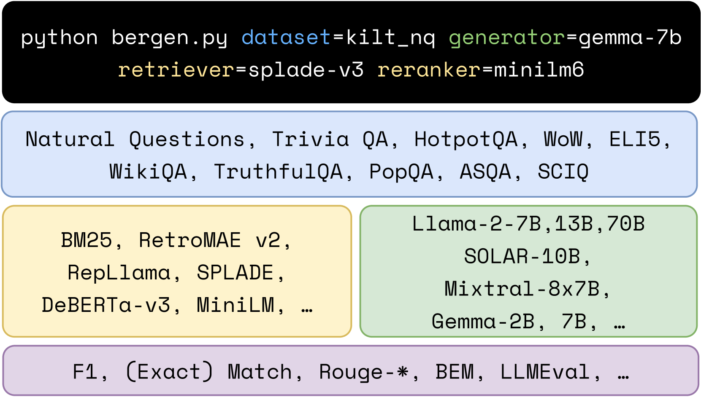

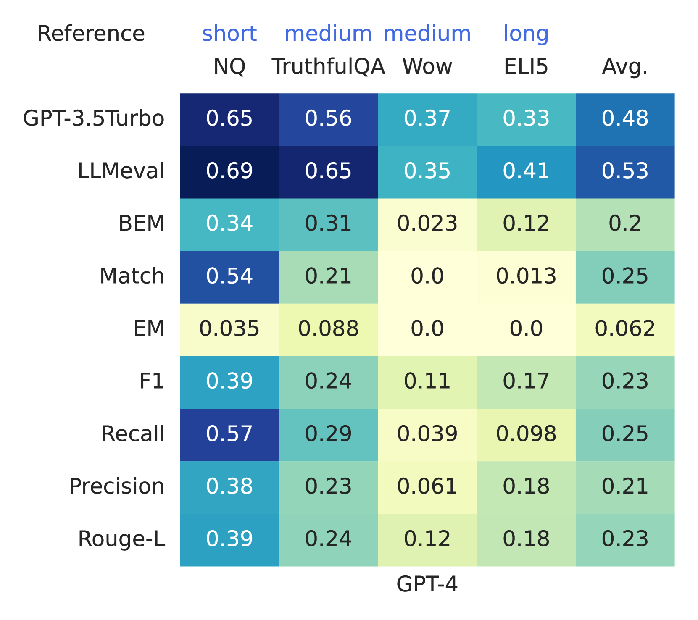

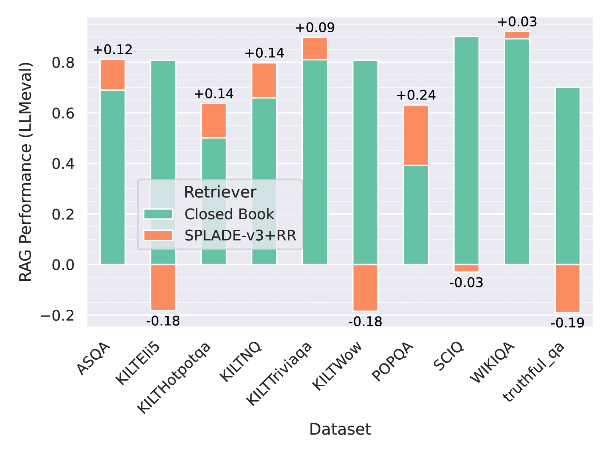

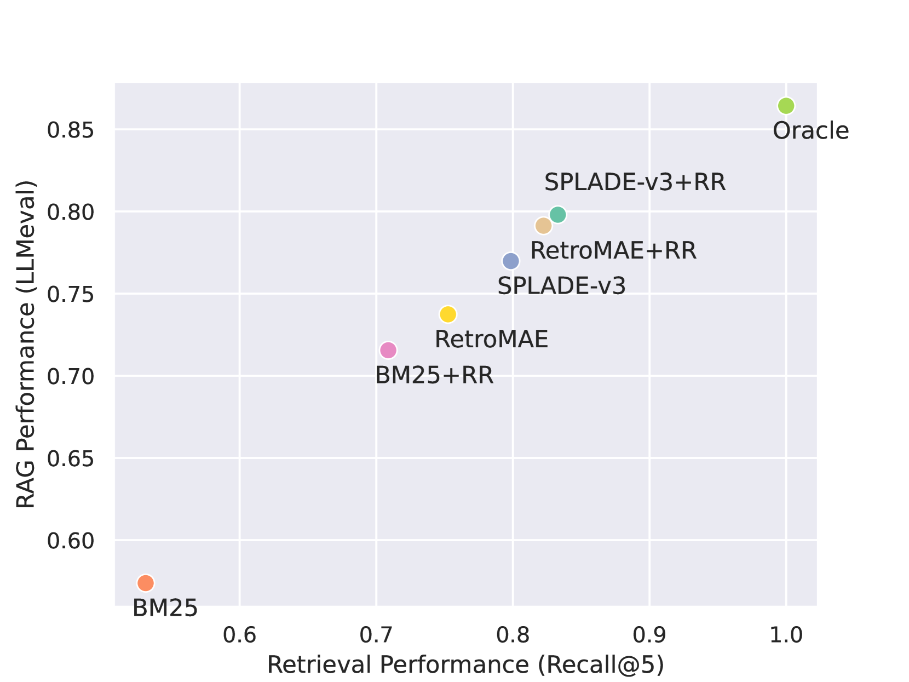

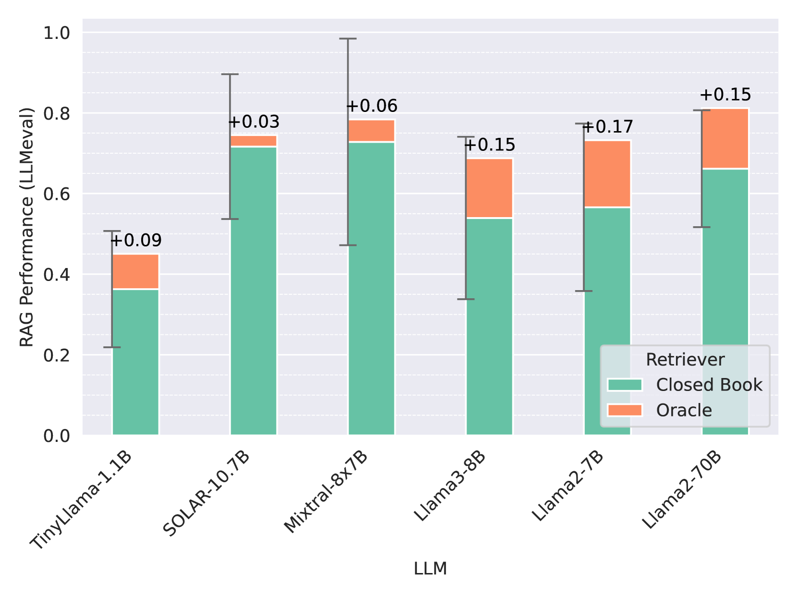

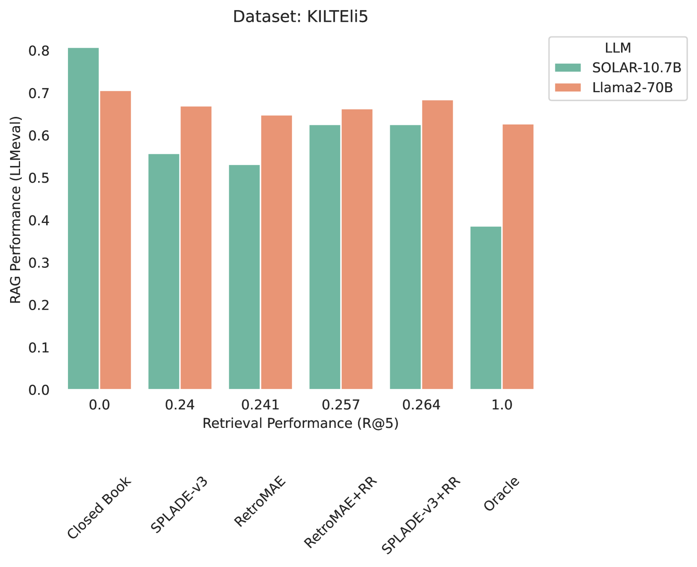

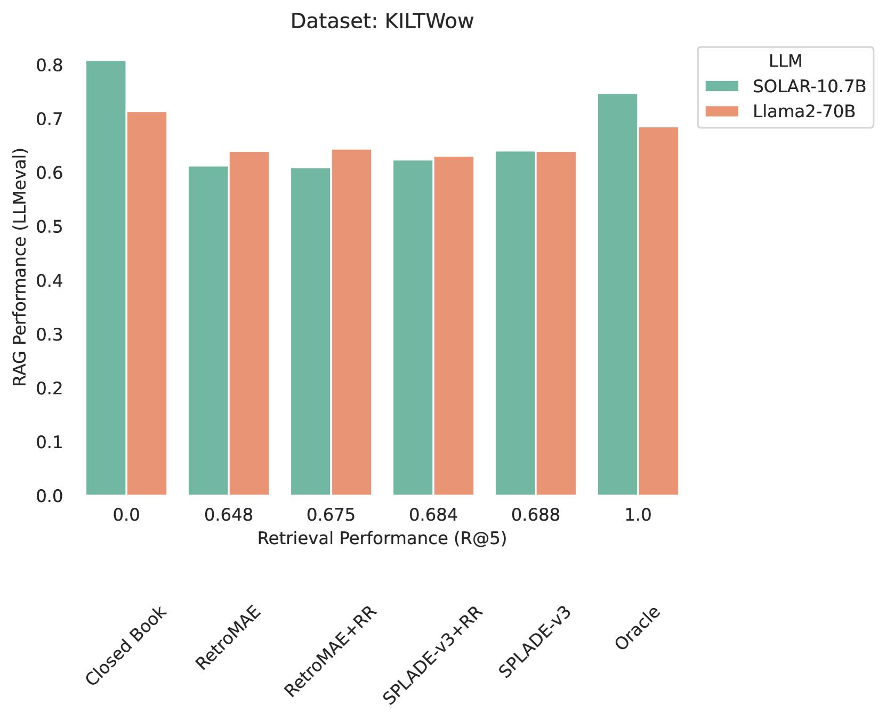

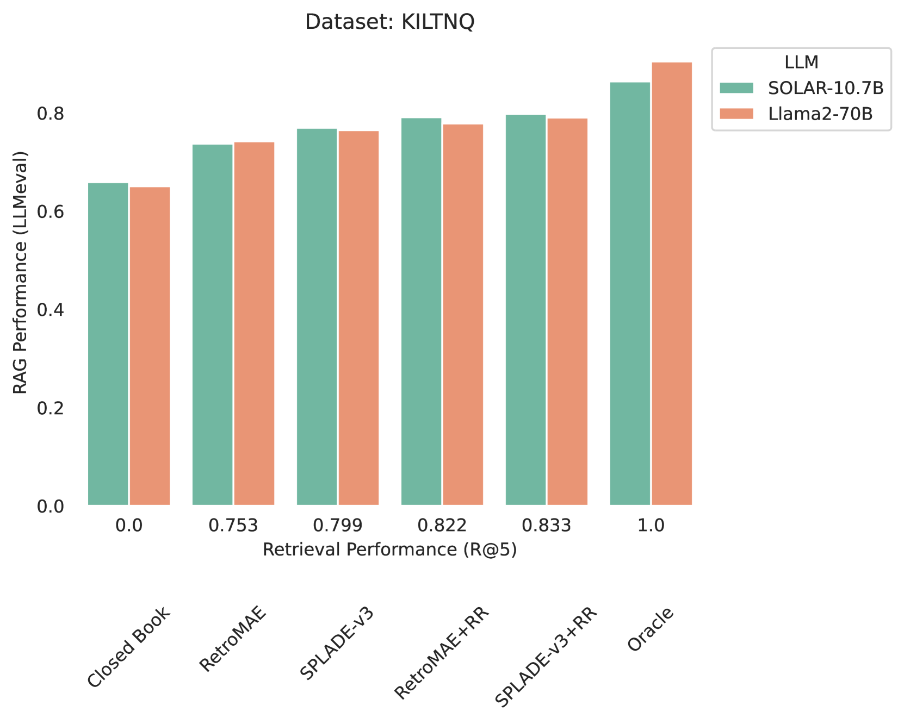

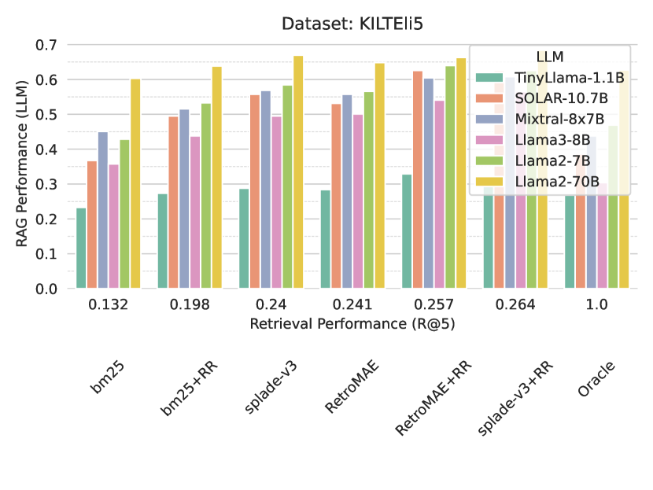

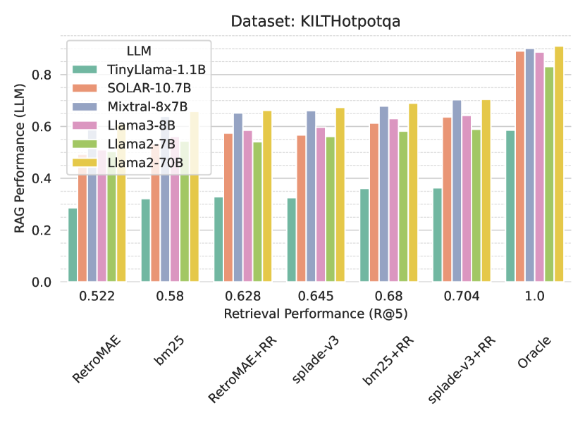

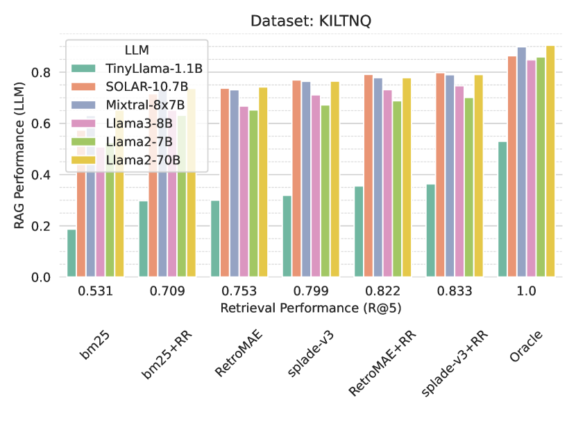

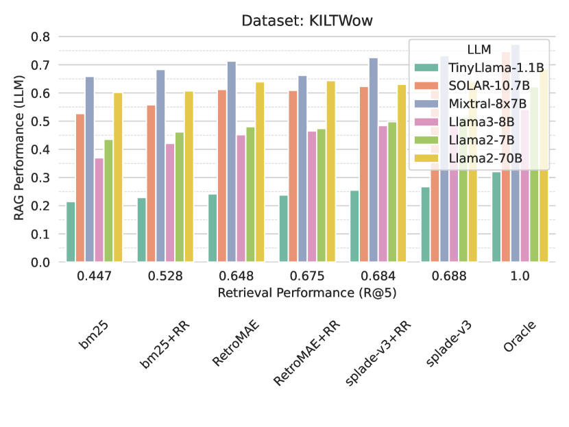

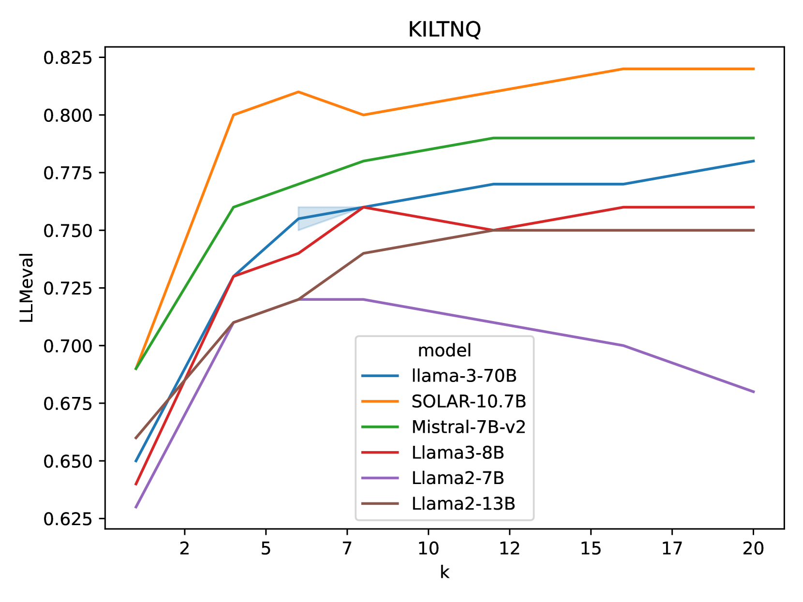

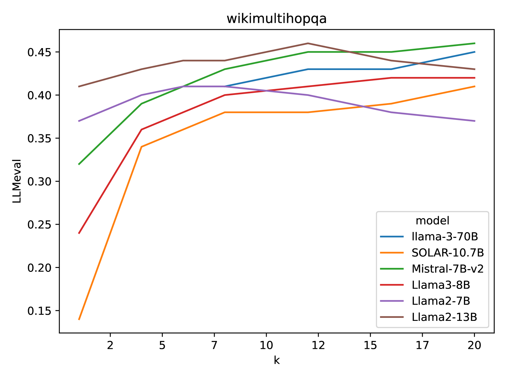

[Arxiv](https://arxiv.org/abs/2407.01102)