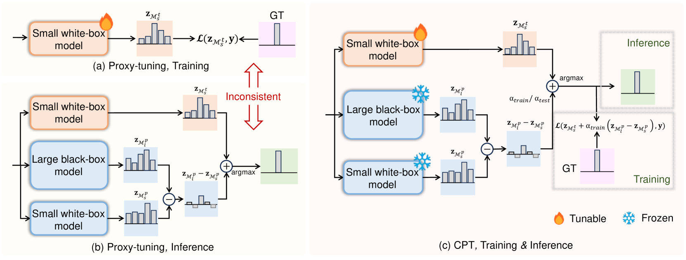
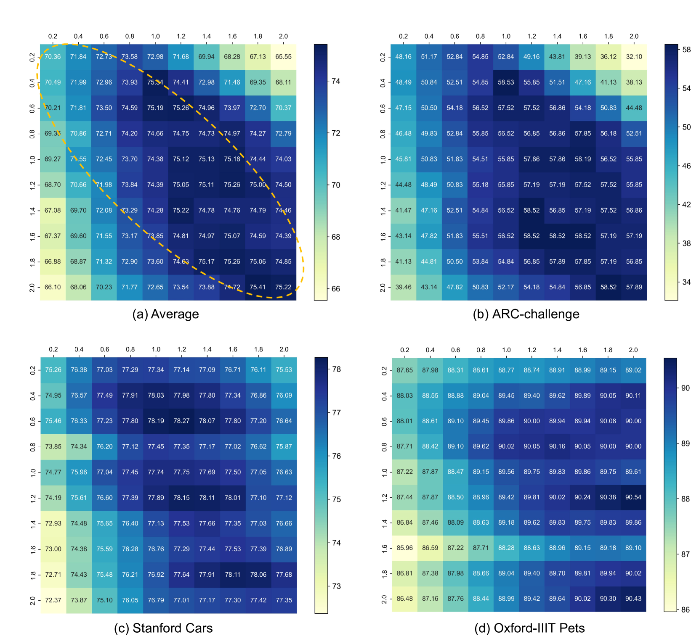
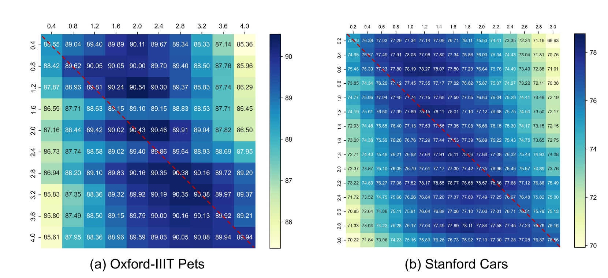

# CPT：实现黑盒优化中一致性的代理调优方法

发布时间：2024年07月01日

`Agent` `人工智能` `机器学习`

> CPT: Consistent Proxy Tuning for Black-box Optimization

# 摘要

> 近期，黑盒调优因高级专有模型的不可访问性而备受瞩目。代理调优通过调整小规模白盒“代理”模型来优化黑盒模型的输出，但仅限于解码阶段，可能导致训练与测试的不一致。为此，我们提出了一致性代理调优（CPT），一种高效的黑盒调优策略。CPT不仅利用了冻结的大型黑盒模型，还结合了小型白盒模型，确保了训练与测试的一致性，从而提升了模型性能。我们的方法专注于对数级计算，具有模型无关性，适用于任何涉及对数分类的任务。实验证明，CPT在大型语言模型和视觉语言模型的黑盒调优中表现卓越。代码已公开，详见https://github.com/chunmeifeng/CPT。

> Black-box tuning has attracted recent attention due to that the structure or inner parameters of advanced proprietary models are not accessible. Proxy-tuning provides a test-time output adjustment for tuning black-box language models. It applies the difference of the output logits before and after tuning a smaller white-box "proxy" model to improve the black-box model. However, this technique serves only as a decoding-time algorithm, leading to an inconsistency between training and testing which potentially limits overall performance. To address this problem, we introduce Consistent Proxy Tuning (CPT), a simple yet effective black-box tuning method. Different from Proxy-tuning, CPT additionally exploits the frozen large black-box model and another frozen small white-box model, ensuring consistency between training-stage optimization objective and test-time proxies. This consistency benefits Proxy-tuning and enhances model performance. Note that our method focuses solely on logit-level computation, which makes it model-agnostic and applicable to any task involving logit classification. Extensive experimental results demonstrate the superiority of our CPT in both black-box tuning of Large Language Models (LLMs) and Vision-Language Models (VLMs) across various datasets. The code is available at https://github.com/chunmeifeng/CPT.

[Arxiv](https://arxiv.org/abs/2407.01155)