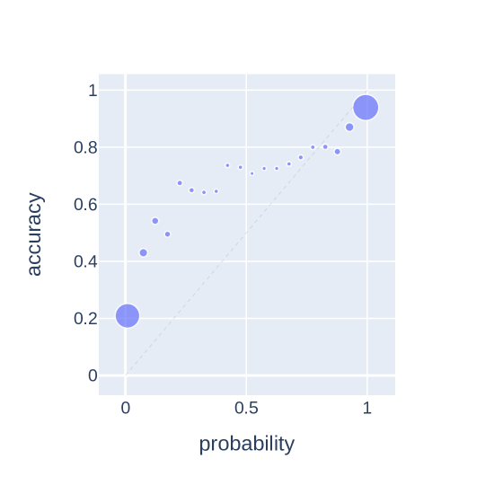
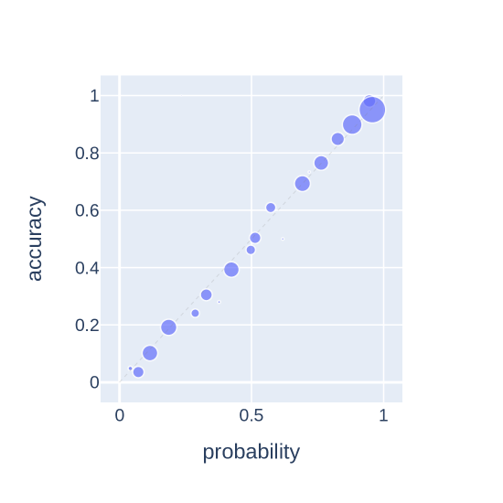
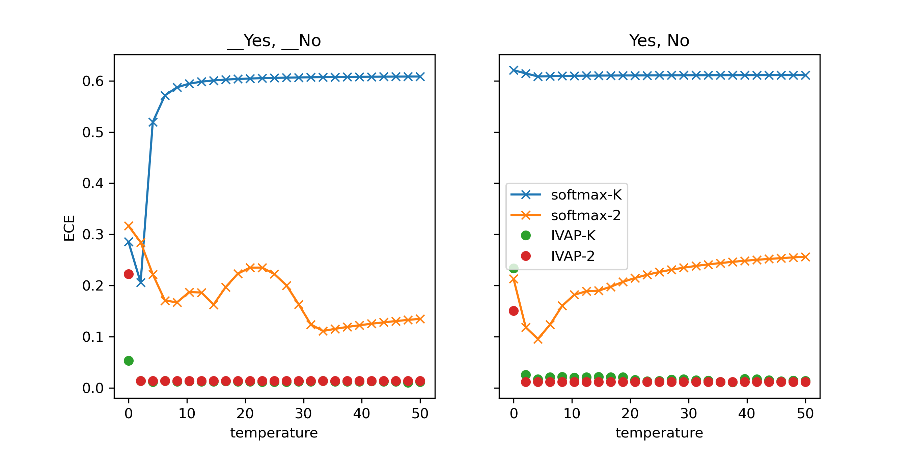
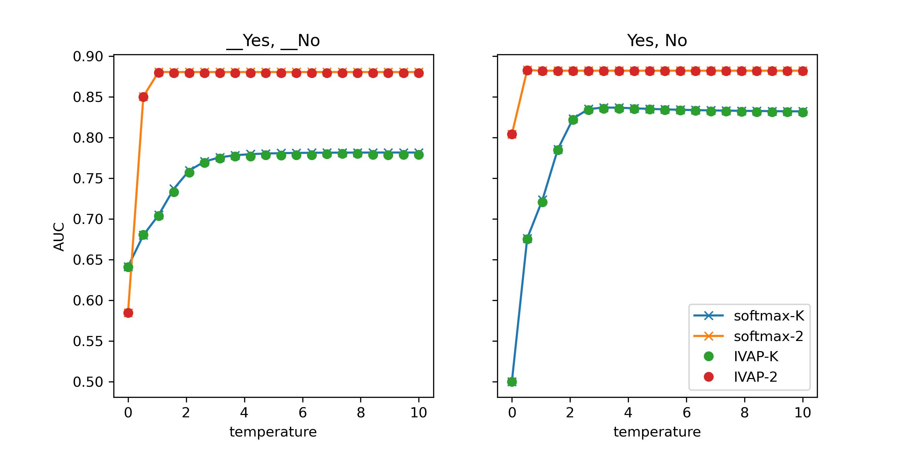
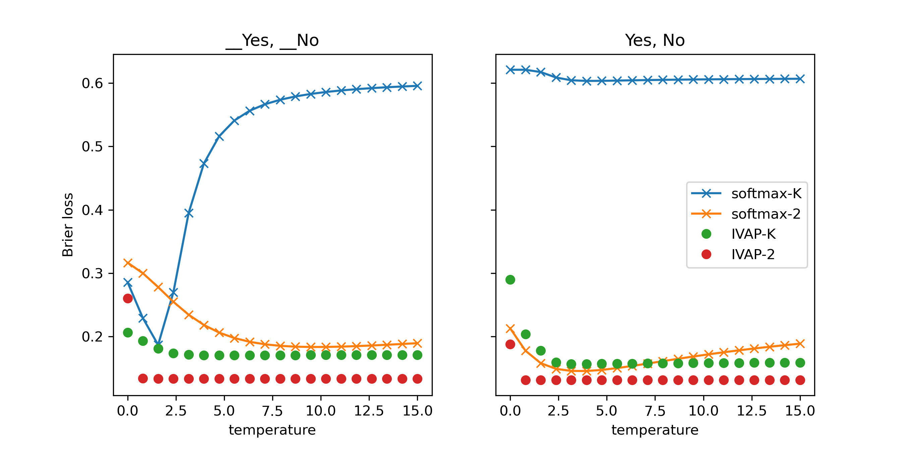
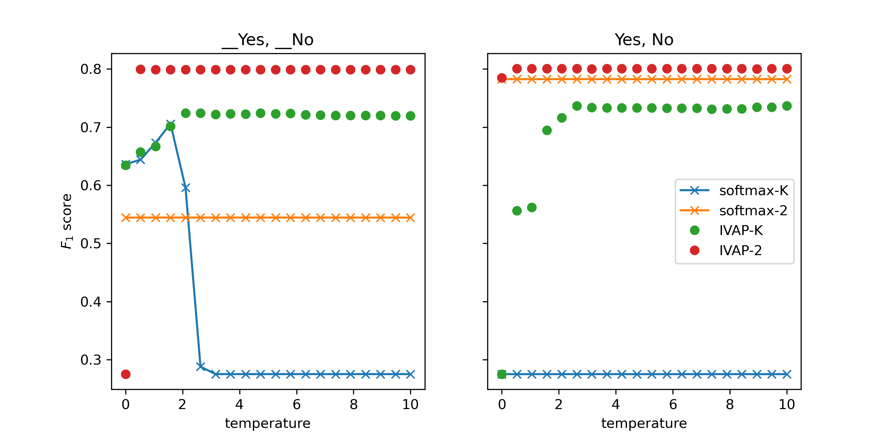
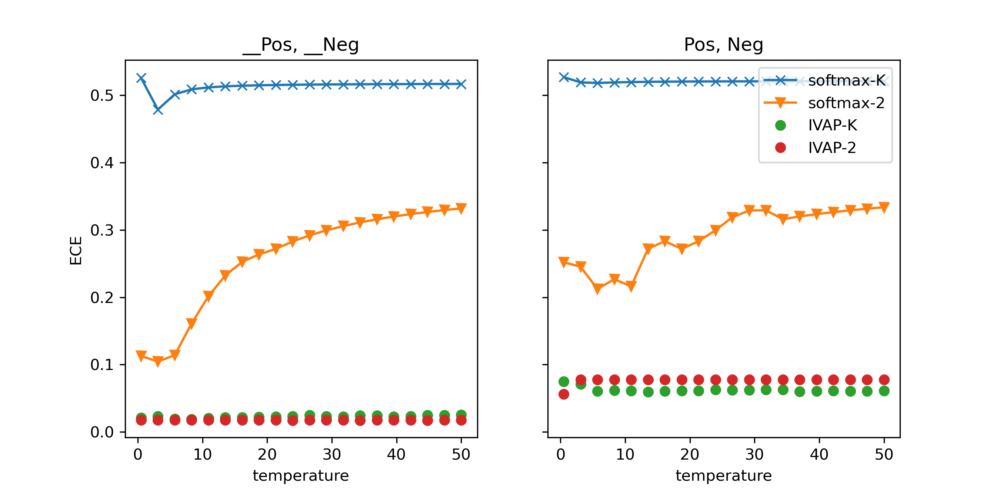
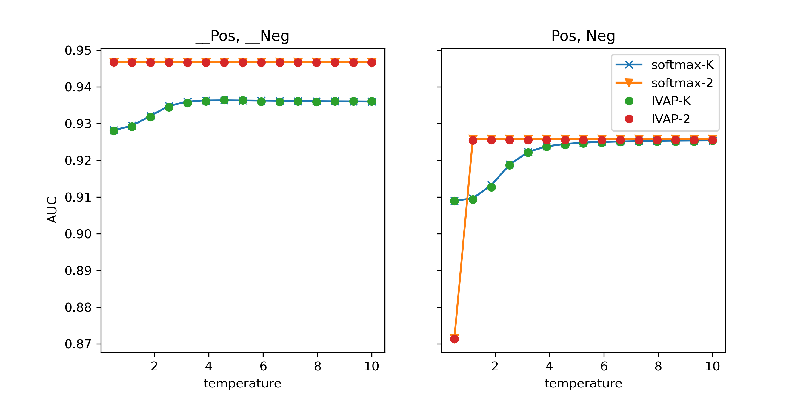

# 大型语言模型经过校准，专为二元问答设计

发布时间：2024年07月01日

`LLM理论` `人工智能`

> Calibrated Large Language Models for Binary Question Answering

# 摘要

> 在二元文本分类任务中，如何量化大型语言模型 (LLM) 预测的不确定性仍是一大难题。我们提出的新方法，利用归纳 Venn-Abers 预测器 (IVAP) 来校准二元标签对应的输出令牌概率，不仅在 BoolQ 数据集上超越了传统温度缩放方法，还确保了预测的高质量和概率的准确校准。这一进展不仅深化了我们对 LLM 校准技术的理解，更为二元问答任务中的不确定性评估提供了实用方案，从而提升了 LLM 预测的可解释性和可靠性。

> Quantifying the uncertainty of predictions made by large language models (LLMs) in binary text classification tasks remains a challenge. Calibration, in the context of LLMs, refers to the alignment between the model's predicted probabilities and the actual correctness of its predictions. A well-calibrated model should produce probabilities that accurately reflect the likelihood of its predictions being correct. We propose a novel approach that utilizes the inductive Venn--Abers predictor (IVAP) to calibrate the probabilities associated with the output tokens corresponding to the binary labels. Our experiments on the BoolQ dataset using the Llama 2 model demonstrate that IVAP consistently outperforms the commonly used temperature scaling method for various label token choices, achieving well-calibrated probabilities while maintaining high predictive quality. Our findings contribute to the understanding of calibration techniques for LLMs and provide a practical solution for obtaining reliable uncertainty estimates in binary question answering tasks, enhancing the interpretability and trustworthiness of LLM predictions.

[Arxiv](https://arxiv.org/abs/2407.01122)