# 大型语言模型的协同性能预测

发布时间：2024年07月01日

`LLM理论` `人工智能`

> Collaborative Performance Prediction for Large Language Models

# 摘要

> 在NLP研究中，全面且准确地预测大型语言模型在各种下游任务中的表现已成为一项核心挑战。虽然早期的规模法则揭示了模型家族内的相似性，并据此进行性能预测，但它们忽略了家族间的相似性，仅依赖于原始法则中的设计因素。为此，我们提出了协同性能预测（CPP）框架，该框架通过整合模型历史表现和其他设计因素，大幅提升了预测精度。此外，我们收集了包含历史性能和设计因素的在线数据，支持CPP不仅在预测LLM性能上超越传统法则，还深入分析了各因素的重要性，填补了以往研究的空白。

> Comprehensively understanding and accurately predicting the performance of large language models across diverse downstream tasks has emerged as a pivotal challenge in NLP research. The pioneering scaling law on downstream works demonstrated intrinsic similarities within model families and utilized such similarities for performance prediction. However, they tend to overlook the similarities between model families and only consider design factors listed in the original scaling law. To overcome these limitations, we introduce a novel framework, Collaborative Performance Prediction (CPP), which significantly enhances prediction accuracy by leveraging the historical performance of various models on downstream tasks and other design factors for both model and task. We also collect a collaborative data sourced from online platforms containing both historical performance and additional design factors. With the support of the collaborative data, CPP not only surpasses traditional scaling laws in predicting the performance of scaled LLMs but also facilitates a detailed analysis of factor importance, an area previously overlooked.

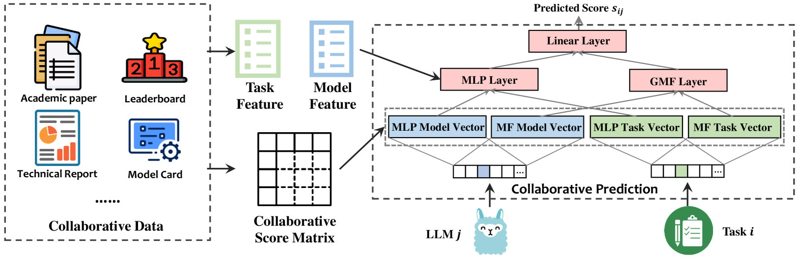

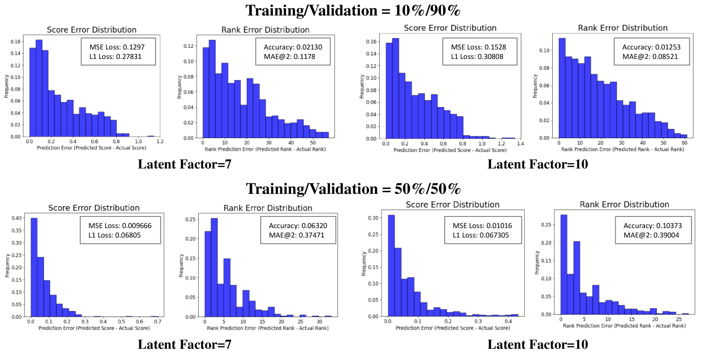

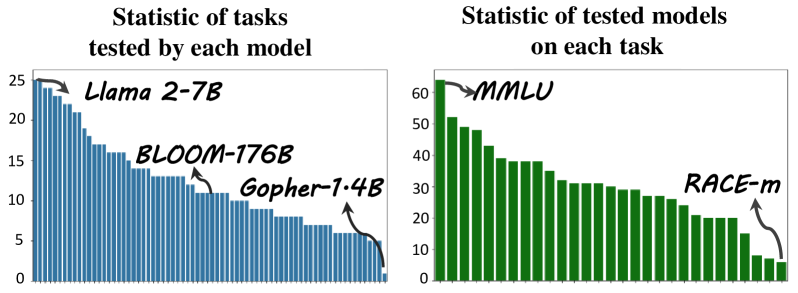

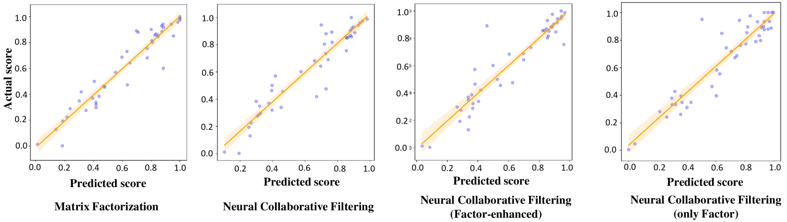

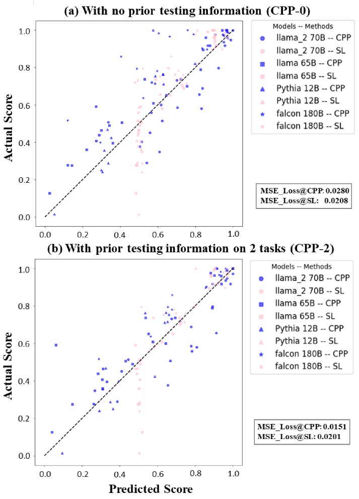

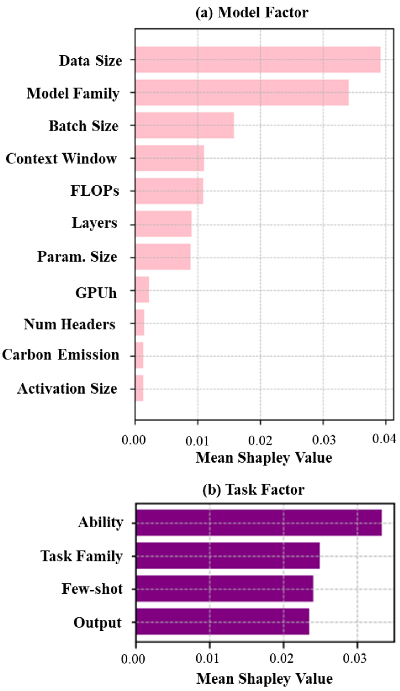

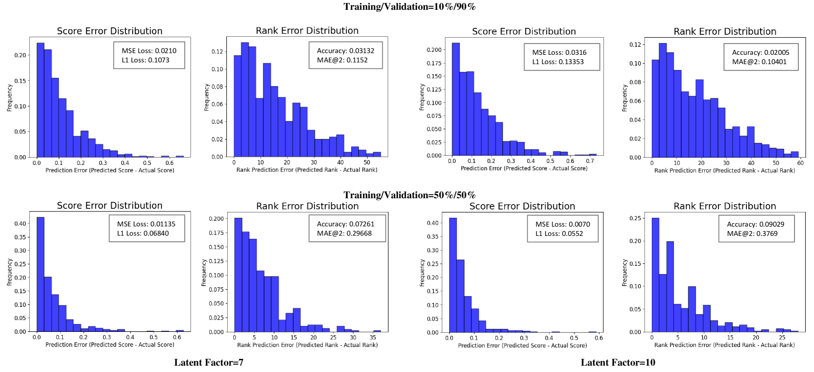

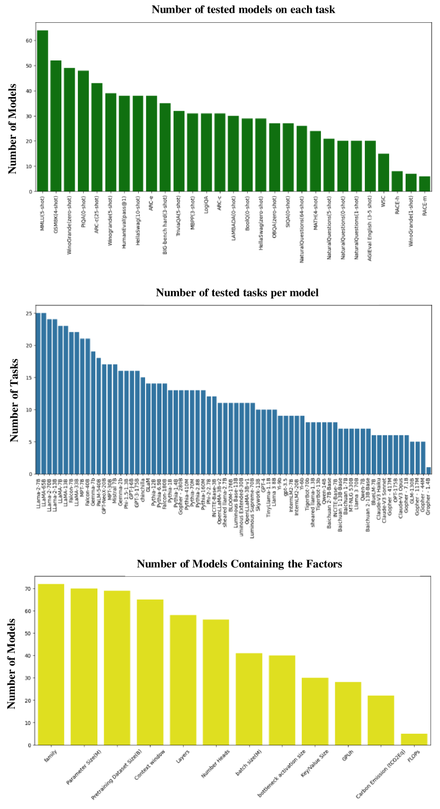

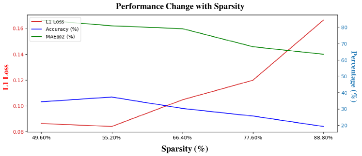

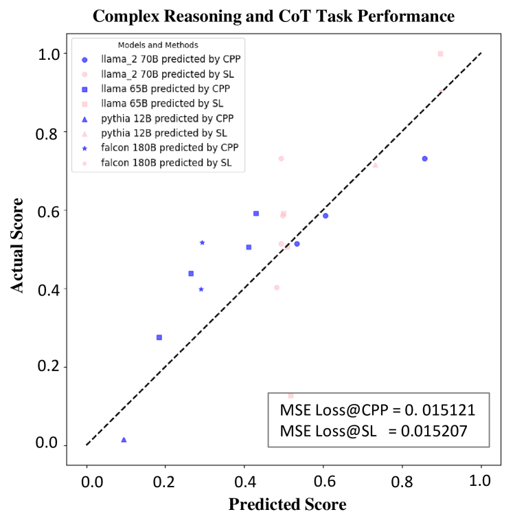

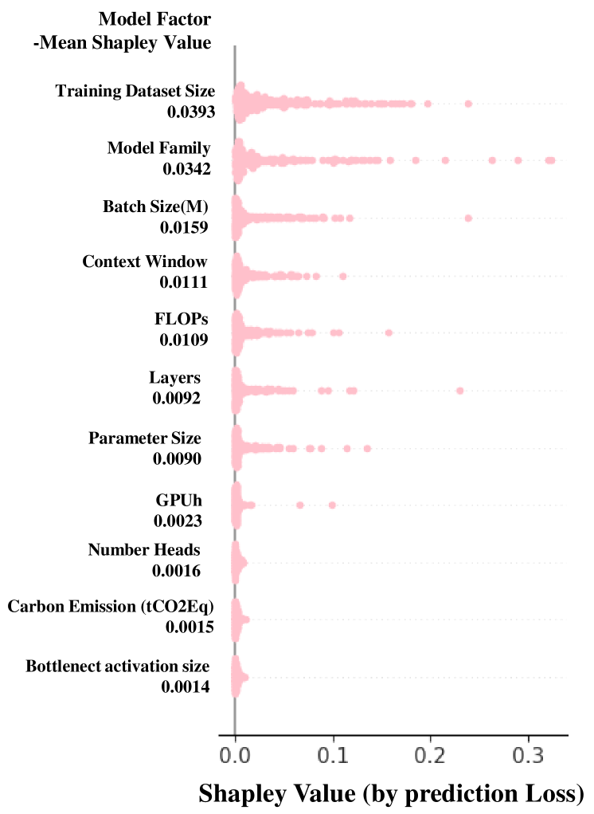

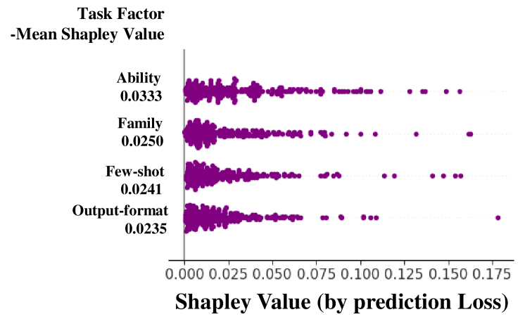

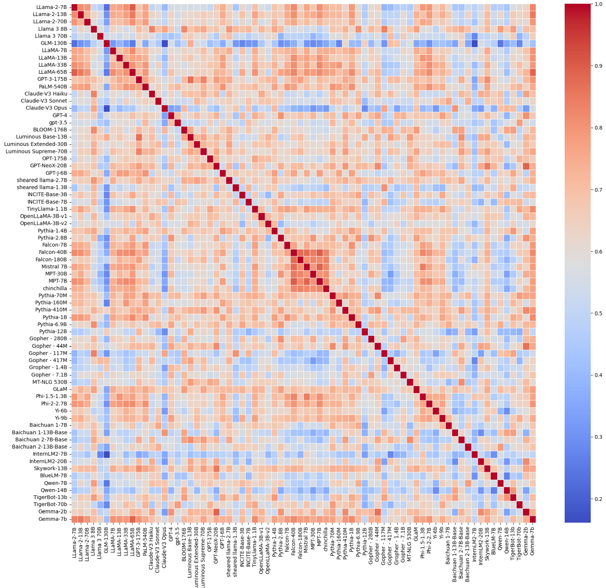

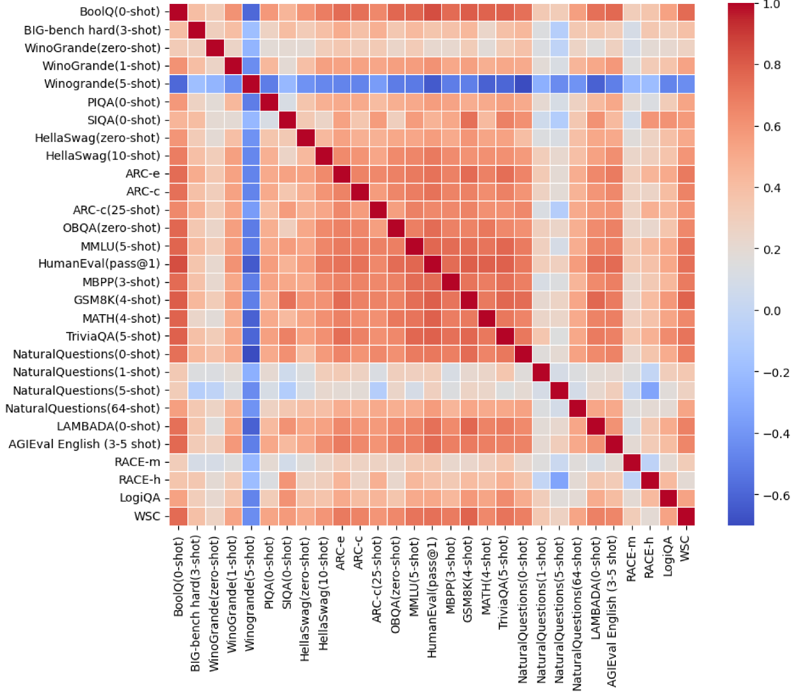

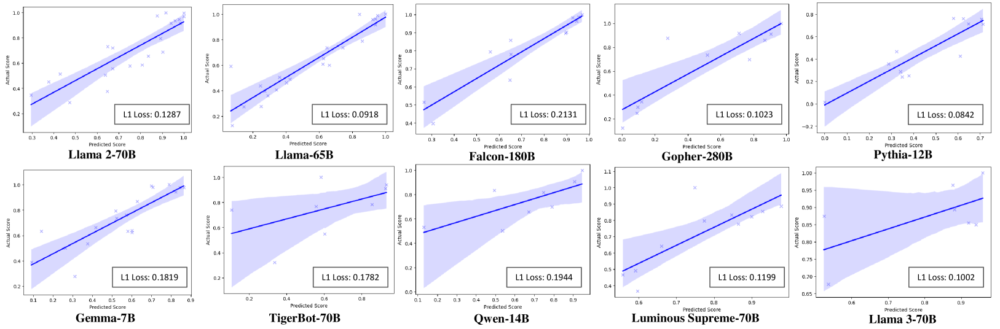

[Arxiv](https://arxiv.org/abs/2407.01300)