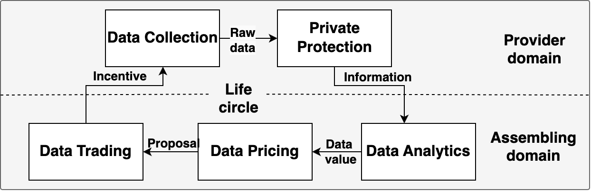

# 数据动态交易：基于常识AI代理的流量导向数据平台

发布时间：2024年07月01日

`LLM应用` `自动驾驶` `智慧城市`

> Data on the Move: Traffic-Oriented Data Trading Platform Powered by AI Agent with Common Sense

# 摘要

> 在数字化浪潮中，数据如黄金般珍贵，尤其在自动驾驶等尖端技术领域。然而，数据交易之路并非坦途，定价难题和信任缺失是其两大障碍。为此，我们创新推出Data on The Move（DTM）平台，它融合交通模拟、数据交易与AI智能，为数据价值评估和交易机制注入智慧。借助大型语言模型（LLMs）的洞察力，DTM通过多轮互动与模拟，精准定价交通数据。同时，通过模拟交通系统、多角色互动及市场中的个体行为多样性，DTM验证了定价方法的可靠性。在DTM的舞台上，各类交通实体如车联网车辆和交通灯控制器，共同参与信息采集、定价、交易与决策。模拟结果显示，基于AI代理的定价策略，不仅提升了数据交易的合理性，更显著提高了交通效率，彰显了DTM的实效与价值。这一创举，不仅首次将LLMs应用于数据定价，更在智能车联与智慧城市领域，引领了数据交易的新风潮。

> In the digital era, data has become a pivotal asset, advancing technologies such as autonomous driving. Despite this, data trading faces challenges like the absence of robust pricing methods and the lack of trustworthy trading mechanisms. To address these challenges, we introduce a traffic-oriented data trading platform named Data on The Move (DTM), integrating traffic simulation, data trading, and Artificial Intelligent (AI) agents. The DTM platform supports evident-based data value evaluation and AI-based trading mechanisms. Leveraging the common sense capabilities of Large Language Models (LLMs) to assess traffic state and data value, DTM can determine reasonable traffic data pricing through multi-round interaction and simulations. Moreover, DTM provides a pricing method validation by simulating traffic systems, multi-agent interactions, and the heterogeneity and irrational behaviors of individuals in the trading market. Within the DTM platform, entities such as connected vehicles and traffic light controllers could engage in information collecting, data pricing, trading, and decision-making. Simulation results demonstrate that our proposed AI agent-based pricing approach enhances data trading by offering rational prices, as evidenced by the observed improvement in traffic efficiency. This underscores the effectiveness and practical value of DTM, offering new perspectives for the evolution of data markets and smart cities. To the best of our knowledge, this is the first study employing LLMs in data pricing and a pioneering data trading practice in the field of intelligent vehicles and smart cities.

[Arxiv](https://arxiv.org/abs/2407.00995)