# DogeRM：借助模型合并技术，为奖励模型注入领域智慧

发布时间：2024年07月01日

`LLM应用` `人工智能` `机器学习`

> DogeRM: Equipping Reward Models with Domain Knowledge through Model Merging

# 摘要

> 强化学习从人类反馈（RLHF）是调整大型语言模型（LLM）行为的热门方法。奖励建模在RLHF中至关重要，但收集训练奖励模型所需的配对偏好数据往往费时费力，尤其是特定领域偏好需专家注释时。为此，我们创新性地提出了DogeRM框架，通过模型合并技术将领域知识融入通用奖励模型。实验结果显示，DogeRM在多个基准测试中性能显著提升，并深入分析了模型合并的影响，展现了其在促进模型对齐方面的广阔前景。

> Reinforcement learning from human feedback (RLHF) is a popular strategy for aligning large language models (LLMs) with desired behaviors. Reward modeling is a crucial step in RLHF. However, collecting paired preference data for training reward models is often costly and time-consuming, especially for domain-specific preferences requiring expert annotation. To address this challenge, we propose the \textbf{Do}main knowled\textbf{ge} merged \textbf{R}eward \textbf{M}odel (DogeRM), a novel framework that integrates domain-specific knowledge into a general reward model by model merging. The experiments demonstrate that DogeRM enhances performance across different benchmarks and provide a detailed analysis showcasing the effects of model merging, showing the great potential of facilitating model alignment.

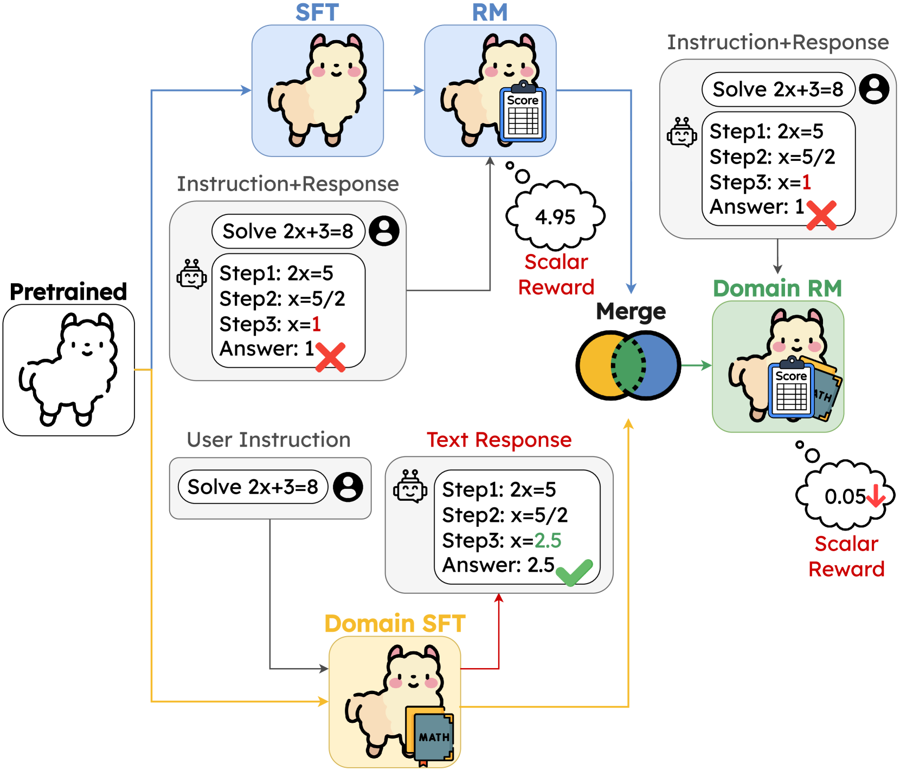

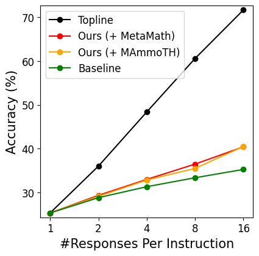

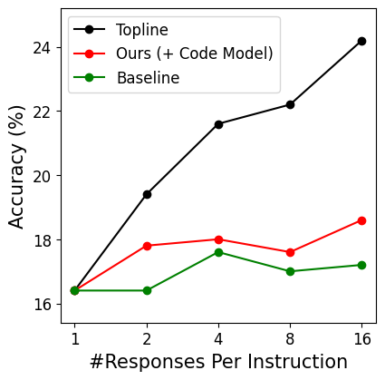

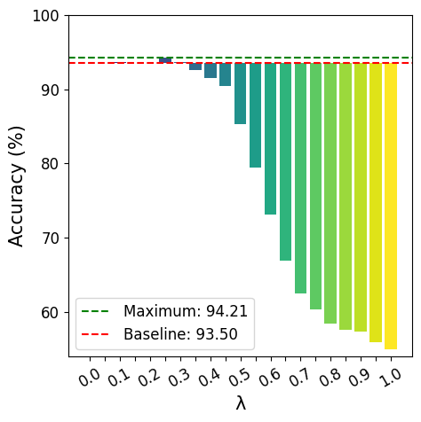

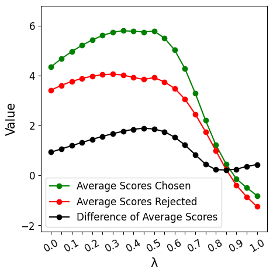

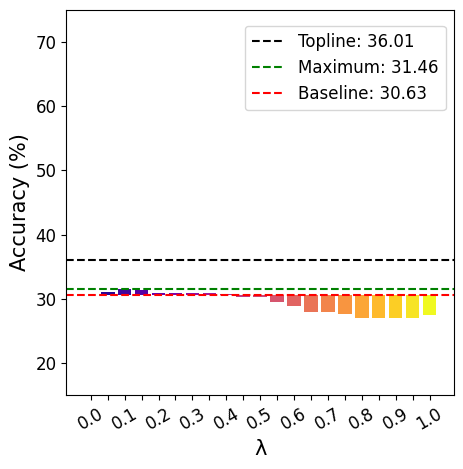

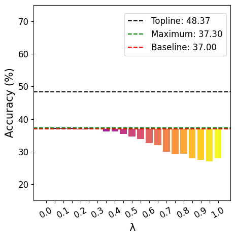

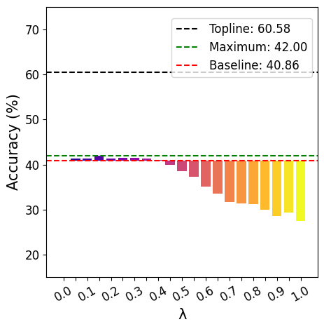

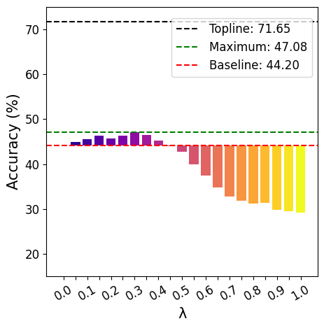

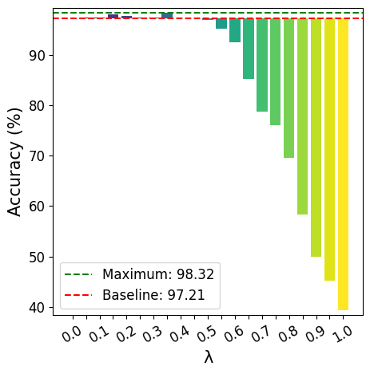

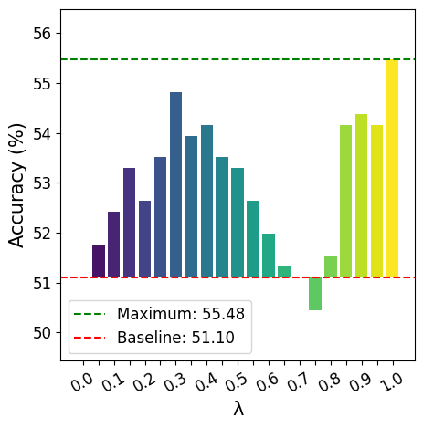

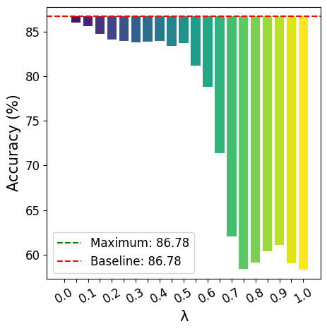

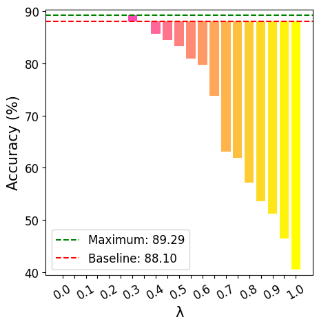

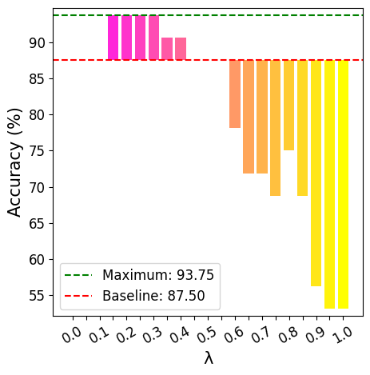

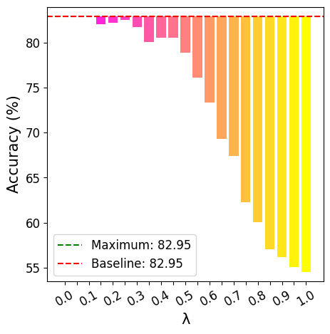

[Arxiv](https://arxiv.org/abs/2407.01470)