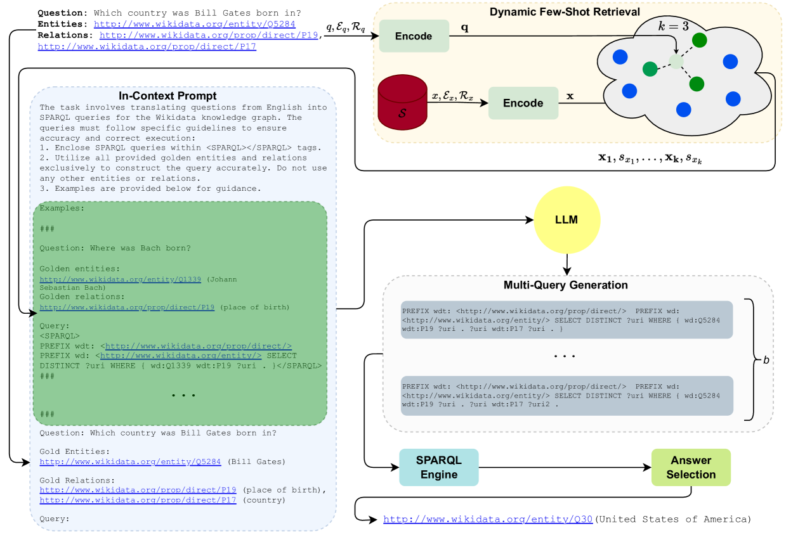
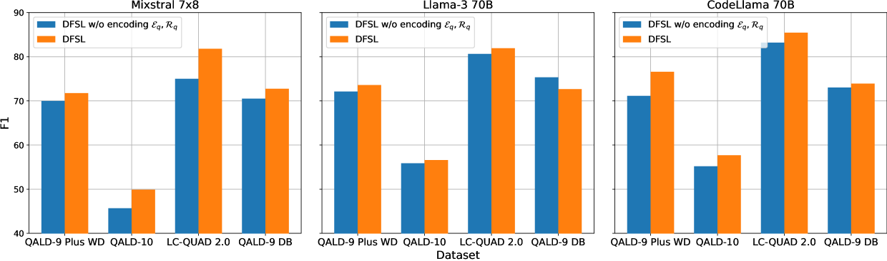
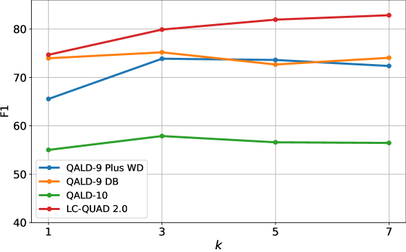
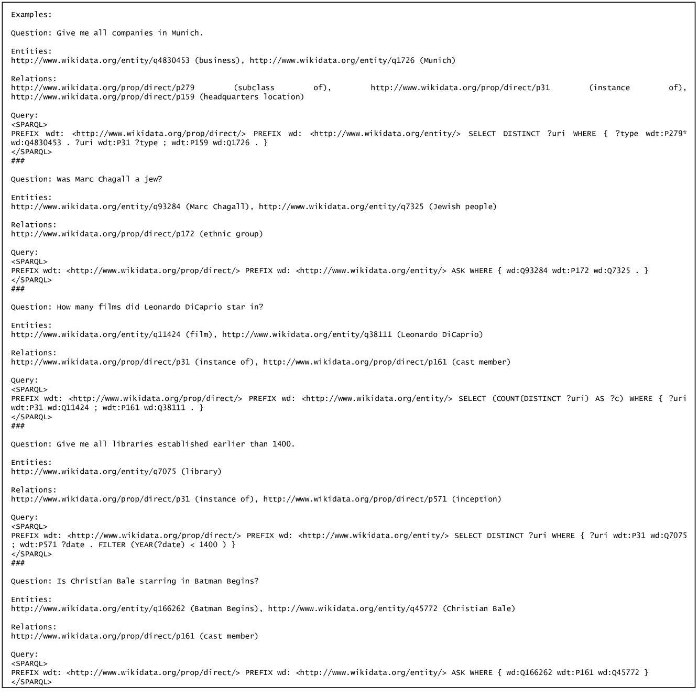

# 知识图谱问答中的动态少样本学习

发布时间：2024年07月01日

`LLM应用` `知识图谱` `问答系统`

> Dynamic Few-Shot Learning for Knowledge Graph Question Answering

# 摘要

> 大型语言模型为KGQA带来了创新机遇，但它们并非专为查询生成设计。为此，我们提出了动态少样本学习（DFSL），它融合了上下文学习的效率与语义相似性，为KGQA提供了一种性能卓越的通用方案。我们在多样的数据集和架构配置上进行了全面评估，验证了其有效性。

> Large language models present opportunities for innovative Question Answering over Knowledge Graphs (KGQA). However, they are not inherently designed for query generation. To bridge this gap, solutions have been proposed that rely on fine-tuning or ad-hoc architectures, achieving good results but limited out-of-domain distribution generalization. In this study, we introduce a novel approach called Dynamic Few-Shot Learning (DFSL). DFSL integrates the efficiency of in-context learning and semantic similarity and provides a generally applicable solution for KGQA with state-of-the-art performance. We run an extensive evaluation across multiple benchmark datasets and architecture configurations.

[Arxiv](https://arxiv.org/abs/2407.01409)