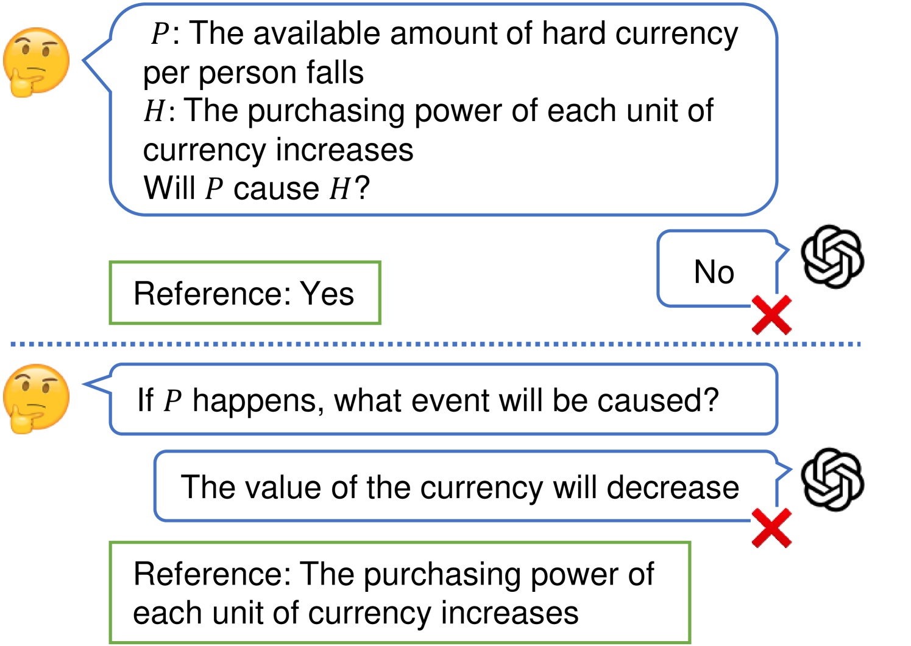
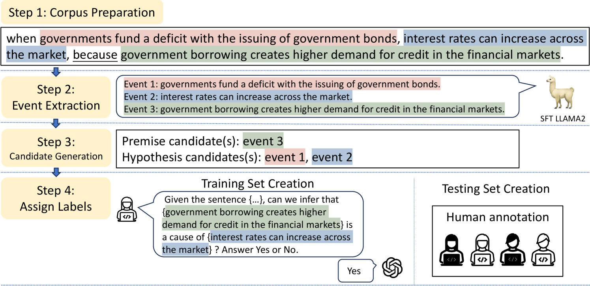

# EconNLI：探究大型语言模型在经济学推理领域的评估

发布时间：2024年07月01日

`LLM应用`

> EconNLI: Evaluating Large Language Models on Economics Reasoning

# 摘要

> 尽管大型语言模型 (LLM) 在撰写经济分析报告和提供财务建议方面应用广泛，但其对经济知识的理解和推理特定经济事件结果的能力尚未得到系统评估。为此，我们推出了经济事件自然语言推理 (EconNLI) 数据集，旨在全面检验 LLM 在经济领域的推理能力。实验结果显示，LLM 在经济推理上存在不足，可能给出错误或虚构的答案。这一发现提醒我们，在依赖 LLM 进行涉及经济分析的关键决策时需谨慎。EconNLI 数据集及代码已公开，供进一步研究使用。

> Large Language Models (LLMs) are widely used for writing economic analysis reports or providing financial advice, but their ability to understand economic knowledge and reason about potential results of specific economic events lacks systematic evaluation. To address this gap, we propose a new dataset, natural language inference on economic events (EconNLI), to evaluate LLMs' knowledge and reasoning abilities in the economic domain. We evaluate LLMs on (1) their ability to correctly classify whether a premise event will cause a hypothesis event and (2) their ability to generate reasonable events resulting from a given premise. Our experiments reveal that LLMs are not sophisticated in economic reasoning and may generate wrong or hallucinated answers. Our study raises awareness of the limitations of using LLMs for critical decision-making involving economic reasoning and analysis. The dataset and codes are available at https://github.com/Irenehere/EconNLI.

[Arxiv](https://arxiv.org/abs/2407.01212)