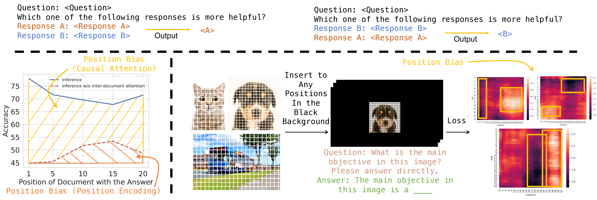
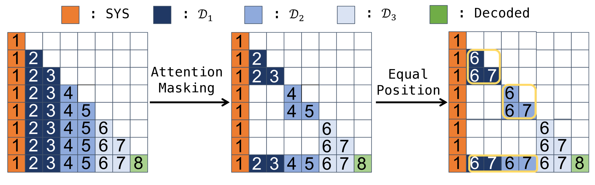
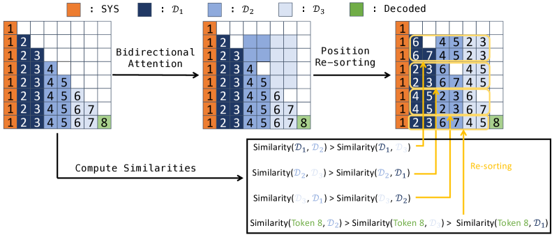
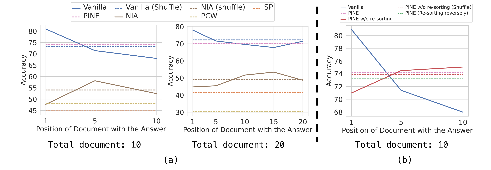

# 解决语言模型中的位置偏差问题：一种机制性解决方案

发布时间：2024年07月01日

`LLM理论` `人工智能`

> Eliminating Position Bias of Language Models: A Mechanistic Approach

# 摘要

> 位置偏差已成为现代语言模型的一大难题，模型往往根据内容在上下文中的位置来优先处理。这种偏差不仅导致模型失灵，还影响了其在多领域的性能和可靠性。我们深入分析发现，几乎所有顶尖语言模型都采用的因果注意力和相对位置编码是位置偏差的根源。具体而言，因果注意力使模型偏爱远距离内容，而相对位置编码则倾向于近距离内容。此外，视觉-语言模型中也存在这一问题。为此，我们提出了一种无需训练的零-shot方法，通过改变因果注意力为段间双向注意力，并利用模型注意力值来重新排序段，从而在段级别实现位置不变推理（PINE）。这一创新方法有效消除了位置偏差，显著提升了模型在需要评估推理对的任务中的性能，甚至在某些情况下超越了GPT-4。

> Position bias has proven to be a prevalent issue of modern language models (LMs), where the models prioritize content based on its position within the given context. This bias often leads to unexpected model failures and hurts performance, robustness, and reliability across various applications. Our mechanistic analysis attributes the position bias to two components employed in nearly all state-of-the-art LMs: causal attention and relative positional encodings. Specifically, we find that causal attention generally causes models to favor distant content, while relative positional encodings like RoPE prefer nearby ones based on the analysis of retrieval-augmented question answering (QA). Further, our empirical study on object detection reveals that position bias is also present in vision-language models (VLMs).
  Based on the above analyses, we propose to ELIMINATE position bias caused by different input segment orders (e.g., options in LM-as-a-judge, retrieved documents in QA) in a TRAINING-FREE ZERO-SHOT manner. Our method changes the causal attention to bidirectional attention between segments and utilizes model attention values to decide the relative orders of segments instead of using the order provided in input prompts, therefore enabling Position-INvariant inferencE (PINE) at the segment level. By eliminating position bias, models achieve better performance and reliability in downstream tasks where position bias widely exists, such as LM-as-a-judge and retrieval-augmented QA.
  Notably, PINE is especially useful when adapting LMs for evaluating reasoning pairs: it consistently provides 8 to 10 percentage points performance gains in most cases, and makes Llama-3-70B-Instruct perform even better than GPT-4-0125-preview on the RewardBench reasoning subset.

[Arxiv](https://arxiv.org/abs/2407.01100)