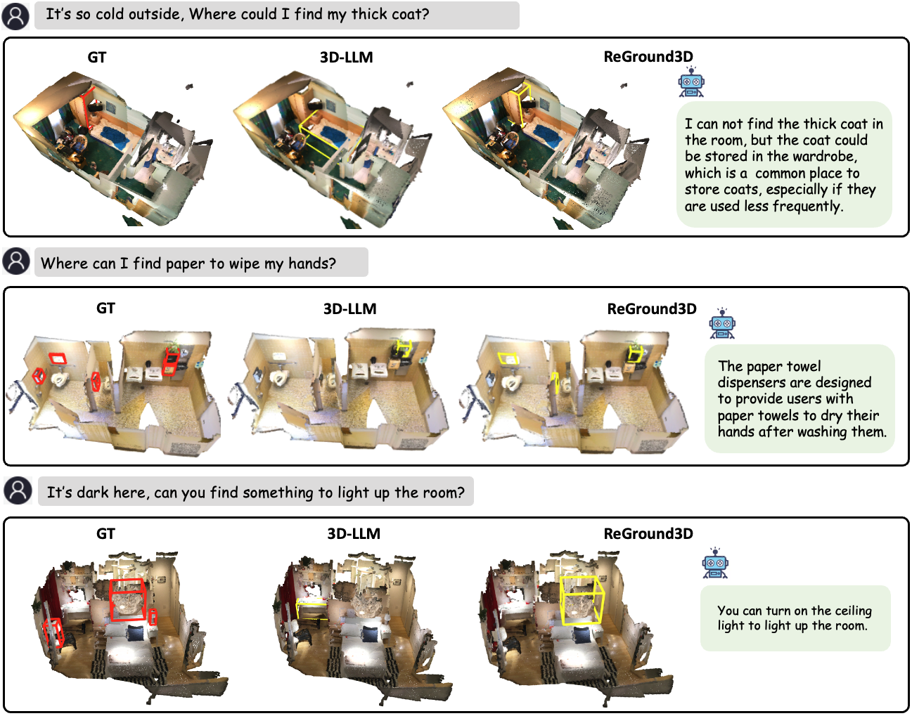

# 赋予 3D 视觉定位推理能力

发布时间：2024年07月01日

`LLM应用` `计算机视觉` `机器人技术`

> Empowering 3D Visual Grounding with Reasoning Capabilities

# 摘要

> 尽管3D视觉定位已取得显著进展，但现有模型仍依赖显式文本描述，且难以从隐含指令中解读人类意图。为此，我们提出了“3D推理定位”新任务，并创建了ScanReason基准，包含10K+问题-答案-位置对，涵盖五种需推理与定位协同的类型。我们的ReGround3D方法结合了MLLM增强的视觉推理模块和3D定位模块，通过精细解析3D场景细节来精确定位对象。此外，我们创新的链式定位机制在推理中交替进行推理与定位，显著提升了性能。大量实验证实了该方法的有效性。

> Although great progress has been made in 3D visual grounding, current models still rely on explicit textual descriptions for grounding and lack the ability to reason human intentions from implicit instructions. We propose a new task called 3D reasoning grounding and introduce a new benchmark ScanReason which provides over 10K question-answer-location pairs from five reasoning types that require the synerization of reasoning and grounding. We further design our approach, ReGround3D, composed of the visual-centric reasoning module empowered by Multi-modal Large Language Model (MLLM) and the 3D grounding module to obtain accurate object locations by looking back to the enhanced geometry and fine-grained details from the 3D scenes. A chain-of-grounding mechanism is proposed to further boost the performance with interleaved reasoning and grounding steps during inference. Extensive experiments on the proposed benchmark validate the effectiveness of our proposed approach.

[Arxiv](https://arxiv.org/abs/2407.01525)