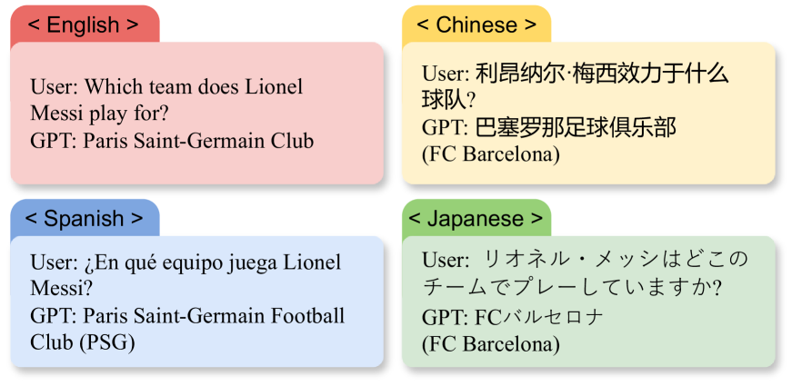
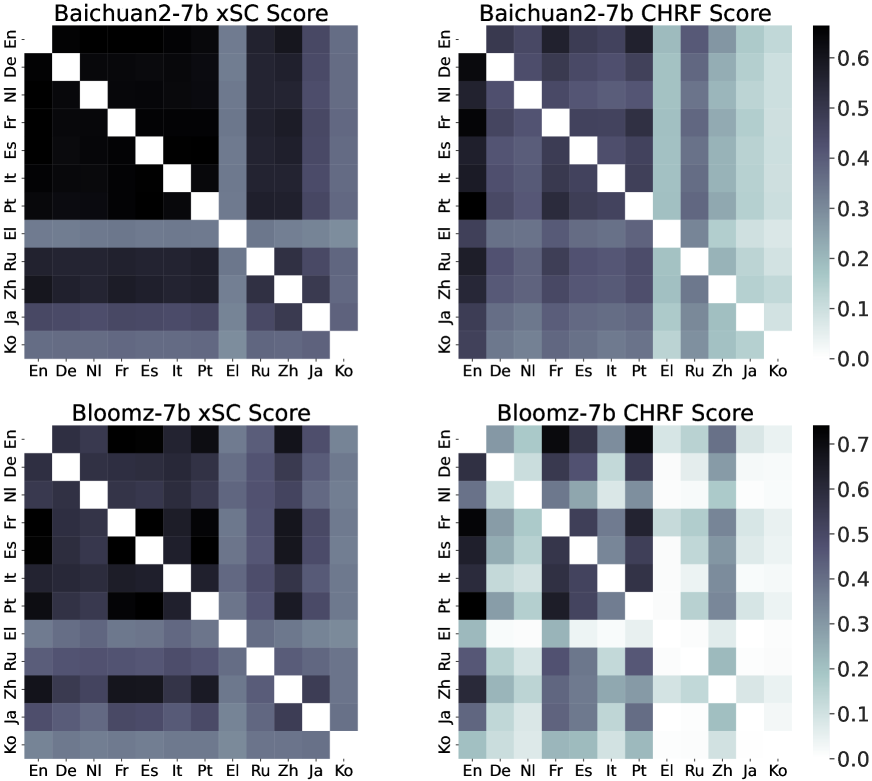
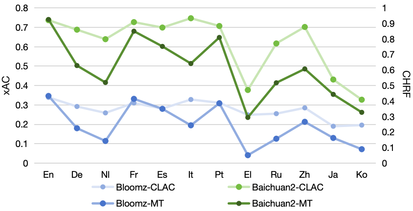

# 探究大型语言模型中基于知识的跨语言不一致问题

发布时间：2024年07月01日

`LLM应用` `多语言技术`

> Evaluating Knowledge-based Cross-lingual Inconsistency in Large Language Models

# 摘要

> 本文探讨了大型语言模型（如ChatGPT、Llama和Baichuan）在跨语言处理中的不一致现象。这些模型虽在NLP任务中表现卓越，但在处理不同语言的相同概念时却常显差异。研究围绕三个核心问题：LLMs跨语言不一致的存在、具体表现及与多语言能力的关联。为此，我们创新性地采用LaBSE模型评估跨语言语义一致性（xSC），并引入跨语言准确性一致性（xAC）和跨语言时效性一致性（xTC）指标，全面衡量模型在语义、准确性和时效性上的不一致。通过整合这些指标，我们为LLMs的跨语言一致性提供了全面评估。研究旨在深化对LLMs多语言能力和可解释性的认识，推动构建更强大、可靠的多语言模型。

> This paper investigates the cross-lingual inconsistencies observed in Large Language Models (LLMs), such as ChatGPT, Llama, and Baichuan, which have shown exceptional performance in various Natural Language Processing (NLP) tasks. Despite their successes, these models often exhibit significant inconsistencies when processing the same concepts across different languages. This study focuses on three primary questions: the existence of cross-lingual inconsistencies in LLMs, the specific aspects in which these inconsistencies manifest, and the correlation between cross-lingual consistency and multilingual capabilities of LLMs.To address these questions, we propose an innovative evaluation method for Cross-lingual Semantic Consistency (xSC) using the LaBSE model. We further introduce metrics for Cross-lingual Accuracy Consistency (xAC) and Cross-lingual Timeliness Consistency (xTC) to comprehensively assess the models' performance regarding semantic, accuracy, and timeliness inconsistencies. By harmonizing these metrics, we provide a holistic measurement of LLMs' cross-lingual consistency. Our findings aim to enhance the understanding and improvement of multilingual capabilities and interpretability in LLMs, contributing to the development of more robust and reliable multilingual language models.

[Arxiv](https://arxiv.org/abs/2407.01358)