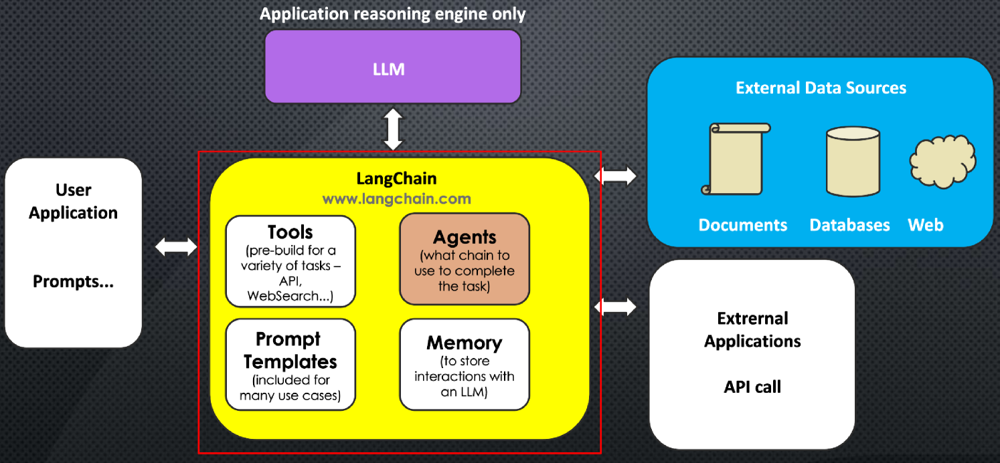
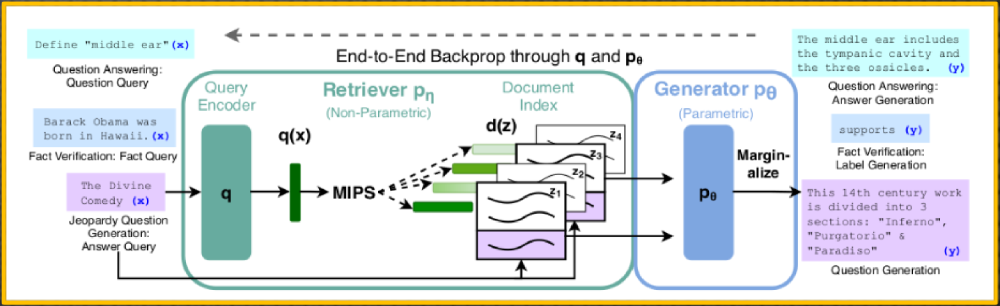
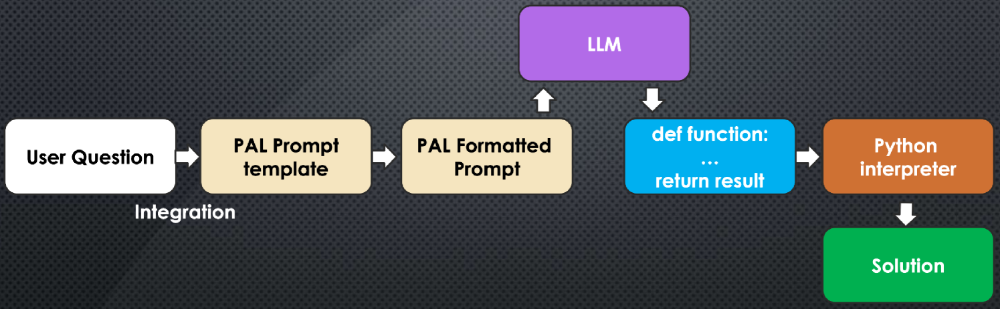
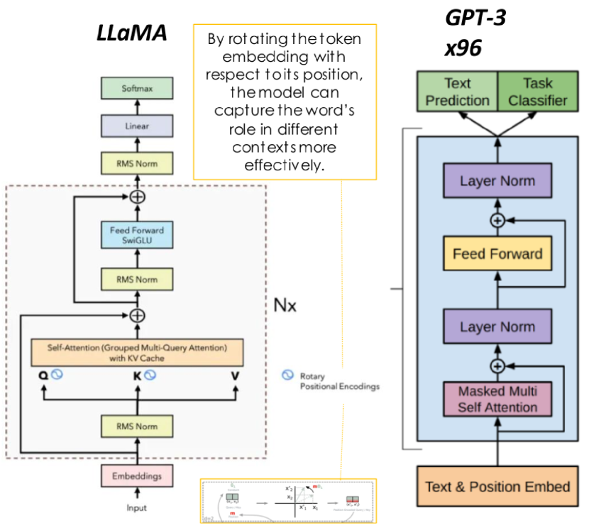
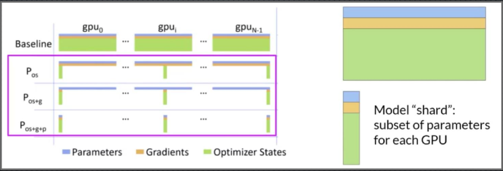
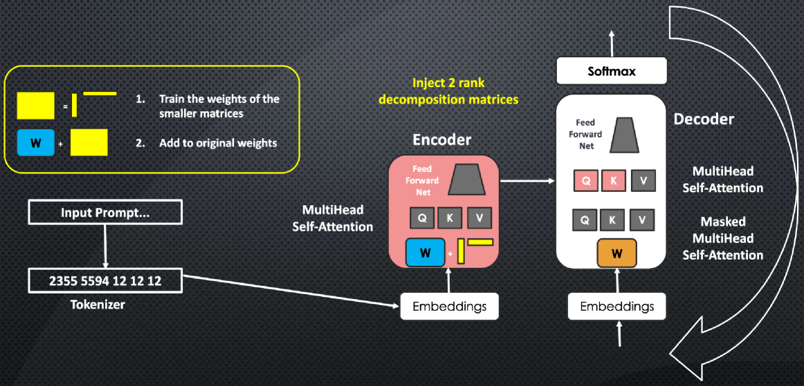
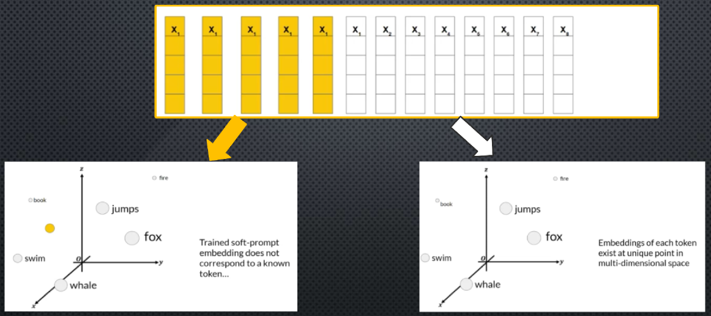

# 深入探索 LLMsuite 中的高级大型语言模型

发布时间：2024年07月01日

`LLM理论` `人工智能`

> Exploring Advanced Large Language Models with LLMsuite

# 摘要

> 本教程深入探讨了 ChatGPT 和 Gemini 等大型语言模型的发展，不仅揭示了其进步，也直面了挑战。针对时间知识截断、数学错误和信息生成不准确等固有限制，教程提出了创新的解决方案，如 RAG、PAL 和 ReAct、LangChain 框架。这些技术的融合显著提升了 LLM 在复杂推理和任务执行中的性能与可靠性。此外，教程还详细介绍了微调策略，涵盖了指令微调、LoRA 等高效参数方法，以及 RLHF 和 ReST 等强化学习技术。同时，对 LLM 的转换器架构和训练技术进行了全面梳理。所有这些技术的实现工具箱已在 GitHub 上公开，供大家自由使用。

> This tutorial explores the advancements and challenges in the development of Large Language Models (LLMs) such as ChatGPT and Gemini. It addresses inherent limitations like temporal knowledge cutoffs, mathematical inaccuracies, and the generation of incorrect information, proposing solutions like Retrieval Augmented Generation (RAG), Program-Aided Language Models (PAL), and frameworks such as ReAct and LangChain. The integration of these techniques enhances LLM performance and reliability, especially in multi-step reasoning and complex task execution. The paper also covers fine-tuning strategies, including instruction fine-tuning, parameter-efficient methods like LoRA, and Reinforcement Learning from Human Feedback (RLHF) as well as Reinforced Self-Training (ReST). Additionally, it provides a comprehensive survey of transformer architectures and training techniques for LLMs. The toolbox for implementing these techniques is publicly available at https://github.com/giorgioroffo/large_language_models_open_suite

[Arxiv](https://arxiv.org/abs/2407.12036)